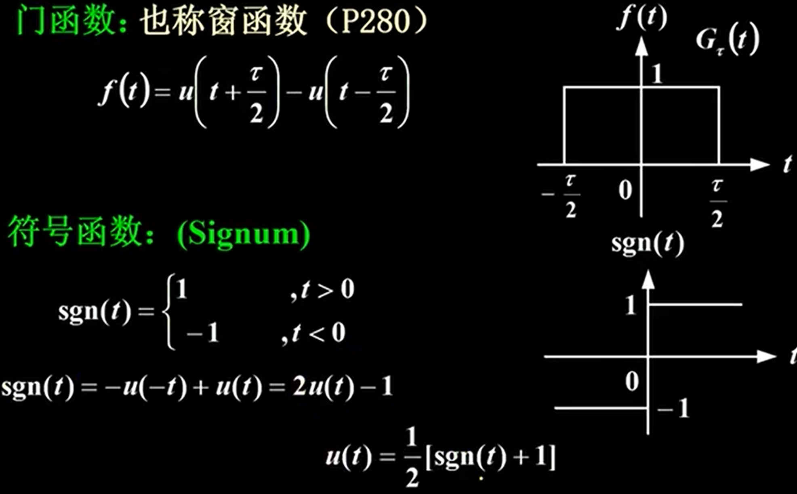
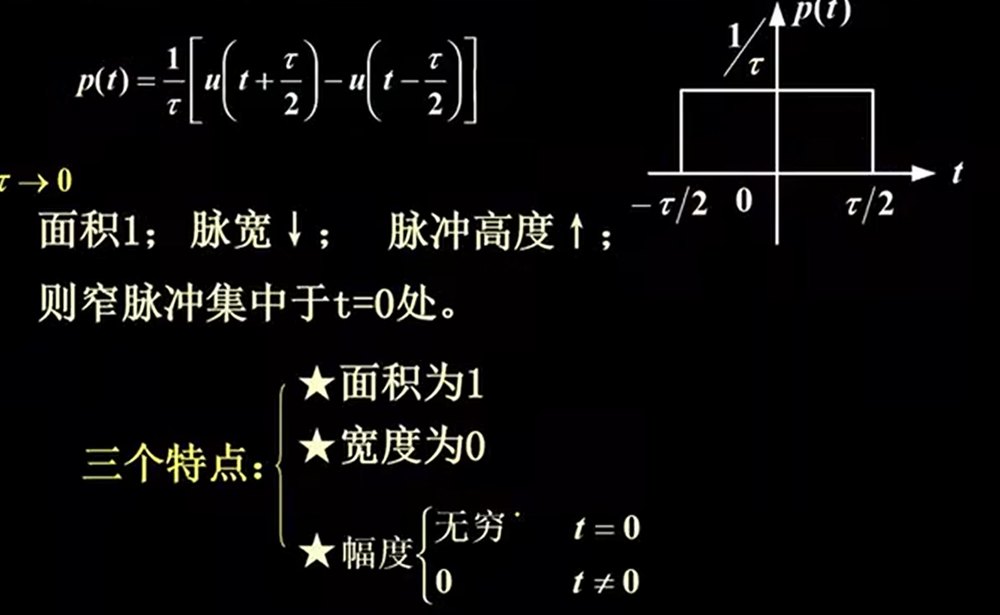
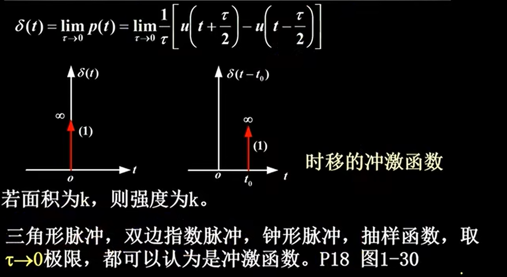
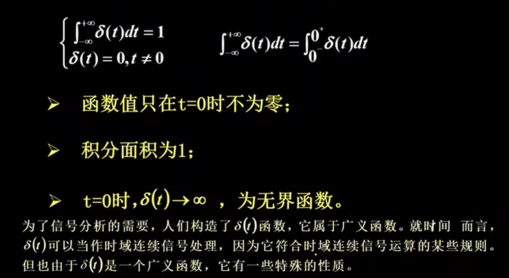

* 函数本身有不连续点（跳变点）或其导数与积分有不连续点的一类函数统称为**奇异信号或奇异函数**

# 单位斜变信号
1. 定义

    

2. 有延迟的单位斜变信号

    

3. 三角形脉冲

    

# 单位阶跃信号
1. 定义

    

2. 有延迟的单位阶跃信号

    

3. 用单位阶跃信号描述其他信号

    

# 单位冲激信号
1. 定义1

    

    

2. 定义2：狄拉克

    
