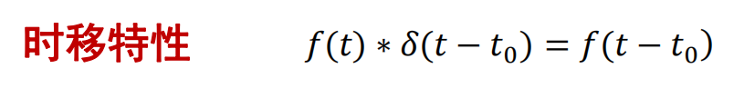
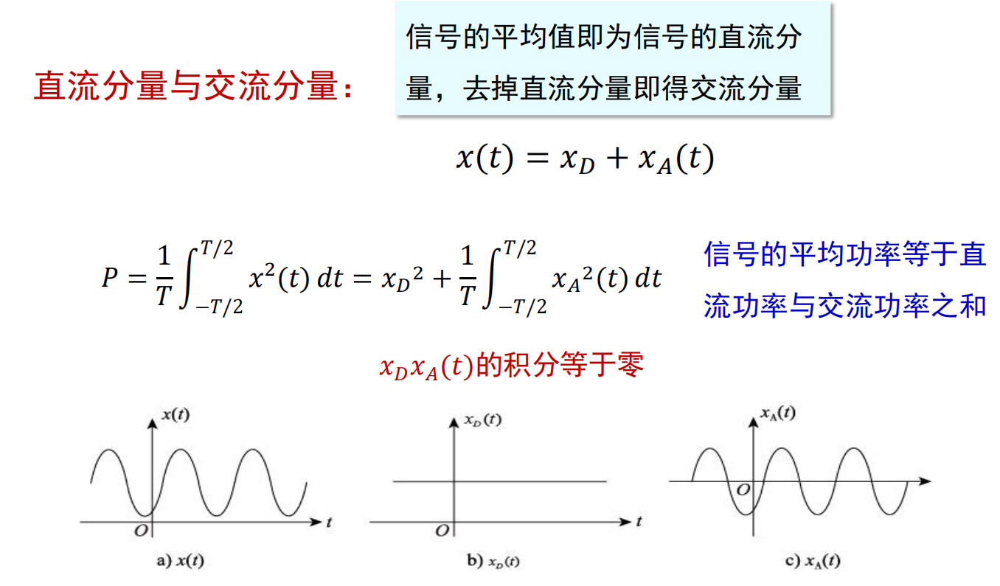

# 斜变信号
* 斜变信号指从某一时刻开始随时间正比例增长的信号，若增长的变化率（斜率）是1，则称为单位斜变信号

        

        

* “截平的”斜变信号，在时间τ以后斜变波形被切平

        

    

# 阶跃信号
* 在跳变点**t=0处函数值未定义，或在t=0处规定函数值u(0)=1/2**

* **单位斜变函数**的**导数**等于**单位阶跃函数**

    

    

# 冲激信号
* 冲激函数取值极大、作用时间极短，如对电容回路闭合。单位冲激信号为高度无穷大、宽度无穷小且面积为1的对称脉冲，常记作狄拉克函数**δ(t)**，用**箭头表示**

* 如果矩形脉冲的面积是E，则表示一个冲激强度为E倍单位值的δ函数，即E*δ(t)

* 冲激函数不限于矩形，可换用其它形式
    1. 三角形脉冲

              

            

    2. 双边指数脉冲

            

            

    3. 钟形脉冲

            

            

    4. Sa(t)信号(抽样信号)

            

            

## 冲激函数的求导性质
* 阶跃函数求导可得冲激函数

## 冲激函数的抽样性质
* 信号f(t)与δ(t)相乘，等于将0时刻信号值f(t)**筛选出来变成**冲激函数f(0)δ(t)，f(t)δ(t)=f(0)δ(t)，或f(t)δ(t-a)=f(a)δ(t-a)

* 如果没有积分到冲激函数δ(t)的位置，积分结果自然为0

## 冲激序列与阶跃序列

## 冲激序列的抽样性质

## 冲激函数的基本特性
* 尺度变换特性：`δ(at)=δ(t)/|a|`

* 偶函数性：`δ(-t)=δ(t)`

* 微积分特性：`δ(t)=du(t)/dt`，`Sum[-∞,t]δ(τ)dτ=u(t)`

## 冲激偶信号
* `δ'(t)=dδ(t)/dt`，冲激函数的微分是呈**正、负极性的一对冲激**，称为冲激偶

    

* 冲击偶的积分：`Sum[-∞,t]δ'(τ)dτ=δ(t)`，`Sum[-∞,∞]δ'(t)dt=0`

* 尺度变换：`aδ'(at)=δ'(t)/|a|`->`δ'(at)=δ'(t)/(a|a|)`

* 奇函数：`δ'(-t)=-δ'(t)`

* 冲击偶的抽样特性：`Sum[-∞,∞]δ'(t)x(t)dt=-x'(0)`，`Sum[-∞,∞]δ'(t-a)x(t)dt=-x'(a)`

* 微分特性：`x(t)δ'(t-a)=x(a)δ'(t-a)-x'(a)δ'(t-a)`
