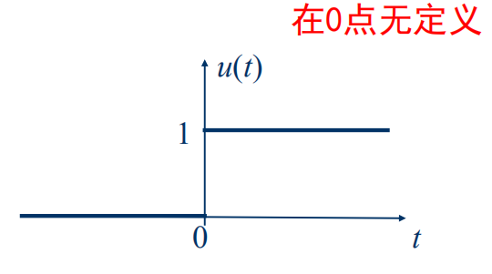

# 斜变信号
* 斜变信号指从某一时刻开始随时间正比例增长的信号，若增长的变化率（斜率）是1，则称为单位斜变信号

$$
f(t)=\begin{cases}
    0, & t<0,  \\
    t, & t>=0.
\end{cases}
$$

* 如果将起始点移至$t_0$，应写作

$$
f(t-t_0)=\begin{cases}
    0, & t<t_0,  \\
    t-t_0, & t>=t_0.
\end{cases}
$$

    

* “截平的”斜变信号，在时间$\tau$以后斜变波形被切平

$$
f_1(t)=
\begin{cases}
    \frac{K}{\tau}f(t),&t<\tau, \\
    K,&t>=\tau.
\end{cases}
$$

# 阶跃信号
* 在跳变点$t=0$处函数值未定义，或在$t=0$处规定函数值$u(0)=1/2$

* **单位斜变函数**的**导数**等于**单位阶跃函数**

$$
u(t)=
\begin{cases}
    0,&t<0, \\
    1,&t>0.
\end{cases}
$$

     

* 阶跃函数性质
    1. 单边特性：
        $$
        f(t)u(t)=
        \begin{cases}
            0,&t<0,\\
            f(t),&t>0.
        \end{cases}
        $$

    2. 积分特性
        $\int_{-\infty}^{t}u(\tau)d\tau=tu(t)\to$斜变函数$r(t)$
    
    3. 筛选信号区间
        * $f(t)g(t)$：筛选$f(t)$的某一段区间

        

    4. 分解为阶跃信号
        * $f(t)=2u(t)-3u(t-1)+u(t-2)$

        

# 冲激信号
* 单位冲激信号为高度无穷大、宽度无穷小且面积为1的对称脉冲，常记作狄拉克函数$\delta(t)$，用**箭头表示**

* 如果矩形脉冲的面积是E，则表示一个冲激强度为E倍单位值的δ函数，即$E*δ(t)$

* 阶跃函数求导得到冲激函数：$\delta (t)=\frac{du(t)}{dt}$

    

## 冲激函数的抽样性质
* 信号$f(t)$与$δ(t)$相乘，等于将0时刻信号值$f(t)$**筛选出来**变成冲激函数$f(0)δ(t)$，有$f(t)δ(t)=f(0)δ(t)$，或$f(t)δ(t-a)=f(a)δ(t-a)$

* 积分性质：
    * $\int_{-\infty}^{\infty}f(t)\delta (t)dt=f(0)\int_{-\infty}^{\infty}\delta(t)dt=f(0)$

    * $\int_{-\infty}^{\infty}f(t)\delta(t-a)dt=f(a)$

## 冲激序列与阶跃序列

## 冲激序列的抽样性质

## 冲激函数的基本特性
* 尺度变换特性：$δ(at)=\frac{δ(t)}{|a|}$

* 偶函数性：$δ(-t)=δ(t)$

* 微积分特性：$δ(t)=\frac{du(t)}{dt}$，$\int_{-\infty}^{\infty}δ(τ)dτ=u(t)$

* 冲激偶信号
    * $δ'(t)=\frac{dδ(t)}{dt}$，冲激函数的微分是呈**正、负极性的一对冲激**，称为冲激偶

        

    * 冲击偶的积分：$\int_{-∞}^{t}δ'(τ)dτ=δ(t)$，$\int_{-∞}^{∞}δ'(t)dt=0$

    * 尺度变换：$\delta (at)=\frac{\delta (t)}{|a|}\Rightarrow$等式两边求导$\Rightarrow aδ'(at)=\frac{δ'(t)}{|a|}\toδ'(at)=\frac{δ'(t)}{a|a|}$

    * 奇函数：$δ'(-t)=-δ'(t)$

    * 冲击偶的抽样特性：$\int_{-∞}^{∞}δ'(t)x(t)dt=-x'(0)$，$int_{-∞}^{∞}δ'(t-t_0)x(t)dt=-x'(t_0)$

    * 微分特性：$x(t)δ'(t-t_0)=x(t_0)δ'(t-t_0)-x'(t_0)δ(t-t_0)$
