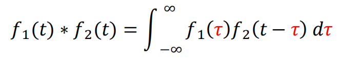
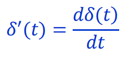
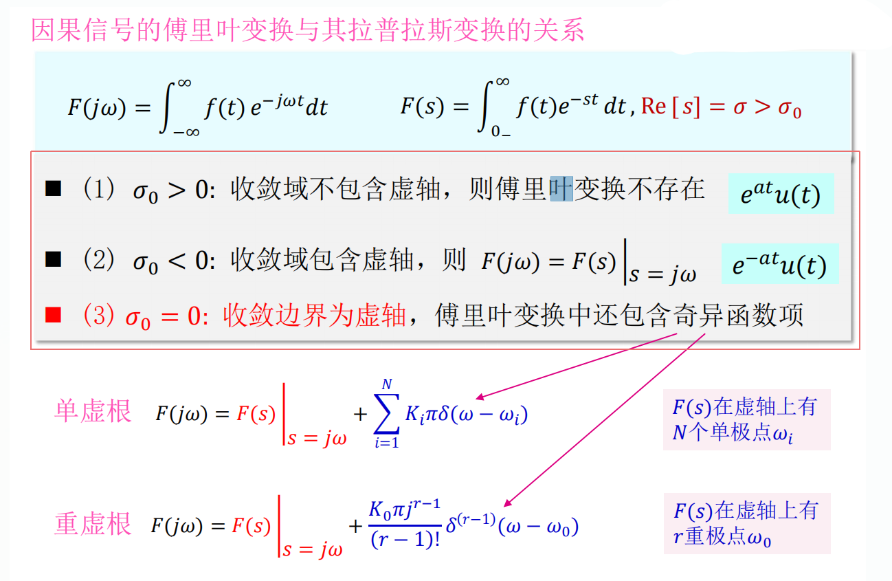
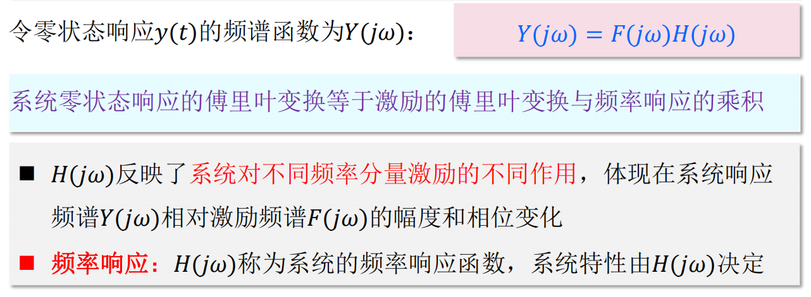

# 单位斜变信号
* 斜变信号也称斜坡信号或斜升信号,这是指从某一时刻开始随时间正比例增长的信号
* 若增长的变化率是1,就称为单位斜变信号
        
        
* '截平的'斜变信号,在时间τ以后斜变波形被切平
        
    

# 单位阶跃信号
    
    
* 在跳变点,t=0处,函数值未定义,或在t=0处规定函数值u(0)=1/2
* 单位斜变函数的导数等于单位阶跃函数

# 单位冲激信号
* 单位冲激信号面积为1,常记作δ(t),冲激函数用箭头表示

* 如果矩形脉冲的面积不是固定为1,而是E,则表示一个冲激强度为E倍单位值的δ函数,即Eδ(t)
* 冲激函数不限于矩形,可换用其它形式
    1. 三角形脉冲
              
            
    2. 双边指数脉冲
            
            
    3. 钟形脉冲
            
            
    4. Sa(t)信号(抽样信号)
            
            

# 冲激偶信号
* 冲激函数的微分(阶跃函数的二阶导数)将呈现正/负极性的一对冲激,称为冲激偶信号,以δ'(t)表示
    
