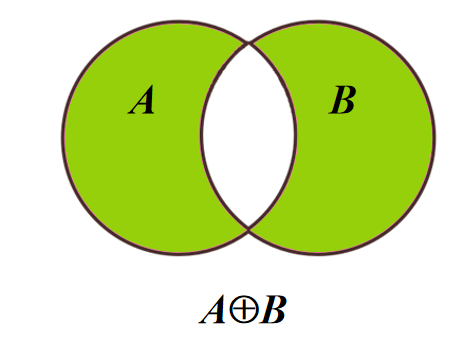
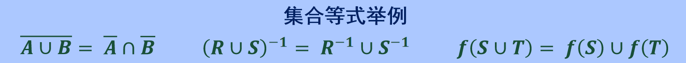
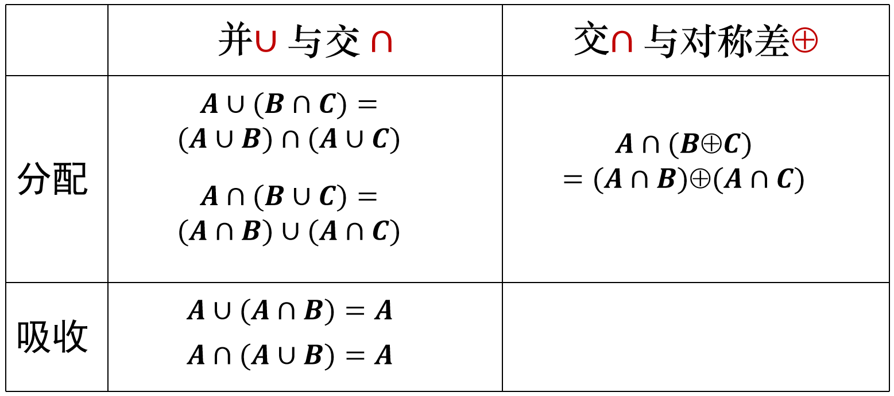
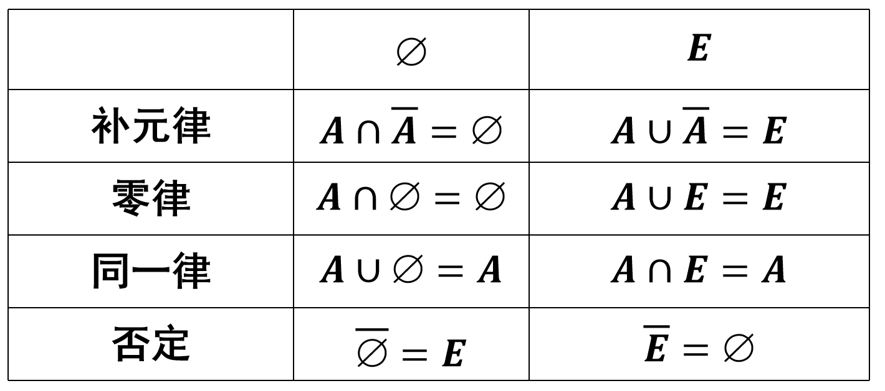

# 命题与逻辑符号
* 命题：对某个事物进行判断，有**真假值**的**陈述句**

* 逻辑连结词：`与∧`，`或∨`，`非¬`，`蕴涵(如果,那么)→`，`双蕴涵(等价于)⟷`

* 量词：`∀x，对每一个、所有x`，`∃x，存在x`

* 恒真：`⟹表示→关系恒真`，`⟺:表示⟷关系恒真`（A⟺B表示A与B要么同时为真，要么同时为假）

* “只要一个年份是400的倍数，则它是闰年”
    * **复合命题**，且是**逻辑蕴含命题**

    * "一个年份是400的倍数"是"它是闰年"的充分条件，符号化为`p→q`
        > 充分条件：有甲这个条件一定会推出乙这个结果，有乙这个结果不一定是甲这唯一个条件

        > 必要条件：有甲这个条件不一定能推出乙这个结果，但乙这个结果一定要有甲这个条件

# 集合并交差
* 集合交：$A∩B={x|x∈A∧x∈B}$
    * 对任意$x$，$x∈A∩B$当且仅当$x∈A∧x∈B$

* 集合并：$A∪B={x|x∈A∨x∈B}$
    * 对任意$x$，$x∈A∪B$当且仅当$x∈A∨x∈B$

* 集合差：$A-B={x|x∈A∧x∉B}$
    * 对任意$x$，$x∈A-B$当且仅当$x∈A∧x∉B$

* 集合补：$\bar{A}$或$\sim A=U-A=\{x|x∉A\}$
    * 对任意$x$，$x∈\bar A$当且仅当$x∉A$

* 对称差：$A⊕B=(A-B)∪(B-A)$

        

* 德摩根定律
    * $\overline{A \cup B} = \bar{A} \cap \bar{B}$

    * $\overline{A \cap B} = \bar{A} \cup \bar{B}$ 

# 广义交与广义并
* 设A是集合族（即A的元素都是集合）
    * 集合族A的广义交：$⋂A=\{x|∀S∈A,x∈S\}$
        * 即属于A的**每个**集合的元素构成广义交集合$⋂A$
    
    * 集合族A的广义并：$⋃A=\{x|∃S∈A,x∈S\}$
        * 即属于A的**某个**集合的元素构成广义并集合$⋃A$
    
    * 若集合族A由有限个集合构成，例如A={A1,A2,...An},则:
        * ⋂A=A1⋂A2⋂...⋂An
    
        * ⋃A=A1⋃A2⋃...⋃An

# 幂集
* 幂集P(A)：A的所有子集组成的集合，即`P(A)={x|x⊆A}`

    

* 如果|A|=n,则|P(A)|=2^n

            

            

# 集合等式
* 集合等式就是断定两种不同形式定义或表达的集合相等

    

* 集合算律
    1. 只涉及一个运算的算符：交换律、结合律、幂等律

            

    2. 只涉及二个运算的算符：分配律、吸收率

            

    3. 只涉及三个运算的算符：德摩根律、双重否定律

            

    4. 涉及全集和空集的算律：补元律、零律、同一律、否定律

            
