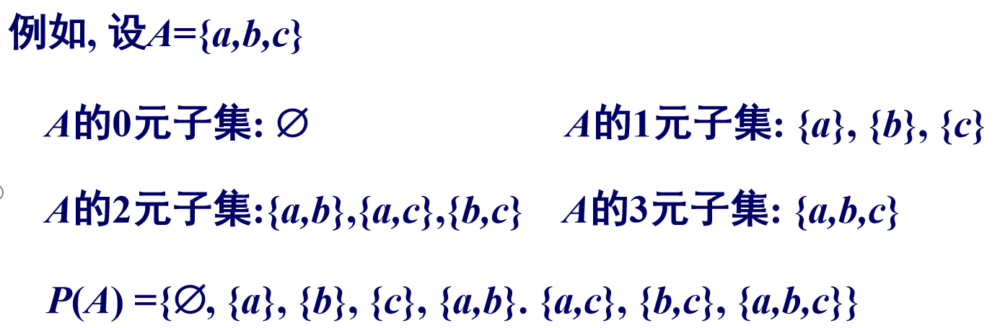
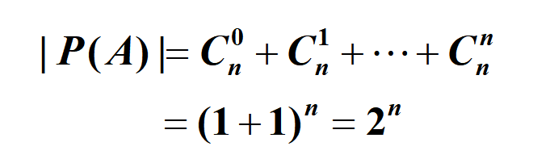
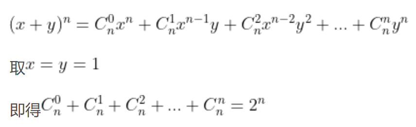

# 命题与逻辑符号
* 命题：对某个事物进行判断，有真假值的陈述句

* 逻辑公式：符号化的命题
    * 逻辑连结词：`与∧`，`或∨`，`非¬`，`蕴涵(如果,那么)→`，`双蕴涵(等价于)⟷`

    * 量词：`∀x，对每一个、所有x`，`∃x，存在x`
    
    * 恒真：`⟹表示→关系恒真`，`⟺:表示⟷关系恒真`
        * A⟺B表示A与B要么同时为真，要么同时为假
    
    * “只要一个年份是400的倍数，则它是闰年”
        * 这个命题的真值为真
    
        * 复合命题，且是逻辑蕴含命题
    
        * "一个年份是400的倍数"是"它是闰年"的充分条件
            * 符号化为`p→q`
    
    * 当A={f(x)|P(x)}时，对论域的任意元素x，若P(x)为真，则总有f(x)∈A，但当f(x)∈A时，不一定P(x)为真，要看函数f的性质
        * 如`A={x^2|0≤x≤5}`

# 集合并交差运算
* 集合交：`A∩B={x|x∈A∧x∈B}`
    * 对任意x，x∈A∩B当且仅当x∈A∧x∈B

* 集合并：`A∪B={x|x∈A∨x∈B}`
    * 对任意x，x∈A∪B当且仅当x∈A∨x∈B

* 集合差：`A-B={x|x∈A∧x∉B}`
    * 对任意x，x∈A-B当且仅当X∈A∧x∉B

* 集合补：`¯A或~A=U-A={x|x∉A}`
    * 对任意x，x∈¯A当且仅当x∉A

* 对称差：`A⊕B=(A-B)∪(B-A)`

        

# 广义交与广义并
* 设A是集合族（即A的元素都是集合）
    * 集合族A的广义交`⋂A={x|∀S∈A,x∈S}`
        * 即属于A的**每个**集合的元素构成广义交集合`⋂A`

        * `∀S∈A,x∈S`含义:∀S(S∈A→x∈S)
    
    * 集合族A的广义并`⋃A={x|∃S∈A,x∈S}`
        * 即属于A的**某个**集合的元素构成广义并集合`⋃A`
    
        * `∃S∈A，x∈S`含义:∃S(S∈A∧x∈S)
    
    * 若集合族A由有限个集合构成,例如A={A1,A2,...An},则:
        * ⋂A=A1⋂A2⋂...⋂An
    
        * ⋃A=A1⋃A2⋃...⋃An

# 幂集
* 幂集P(A)：A的所有子集组成的集合，即`P(A)={x|x⊆A}`

    

* 如果|A|=n,则|P(A)|=2^n

            

            

# 集合等式
* 集合等式就是断定两种不同形式定义或表达的集合相等

    

* 集合算律
    1. 只涉及一个运算的算符：交换律、结合律、幂等律

            

    2. 只涉及二个运算的算符：分配律、吸收率

            

    3. 只涉及三个运算的算符：德摩根律、双重否定律

            

    4. 涉及全集和空集的算律：补元律、零律、同一律、否定律

            
