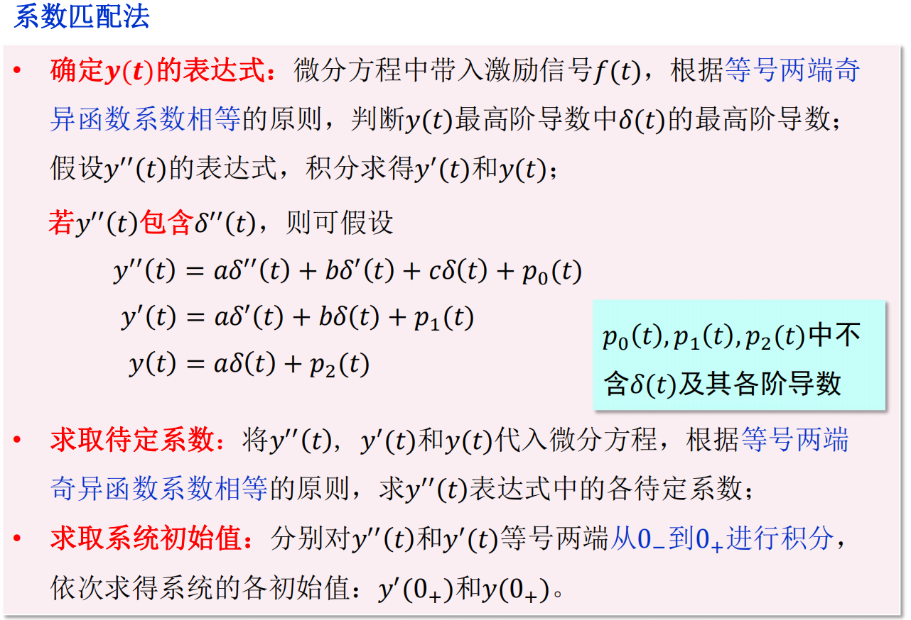

# 各种响应定义
* 1.自由响应：也叫固有响应。由系统本身特性决定，和外加激励无关，对应于齐次解

* 1.强迫响应：形式取决于外加激励，对应于特解

* 2.暂态响应：指激励信号接入一段时间内，完全响应暂时出现的有关成分，随着时间$t$的增加，它将消失

* 2.稳态响应：由完全响应中减去暂态响应分量得到稳态响应分量

* 3.零输入响应：**没有外加激励信号**的作用，只由起始状态（起始时刻系统储能）所产生的响应

* 3.零状态响应：不考虑原始时刻系统储能的作用（起始状态等于零），由系统的外加激励信号产生的响应

* 系统的完全响应=零输入响应+零状态响应
    * 系统的**零输入响应**，是求系统方程的**齐次解**。由非零的系统状态值$u_c(0^-)$和$i_L(0^-)$决定的初始值求出**待定系数**

    * 系统的**零状态响应**，是在激励作用下求系统方程的**非齐次解**，由状态值$u_c(0^-)$和$i_L(0^-)$为**零**决定的初始值求出待定系数

# 对系统线性的进一步认识
* 由常系数微分方程描述的系统在下述意义下是线性的
    1. 响应可分解为：零输入响应+零状态响应

    2. 零状态线性：当起始状态为零时，系统的零状态响应对于各激励信号呈线性

    3. 零输入线性：当激励为零时，系统的零输入响应对于各起始状态呈线性

