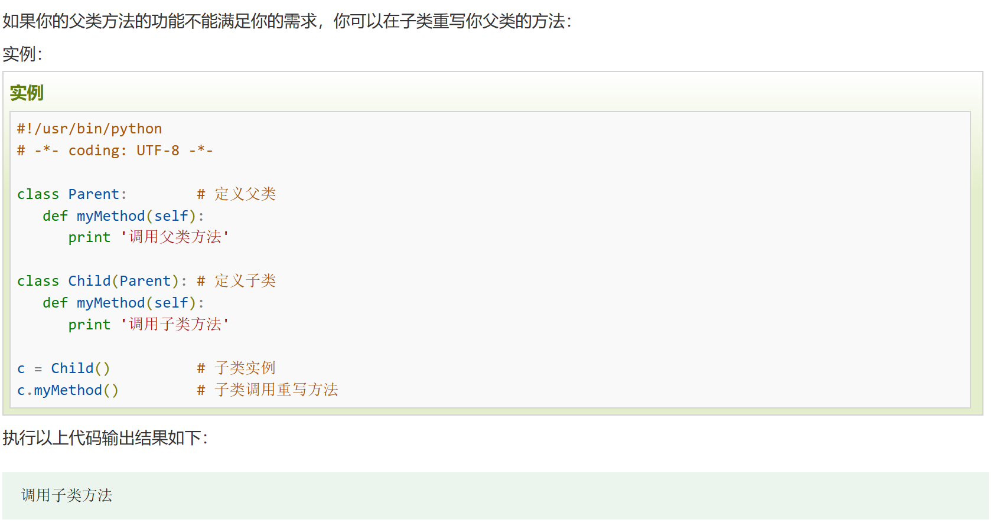

* 创建类
    ```python
    class ClassName:
        ......
    ```
    * self代表类的实例，代表当前对象的地址，而`__class__`用于查看当前对象的类
    * self不是python关键字，可以把self更改而不影响运行
    ```python
    class ClassName:
        def prt(self):
            print(self)
            print(self.__class__)
    t=ClassName()
    t.prt()
    ```     
* 创建实例对象
    * 使用类名称来实例化，并通过`__init__`方法接收参数
    ```python
    obj1=ClassName("John",'18')
    ```    
    * 使用点号`.`访问对象的属性
    ```python
    obj1.PrintName()
    ```
    * 可更改，添加和删除对象的属性
    ```python
    obj.name='D5'    #对对象添加一个‘name’属性
    obj.name='R2'    #修改‘name’属性
    del obj.name     #删除‘name’属性
    ```    
* python对象销毁（垃圾回收）
          
    * 析构函数`__del__`在对象销毁时被调用，当对象不再被使用时`__del__`方法运行
* 类的继承
    ```python
    class 派生类名(基类名):
        ......
    ```
    1. 如果在子类中需要父类的构造方法就需要显式的调用父类的构造方法，或者不重写父类的构造方法
        1. 子类需要自动调用父类的方法：子类不重写`__init__()`，实例化子类后会自动调用父类的`__init__()`
        2. 子类不需要自动调用父类的方法：子类重写`__init__()`，实例化子类后不会自动调用父类的`__init__()`
        3. 子类重写`__init__()`又需要调用父类的方法：使用`super`关键词或经典写法：
        ```python
        class Son(Father):
            def __init__(self, name,age):   
                super(Son,self).__init__(name,age)#两个选一个
                Father.__init__(self,name,age)#两个选一个
        ```    
    2. Python总是首先查找对应类型的方法，如果它不能在派生类中找到对应的方法，它才开始到基类中逐个查找
    3. 如果在继承元组中列了一个以上的类，那么它被称为‘多重继承’
    ```python
    class SUbClassName(ParentClass1[,ParentClass2,......])
    ```    
* 方法重写
        
* 运算符重载
        
* 类属性与方法
    * 类的私有属性：`__privateAttrs`两个下划线开头，声明该属性为私有，在类内部的方法中使用时`self.__privateAttrs`
    * 类的方法：使用`def`定义一个方法，类方法必须包含第一个参数`self`，可取其他字符
    * 类的私有方法：`__privateMethods`两个下划线开头，声明该方法为私有，在类内部调用`self.__privateMethods`
    * python不允许对象访问私有数据，但可使用`对象名._类名__私有属性名`访问属性
    * 单下划线、双下划线、头尾双下划线说明：
        
