# 频率响应的一般概念

* 由于放大电路中存在**电抗元件**（如管子的极间电容，电路的负载电容、分布电容、耦合电容、射极旁路电容等），当信号频率**过高或过低**时，不但放大倍数会变变小，而且会产生超前或滞后的相移，使得放大电路对**不同频率信号分量**的放大倍数和相移都不同

1. 幅度失真：放大电路对不同频率信号的幅值放大不同

    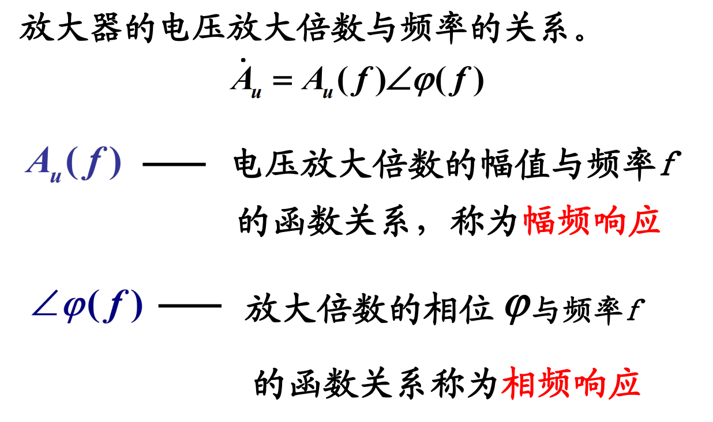

2. 相位失真

    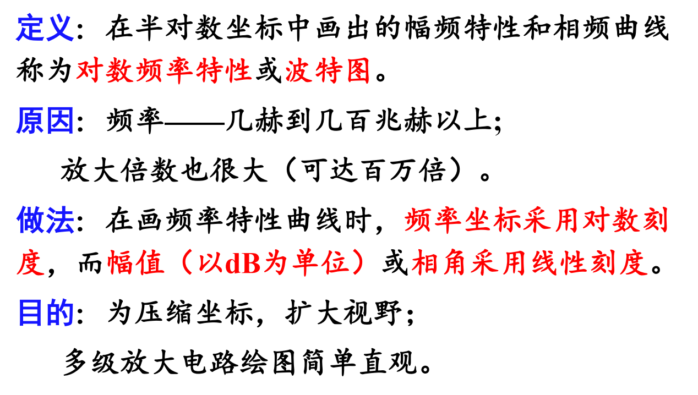

3. 产生线性失真的原因
    1. 放大电路中存在电抗性组件

    2. 放大倍数$\beta(\omega)$是频率的函数

    3. 电路中存在着电抗器件是影响频率的主要因素，研究频响实际上是研究电抗元件对放大器倍数的影响
        > 当$f$低时，主要是耦合电容，旁路电容起作用

        > 当$f$高时，主要是PN结电容和分布电容起作用

4. 线性失真和非线性失真
    1. 起因不同：
        > 线性失真是由电路中的线性电抗元件**对不同信号频率的响应不同**而引起的（也称频率失真）
    
        > 非线性失真由电路中非线性元件的非线性特性（如BJT，FET的特性曲线）引起的 

    2. 结果不同：
        > 线性失真只会使各**频率分量信号的比例关系和时间关系发生变化，或滤掉某些频率分量的信号**
        
        > 非线性失真会将正弦波变为非正弦波，它**不仅包含输入信号的频率成分**，**而且还产生许多新的谐波成分**

5. 频率响应（频率特性）
    * 放大器的电压放大倍数与频率的关系：$\dot{A_u}=A_u(f)\angle \phi (f)$
        > $A_u(f)$：电压放大倍数的幅值与频率$f$的函数关系，称为**幅频响应**

        > $\angle\phi(f)$：电压放大倍数的相位$\phi$与频率$f$的函数关系称为**相频响应**

6. 波特图
    * 定义：在半对数坐标中画出幅频特性和相频特性曲线称为**对数频率特性**或**波特图**

    * 做法：在画频率特性曲线时，**频率坐标采用对数刻度**，**而幅值（以$dB$为单位）**或**相角采用线性刻度**

    

7. 瞬态响应对频率响应的估计
    * 瞬态法：通过在时域分析中研究放大电路瞬态响应（如阶跃响应），研究放大电路的频率特性的方法

        

    * 小结：
        1. $f_L$和$f_H$大小均取决于$C$所在回路的时间常数$\tau$

        2. $f_H$越大，$t_r$越小，放大电路**高频特性**越好

        3. $f_L$越低，$\delta$越小，放大电路**低频特性**越好

        4. 频率响应和阶跃响应分别从**频域**和**时域**两个角度描述同一个电路模型的放大能力，从而得出不同的指标

# 单时间常数RC电路的频率响应
1. RC低通电路的频率响应
    * 在放大电路的高频区，影响频率响应的主要因素是**管子的极间电容和接线电容等**，它们在电路中与其它支路是**并联的**。它们对高频响应的影响可用RC低通电路来模拟

        

    * 极间电容（**似乎也叫结电容**）：二极管的**极间电容**包括**势垒电容**和**扩散电容**两部分
        1. 势垒电容$C_B$
            > 由PN结的空间电荷区（耗尽层）形成，它与PN结面积S成正比，与耗尽层厚度成反比
            
            > 反向偏置电压增加，$C_B$减小，正向偏置电压增加，$C_B$增大，$C_B$是非线性电容，电路上$C_B$与结电阻并联
            
            > **势垒电容在反向偏置时十分重要。在PN结反偏时结电阻很大，但$C_B$的作用不能忽视，特别在高频时，它对电路有较大的影响**

        2. 扩散电容$C_D$
            > 积累在P区的电子或积累在N区的空穴随外加电压的变化而构成了PN结的扩散电容$C_D$
            
            > $C_D$是非线性电容PN结正偏时$C_D$较大，**反偏时载流子数目很少，因此反向时扩散电容数值很小，一般可忽略**
    
    * 由于PN结极间电容（$C_B$和$C_D$）的存在，使其在**高频运用**时，**必须考虑极间电容的影响**。

        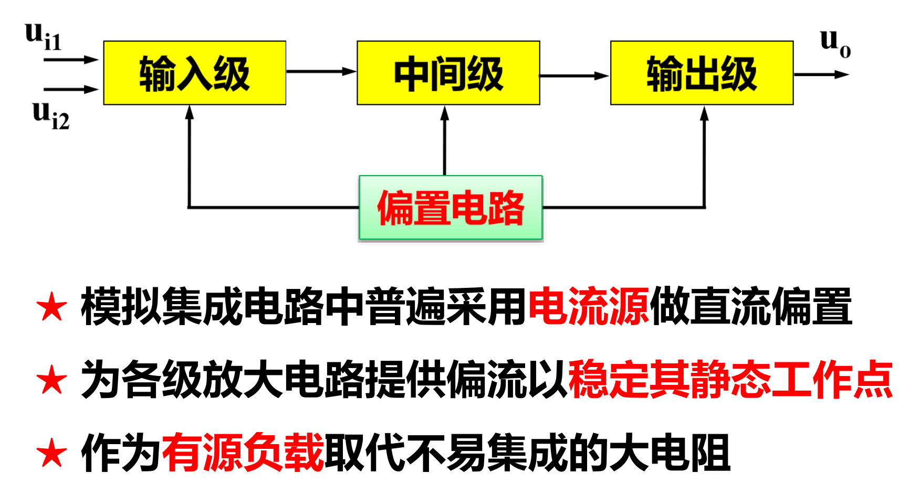
    
    1. 电压放大倍数
        > 电容的阻抗公式：$Z=\frac{1}{j\omega C}$

        $$
        \dot{A}_{uH}(s)=\frac{\dot{u_o}(s)}{\dot{u_i}(s)}=\frac{1/sC_1}{R_1+1/sC_1}=\frac{1}{1+sR_1C_1}
        \\~\\
        \\稳态分析时：令s=j\omega=j2\pi f
        $$

        

    2. 时间常数
        $$
        \tau_h=R_1 C_1\\
        ~\\
        截止频率f_H=\frac{1}{2\pi \tau_h}=\frac{1}{2\pi R_1 C_1}
        $$

        

    3. 幅频响应
        $$
        {A}_{uH}(s)=|\dot{A}_{uH}(s)|=\frac{1}{\sqrt{1+(\frac{f}{f_h})^2}}
        $$
            
        

    4. 相频响应

    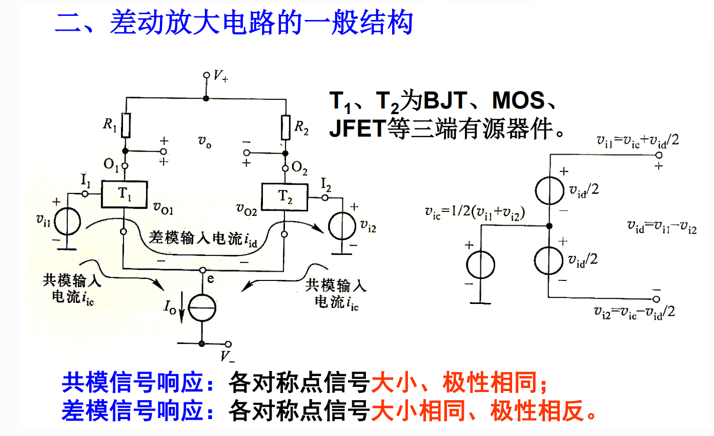

    5. 幅频响应的折线近似画法

    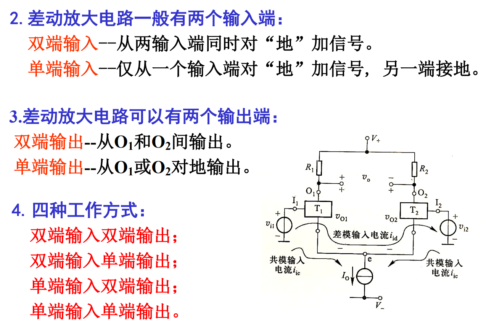

    6. 相频响应的折线近似画法

    

    7. 低通电路结论

        > $f_H$为截止频率

    

2. RC高通电路的频率响应

    

    1. 电压放大倍数

        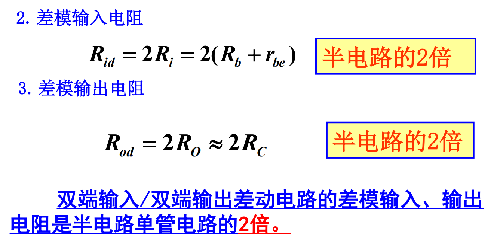

    2. 时间常数
        * $\tau_L=R_2C_2$

        * 截止频率：$f_L=\frac1{2\pi\tau_L}=\frac{1}{2\pi R_2C_2}$

        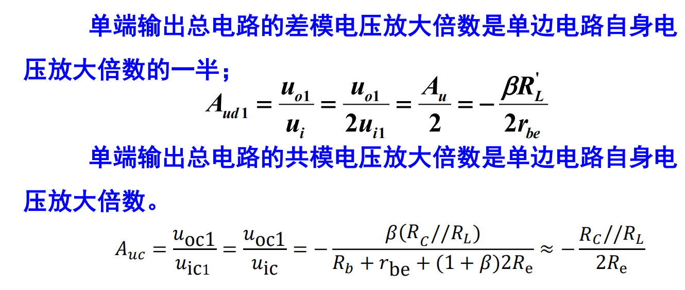

    3. 幅频响应

        

    4. 相频响应

        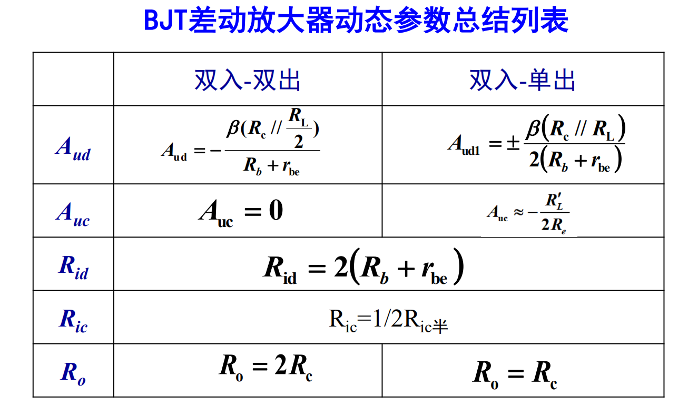

    5. 对数幅频特性

        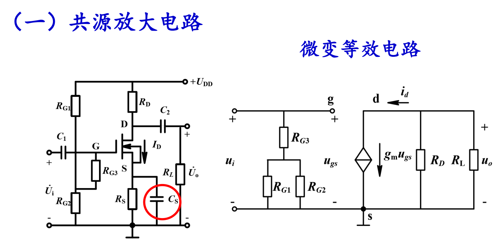

    6. 对数相频特性

        

    7. 高通电路结论

        

# 单极放大电路的频率响应
* 中频段：各种容抗忽略不计

* 低频段：隔直耦合电容的影响使电压放大倍数降低，同时**隔直电容与电阻构成RC高通电路**，产生$0\sim 90\degree$的超前相位差

* 高频段：三极管极间电容的影响使电压放大倍数降低，同时**极间电容与电阻构成RC低通电路**，产生$0\sim -90\degree$的滞后相位差

1. BJT高频小信号模型的提出

    

    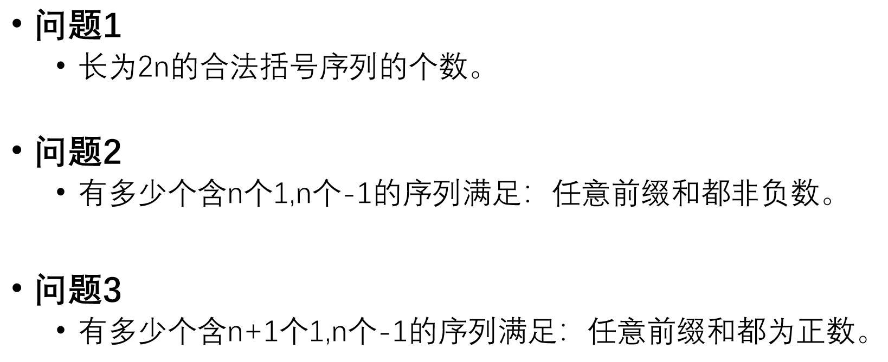

    

    

2. 共射极电路的高频响应

    

    1. 密勒定理

        

        

        > $C$变成$C_1$和$C_2$，$C_1$相对$C$放大，$C_2$相对$C$几乎不变

        

        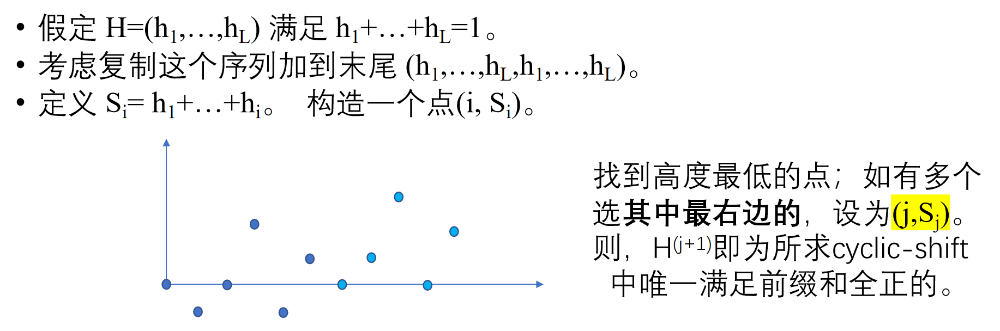

    2. 共射极高频等效电路

        

    3. 高频响应与上限频率

        

        

    4. 共射放大电路高频段的波特图

        

3. 单极放大器的低频响应
    
    

    

4. 增益带宽积

    

5. 阻容耦合单管共射放大电路的中频响应
    1. 中频段

        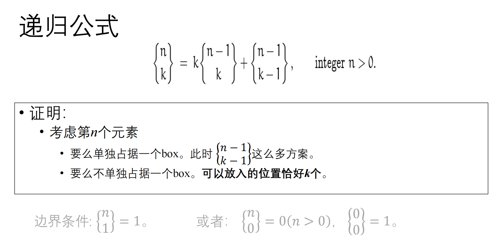

6. 完整的共射放大电路的频率响应

    

# 多级放大电路的频率响应
1. 多级放大电路的幅频特性和相频特性

    

    

2. 多级放大电路的上限频率和下限频率

    

    * 例题：
    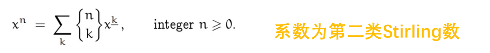
    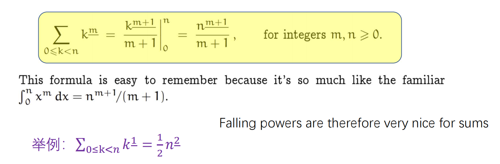

# 频率响应小结

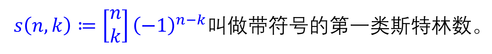

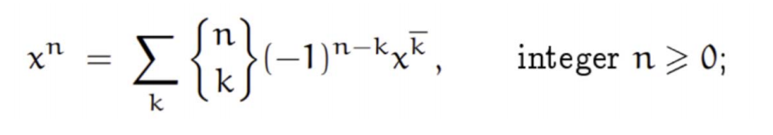
