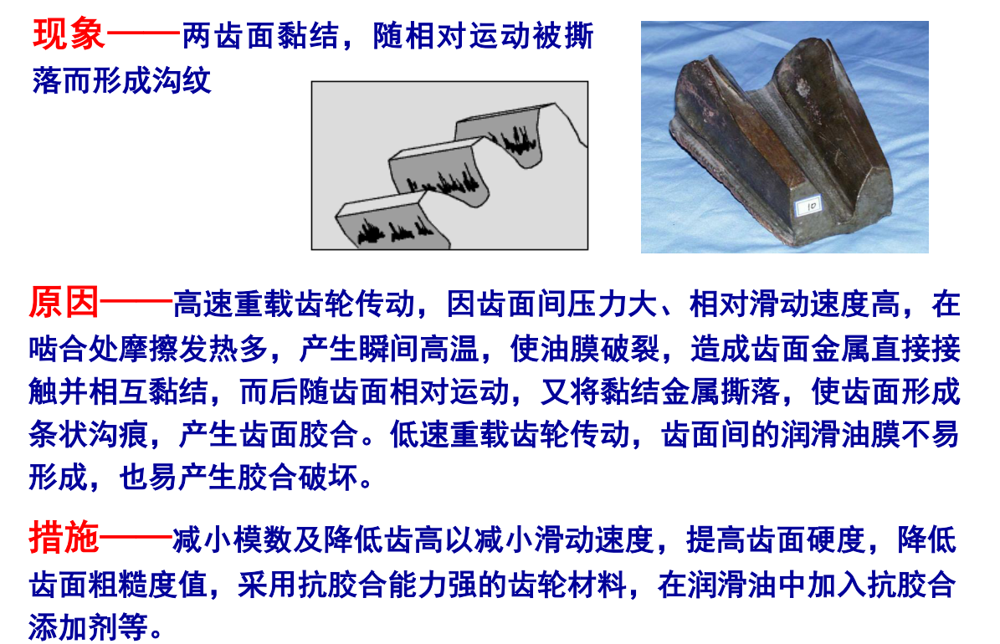

# 轮齿的失效形式和设计计算准则
* 齿轮的失效形式
    1. 轮齿折断

        

    2. 齿面点蚀

        

    3. 齿面胶合

        

    4. 齿面磨损

        

    5. 齿面塑性变形

        

* 齿轮设计计算准则
    * 闭式齿轮：通常都是装在经过精确加工且封闭严密的箱体（齿轮箱）内，或全部侵入油池中

        

    * 开式齿轮：齿轮完全暴露在空气中，没有加防尘罩或机壳之类的保护装置

        
