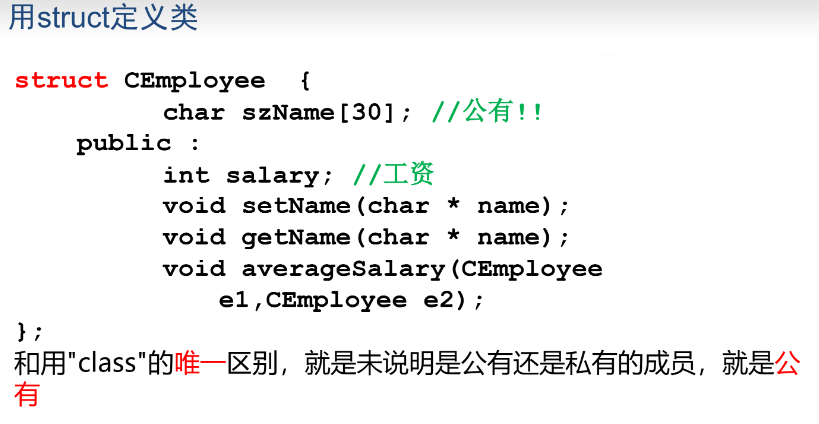
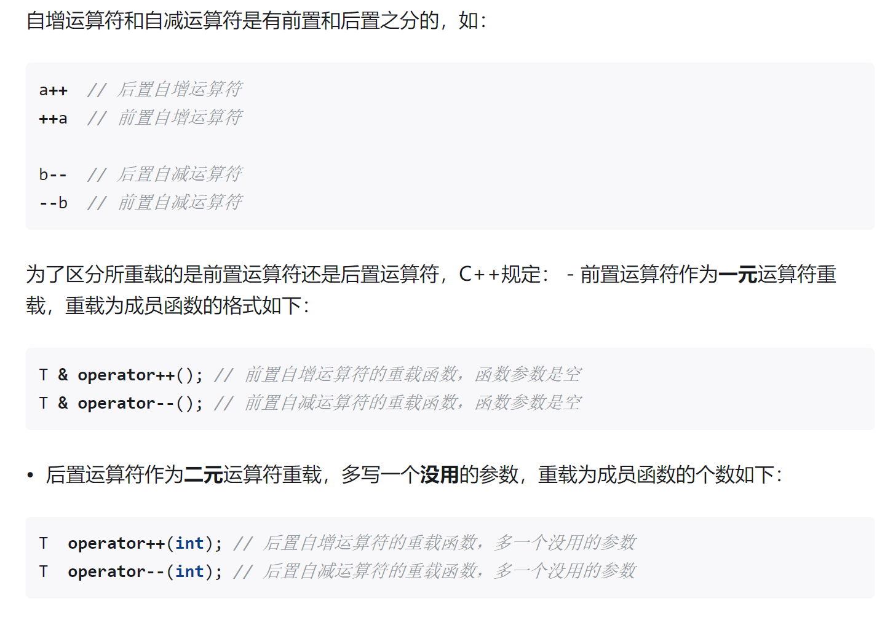

# C++

## 从C到C++

### 引用

#### 引用的概念

`类型名 &应用名=某变量名;`

* 某个变量的引用，等价于这个变量，相当于该变量的一个**别名**

* 定义引用时一定要将其**初始化成引用某个变量**

* 初始化后，它就一直引用该变量，**不会再引用别的变量了**

* 引用只能引用变量，不能引用常量和表达式

##### 引用的应用

###### 交换
```cpp
void swap(int &a, int &b)
{
    int tmp = a;
    a = b;
    b = tmp;
}
int n1, n2;
swap(n1, n2);
```

###### 函数的返回值

```cpp
#include<iostream>
using namespace std;
int n=4;
int &SetValue()
{
    return n;
}
int main()
{
    SetValue()=40;
    cout<<n;    //输出：40
    return 0;
}
```

###### 常引用
* 不能通过常引用去修改其引用的内容

* T&类型的引用或T类型的变量可初始化const T&类型的引用

* const T类型的常变量或const T&类型的引用**不能初始化T&类型的引用**，除非进行强制类型转换


### const关键字

##### const
* 定义常量
    ```cpp
    const int MAX=23;
    const string NAME="D5error";
    ```

* 定义常量指针
    * 不可通过常量指针修改其指向的内容
    
    * 不可把常量指针赋值给非常量指针,反之可以

    ```c
    int n,m;
    const int *p=&n;
    p=&m;    // 常量指针的指向可以变化
    ```

* 定义常引用

    * 不能通过常引用修改其引用的变量

```c
int n;
const int &p=n;
```

### 动态内存分配

#### new运算符

##### 分配一个变量
* `P=new T;`

* T是任意类型名，P是类型为T*的**指针**

* 动态分配出一片大小为sizeof(T)字节的内存空间，并将该内存空间的起始地址赋值给P

##### 分配一个数组
* `P=new T[N];`

* T是任意类型名，P是类型为T*的指针，N是要分配的数组元素的个数，可为表达式

* 动态分配出一片大小为sizeof(T)*N字节的内存空间，并将该内存空间的起始地点赋值给P

##### delete运算符

* 用`new`动态分配的内存空间，**一定要用`delete`运算符进行释放**

##### 释放一个变量

```c
int *P=new int;
*P=5;
delete P;
```

##### 释放一个数组
```c
int *P=new int[20];
P[0]=1;
delete[] P;
```

### 内联函数和重载函数参数缺省值

#### 内联函数
* 编译器处理对内联函数的调用语句时，是将**整个函数的代码插入到调用语句处**，而不会产生调用函数的语句

```c
inline int Max(int a,int b)
{
    if(a>b)
    {
        return a;
    }
    return b;
}
```

#### 函数重载

* 一个或多个函数，名字相同，然而参数个数或参数类型不相同，叫函数的重载
    * `int Max(double a1,double a2){}`
    
    * `int Max(int b1,int b2){}`
    
    * `int Max(int n1,int n2,int n3){}`

#### 函数的缺省参数

* 定义函数时，最右边的连续若干个参数有缺省值，调用函数时相应位置不写参数，此时参数为缺省值

`void func(int x1, int x2=2,int x3=3){}`

## 类和对象基础

### 类和对象基本概念

#### 类
* 和结构体一样，花括号结尾**必须有分号**

```c
class CRectangle
{
    public:
        int w,h;
        int Area()
        {
            return w*h;
        }
        int Perimeter()
        {
            return 2*(w+h);
        }
        void Init(int W_,int h_)
        {
            w=w_;
            h=h_;
        }
};
```

#### 对象
* 通过类定义出来的变量，为**类的实例**，即对象

* 对象所占用的内存空间的大小，等于所有成员变量的大小**之和**

* 每个对象的某个成员变量发生改变，不会影响到另一个对象

* 对象之间可用`=`进行赋值

* 用法
    * 对象名.成员名

    * 指针->成员名

    * 引用名.成员名

* 类成员可访问的范围
    ```c
    class className
    {
        private:    //私有成员，只能在成员函数内访问
            私有属性和函数
        public:    //公有成员，可以在任何地方访问
            公有属性和函数
        protected:    //保护成员，只能在本类和派生类的成员函数内访问
            保护属性和函数
    };
    ```

    * 若某个成员前面没有上述关键字，**则缺省为私有成员**

    * 类的成员函数内部可访问当前对象的全部属性和函数，及同类其他对象的全部属性和函数
    * 在类的成员函数以外的地方，**只能访问该类对象的公有成员**

    

#### 成员函数的重载及参数缺省
* 成员函数可以重载

* 成员函数可以带缺省参数

* 声明了一个类A，类A里声明了一个成员函数`void f()`，**但没有在类的声明里给出f的定义**，那么在类外定义f时，**就要写成`void A::f()`**，表示这个`f()`函数是类A的成员函数

### 构造函数

* 成员函数的一种
    * 名字与类名相同，可以有参数，**不能有返回值**（void也不行）
    
    * 作用是**将对象进行初始化**，如给成员变量赋值
    
    * 如果定义类时没写构造函数，则编译器**生成一个默认的无参数**的构造函数，默认构造函数**不做任何操作**
    
    * 如果定义了构造函数，则编译器**不生成默认的无参数的构造函数**
    
    * 对象生成时构造函数自动被调用，对象一旦生成，就再也不能在其上执行构造函数

    * 一个类可以有多个构造函数，**参数个数或类型不同**
    
    * 构造函数最好是public，private构造函数不能直接用来初始化对象（待定）

```cpp
class Complex
{
    private:
        double real,imag;
    public:
        void Set(double r,double i);
};
Complex c1;    //默认构造函数被调用
Complex *pc=new Complex;    //默认构造函数被调用
```

```cpp
class Complex
{
    private:
        double real,imag;
    public:
        Complex(double r,double i=0);
};
Complex::Complex(double r,double i)
{
    real=r;
    imag=i;
}
Complex c1(2);    //自定义构造函数被调用
Complex c2(2,4);        //自定义构造函数被调用
Complex *pc=new Complex(3,4);        //自定义构造函数被调用
Complex c3[2]={Complex(1,2),Complex(3,4)};        //自定义构造函数被调用
```

### 复制构造函数

#### 复制构造函数概念
* 只有一个参数，即对同类对象的引用
    * `X::(X &)`或`X::(const X &)`

* 如果没有定义复制构造函数，编译器**生成默认复制构造函数**，默认的复制构造函数完成复制功能

* 若定义的自己的复制构造函数，**则默认的复制构造函数不存在**

* **不允许有形如`X::X(X)`的复制构造函数**

```c
class Complex
{
    private:
        double real,imag;
};
Complex c1;    //调用缺省无参构造函数
Complex c2(c1);    //调用缺省的复制函数,将c2初始化和c1一样
```

#### 复制构造函数起作用的三种情况

* 当用一个对象去初始化同类的另一个对象时

```c
Complex c2(c1);    //复制构造函数被调用
Complex c2=c1;    //初始化语句，复制构造函数被调用，而非幅值
```

* 如果某个函数有一个参数是类A的对象，那么该函数被调用时，类A的复制构造函数将被调用

* 从实参传递到形参中，复制函数会起作用，即调用形参的复制构造函数将实参复制到形参上，除非将形参的类型改成引用或指针


```cpp
class A
{
    public:
        A(){};
        A(A &a)
        {
            cout<<"Copy constructor called"<<endl;
        }
};
void Func1(A a1){}
void Func2(A &a1){}
int main()
{
    A a2;
    Func1(a2);
    Func2(a2);
    return 0;
}
```

* 如果函数的返回值是类A对象时，**则函数返回时，A的复制构造函数被调用**

```c
A Func()
{
    A b(4);
    return b;
}
```

* 对象间赋值并不导致复制构造函数被调用，就是简单的赋值

### 类型转换构造函数
* **只有一个参数，而且不是复制构造函数的构造函数**，一般就可以看作是类型转换构造函数

* 当需要时，编译系统会自动调用转换构造函数，**建立一个无名的临时对象（或临时变量）**，如`Complex obj=9;`

```c
class Complex
{
    public:
        double real,imag;
        Complex(int i)
        {
            cout<<"IntConstrutor called"<<endl;
            real=i;
            imag=0;
        }
        Complex(double r,double i)
        {
            real=r;
            imag=i;
        }
};
int main()
{
    Complex c1(7,8);
    Complex c2=12;
    c1=9;    //9被自动转换成一个临时Complex对象
    cout<<c1.real<<","<<c1.imag<<endl;
    return 0;
}
```

### 析构函数

* 名字与类名相同，在前面加`~`，没有参数和返回值，**一个类最多只能有一个析构函数**，析构函数在对象消亡时自动调用

* 若定义类时无析构函数，**则编译器生成缺省析构函数，缺省析构函数什么都不做**

* 若定义了析构函数，则编译器不生成缺省析构函数

```c
class String
{
    private:
        char *p;
    public:
        String()
        {
            p=new char[10];
        }
        ~String()
};
String::~String()
{
    delete []p;
}
```

* 对象数组生命期结束时，对象数组的**每个元素**的析构函数都会被调用

* **参数对象**消亡也会导致析构函数被调用

* 函数调用的**返回值**（临时对象）被用过后，该临时对象析构函数被调用

### 构造函数析构函数调用时机

```cpp
class Demo
{
        int id;
    public:
        Demo(int i)
        {
            id=i;
            cout<<"id="<<id<<" constructed"<<endl;
        }
        ~Demo()
        {
            cout<<"id="<<id<<" desstructed"<<endl;
        }
};
void Func()
{
    cout<<"func starts"<<endl;
    static Demo d2(2);
    Demo d3(3);
    cout<<"func ends"<<endl;
}
Demo d1(1);
int main()
{
    cout<<"main starts"<<endl;
    Demo d4(4);
    d4=6;
    {
        Demo d5(5);
    }
    Func();
    cout<<"main ends"<<endl;
}
```

```c
int main()
{
    A *p=new A[2];
    A *p2=new A;
    A a;
    delete []p;
}
```

* 类A的析构函数将调用3次：new出的对象只有用delete删去才会调用析构函数

## 类和对象提高

### this指针

```cpp
//CPP
class C
{
    pubilc:
        int x;
        void func(int a);
};
void C::func(int a)
{
    x=a;
}
int main()
{
    C obj;
    obj.func(1);
    return 0;
}
```

```c
//C
struct C
{
    int x;
};
void func(struct C *this,int a)
{
    this->x=a;
}
int main()
{
    struct C obj;
    func(&obj,1);
    return 0;
}
```
* 其作用就是指向成员函数所作用的对象

* **非静态成员函数**中可以**直接**使用this来代表指向该函数作用的对象的指针

* 静态成员函数中不能使用this指针，因为静态成员函数并不具体作用于某个对象

* 用处：但函数里定义的变量名等于成员变量名时，可使用this指针对同名的成员变量进行操作

### 静态成员变量

#### 静态成员变量概念
* 静态成员：在定义前面加了static关键字的成员

* 普通成员变量每个对象各自拥有一份，**而静态成员变量总共一份，为所有对象共享**

* sizeof运算符不会计算静态成员变量

* 静态成员变量本质上是全局变量，哪怕一个对象都不存在，**类的静态成员也存在**

* 必须在定义类的文件中对静态成员变量进行一次说明或初始化,否则编译能通过,链接不能通过

```cpp
class CMyclass
{
    int n;
    static int s;
    static void func();
};
```

#### 静态成员函数
* 普通成员函数必须具体作用于某个对象，而静态成员函数并不具体作用于某个对象

* 静态成员不需要通过对象就能访问

* 静态成员函数没有this指针，**只能访问静态成员**（包括静态成员变量和静态成员函数）

* 静态成员函数本质上是全局函数
* 在静态成员函数中，**不能访问非静态成员变量，也不能调用非静态成员函数**

#### 如何访问静态成员
* 类名::成员名，`CRectangle::PrintTotal();`

* 对象名.成员名，`CRectange r; r.PrintTotal();`

* 指针->成员名，`CRectange *p=&r; p->PrintTotal();`

* 引用.成员名，`CRectange &ref=r; int n=ref.nTotalNumber;`

### 成员对象和封闭类

* 有成员对象的类叫封闭类

```c
class CA
{
    public:
        int a;
        CA(int i):a(i){}
};
class CB
{
    public:
        int b;
};
class CC
{
    private:
        int x;
        CA obj1;
        CB obj2;
    public:
        CC(int a,int b,int c):obj1(a),obj2(b),x(c){}
        void Print()
        {
            cout<<obj1.a<<endl;
            cout<<obj2.b<<endl;
            cout<<x<<endl;
        }
};
int main()
{
    CC obj(1,2,3);
    obj.Print();
    return 0;
}
```

* 如果CC类不定义构造和拿书，则下面语句会报错`CC obj;`，因为编译器不明白obj1该如何初始化。而obj2的初始化没问题，因为有默认的构造函数

* 任何生成封闭类对象的语句，都要让编译器明白，对象中的成员对象，是如何初始化的

* 具体的做法是：通过封闭类的构造函数的初始化列表

* 成员对象的初始化列表中的参数可以是任意复杂的表达式，可以包括函数，变量，只要表达式中的函数或变量有定义就行

* 封闭类对象生成时，先执行所有对象成员的构造函数，然后才执行封闭类的构造函数

* 对象成员的构造函数**调用次序和对象成员在类中的说明次序一致**，与它们在成员初始化列表中出现的次序**无关**

* 当封闭类的对象消亡时，先执行封闭类的析构函数，然后再执行成员对象的析构函数，**次序和构造函数的调用次序相反**

### 常量对象和常量成员函数

* 如果不希望某个对象的值被改变，则定义该对象的时候可以在前面加const关键字

* 对于常量对象**只能使用**构造函数，析构函数和有const说明的函数

* 在类的成员函数说明后面可以加const关键字，则该成员函数成为常量成员函数

* 常量成员函数内部**不能改变属性的值，也不能调用非常量成员函数**

```cpp
class Sample
{
    private:
        int value;
    public:
        void func(){};
        Sample(){};
        void SetValue()const{};
};
```

* 在定义常量成员函数和声明常量成员函数时**都要使用const关键字**

* 两个函数，名字和参数表都一样，但一个有const，**算重载**

### 友元

* 友元分为友元函数和友元类两种

* 友元函数：一个类的友元函数可以访问该类的**私有成员和保护成员**

* 可以将一个类的成员函数（包括构造、析构函数）说明为另一个类的友元

```cpp
class B
{
    public:
        int func(A *p)
        {
            return (p->value)*2;
        }
}
class A
{
    private:
        int value;
        friend int func(A *p);
};
```

* 友元类：如果A是B的友元类，那么A的所有成员函数可以访问B的私有成员和保护成员

* 友元类之间的关系**不能传递，也不能继承**

## 运算符重载

### 赋值运算符的重载

#### 赋值运算符的重载
* 赋值运算符 `=` 只能重载为**成员函数**

```cpp
class String
{
private:
    char *str;
public:
    ...
};
String &String :: operator =(const char *s)
{
    delete []str;
    str= new char[strlen(s)+1];
    strcpy(str,s);
    return *this;
}
```

#### 浅拷贝和深拷贝
* 浅拷贝会产生的问题
    1. 如果不定义自己的赋值运算符，那么`S1 = S2`导致`S1.str`和`S2.str`指向同一地方

    2. 如果`S1`对象消亡，析构函数将释放`S1.str`指向的空间，则S2消亡时还要释放一次，会产生问题

    3. 另外，如果执行 `S1 = "other";` 将导致`S2.str`指向的地方会被`delete`

* 因此不能使用默认的浅拷贝，应自行实现一个深拷贝以以避免上面的问题

### 类型转换运算符和自增自减运算符的重载

#### 自增自减运算符的重载



#### 类型转换运算符的重载
* 不用写返回值类型，强制转换运算符就代表了返回值类型

```cpp
class Demo
{
private:
    int n;
public:
    ...
    operator int()
    {
        return n;
    }
};
```

## 多态

### 虚函数和多态

#### 虚函数

* 在类的定义中,前面有`virtual`关键字的成员函数就是虚函数

```cpp
class base
{
    virtual int get();
};
int base::get()
{
    ...
}
```

* virtual关键字只用在类定义里的声明函数中,写函数体时不用

#### 多态的表现形式
* 派生类的指针可以赋给基类指针，通过基类指针调用派生类中的同名虚函数时
    1. 若该指针指向一个基类的对象，那么调用的是**基类的虚函数**
    
    2. 若该指针指向一个派生类的对象，那么被调用的是派生类的虚函数

* 基类指针指向派生类的对象时，若想使用派生类的同名成员变量或异名成员变量，只能将基类指针强制转换为派生类指针

### 虚析构函数纯虚函数和抽象类

#### 虚析构函数
* 通过基类的指针删除派生类对象时，通常情况下只调用基类的析构函数，但是当删除一个派生类对象时，应该先调用**派生类**的析构函数，然后再调用**基类**的析构函数

* 解决方法：把基类的析构函数声明为`virtual`

#### 纯虚函数和抽象类
* 纯虚函数：没有函数体的虚函数

```cpp
class A
{
    public:
        virtual void Print()=0;
};
```

* 包含虚函数的类叫做抽象类
    * 抽象类只能作为基类派生新类使用，不能创建抽象类的对象
    * 抽象类的指针和引用可以指向由派生类派生出来的类的对象

* 在抽象类的成员函数可以调用虚函数，但是在构造函数或析构函数内部不能调用纯虚函数

* 如果一个类从抽象类派生而来,那么当且仅当它实现了基类中的**所有**纯虚函数，它才能成为**非抽象类**

## 模板

### 函数模板

* 定义

```cpp
template<class 类型参数1, class 类型参数2, ...>
返回值类型 函数名(形参表)
{
    函数体;
}
```

* 调用
```cpp
函数名(形参);
```

* 函数模板会根据形参的类型产生相应的函数
```cpp
template<class T>
void swap(T &a, T &b)
{
    T t = a;
    a = b;
    b = t;
}
swap(num1, num2);
swap(str1, str2);
```

### 类模板

```cpp
template<class 类型参数1, class 类型参数2, ...>
class 类模板名
{
    ...
};
```

* 类模板里成员变量的写法

```cpp
template <class 类型参数1, class 类型参数2, ...>
返回值类型 类模板名<类型参数名表>::成员函数名(参数表)
{
    ...
}
```

* 用类模板实例化对象

```cpp
类模板名<真实类型参数> 对象名(构造函数实参表);
```

* 类模板的"<类型参数表>"中可以出现非类型参数

```cpp
template<class T,int size>
class Carray
{
        T array[size];
    public:
        ......
}
```
