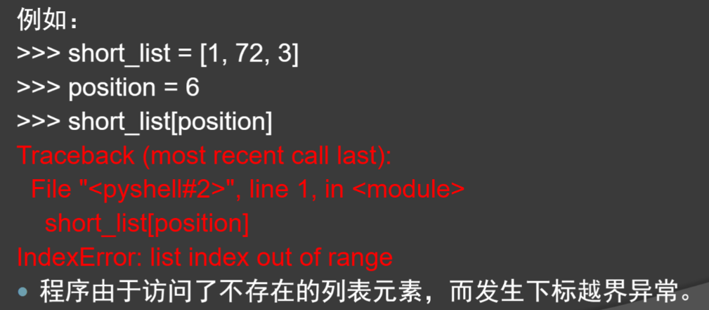
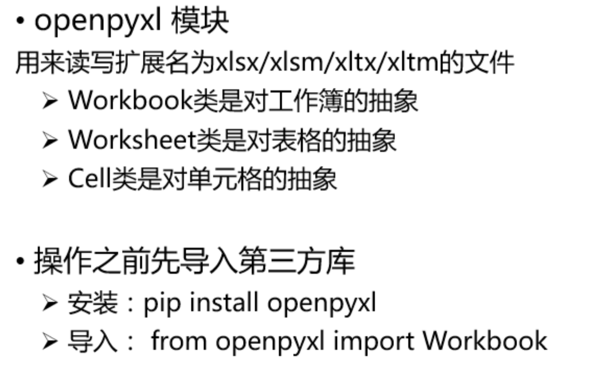
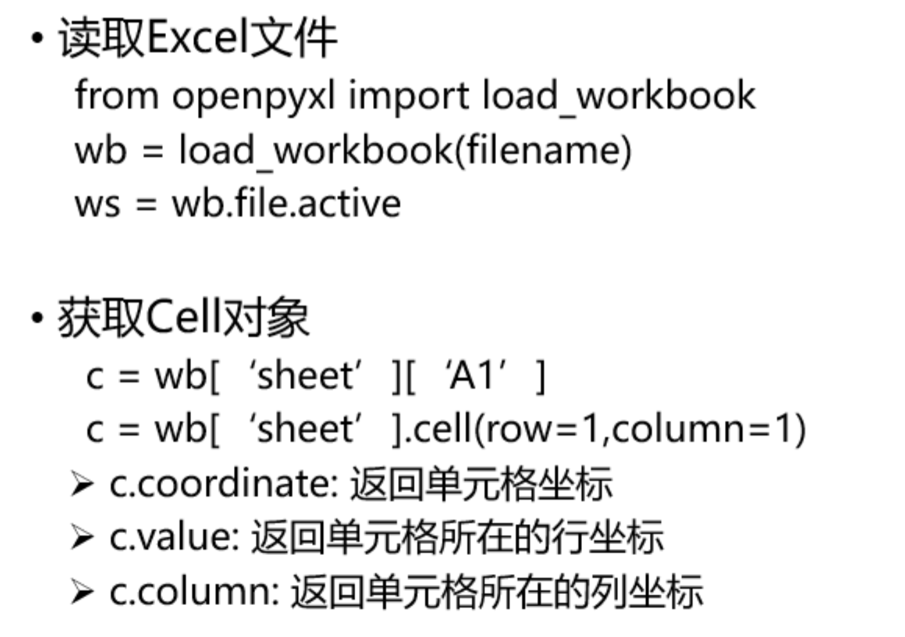
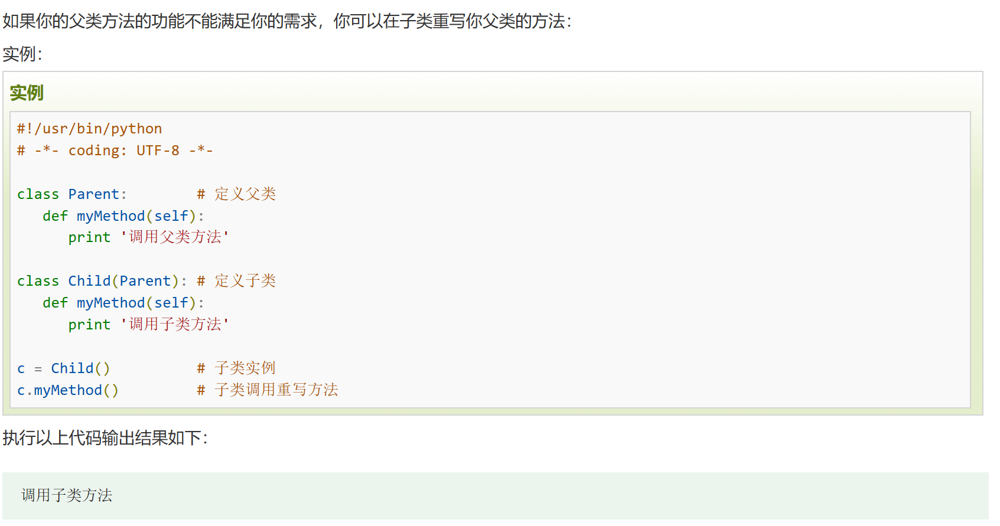
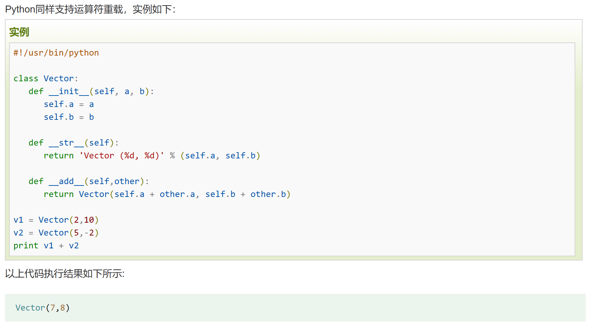
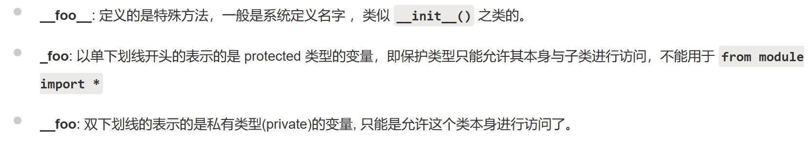

# Python

## python概述

### 标识符和变量

#### 标识符
* 标识符由字母、下划线和数字组成，**不能以数字为开头，且区分大小写**，关键字不能作为标识符

#### id函数
* 在大多数语言中是赋值，而Python并不是把值存储在变量中，而像是把名字“贴”在值的上边（将名字绑定了对象）

* 变量是将名字和对象**进行关联**

* 赋值操作**不会实际复制值**，它只是为数据对象起一个相关的名字

* `id()`是内置函数，可以显示对象的地址

#### 补充
* 小整数对象池：小整数的范围为[-5,256]，在这个范围内的小整数，**任意相同的整数都是同一个对象**
    * 小整数的缓冲池是在python初始化的时候被创建的

* 大整数对象池：超出小整数的范围即为大整数，每次都会创建一个新的对象。但是**处于一个代码块**的大整数**是同一个对象**

### 算术运算符

|运算符|描述|
|-|-|
|+|a+b：两个对象相加|
|-|a-b：两个对象相减|
|*|a*b：两个对象相乘|
|/|a/b：a除以b，有小数|
|%|a%b：取模，返回除法的余数|
|//|a//b：整除，返回结果的整数部分|
|divmod|divmod(a,b)：返回整除和取模|
|**|a**b：返回a的b次幂|

### 字符串

* 用引号括起都是字符串，引号可为单引号或双引号

|操作|用途|
|-|-|
|str.title()|将每个单词的首字母改为大写,其余小写|
|str.upper()|全部改为大写|
|str.lower()|全部改为小写|
|str.rstrip()|暂时删除末尾多余的空格|
|str.lstrip()|暂时删除开头多余的空格|
|str.strip()|暂时删除开头和末尾多余的空格|
|len(str)|计算字符串的长度|
|str1 in str2|字符串str2是否包含子串str1|
|str.replece(原,新,次数)|按照次数（缺省全部）将原子串替换新子串|

|运算符|功能|示例|
|:-|:-|:-|
|+|连接字符串|>>>'D5'+'rrr'：`D5rrr`|
|*|复制字符串|>>>'ab'*3：`ababab`|
|==|比较字符串|>>>'D5'=='D5'：`True`|

* 字符串可是正向递增也可以是反向递减

|0|1|2|3|4|5|6|7|
|-|-|-|-|-|-|-|-|
|a|b|c|d|e|f|g|h|
|-8|-7|-6|-5|-4|-3|-2|-1|

* 索引：在[]中给出序号

* 切片在[]中给出切片序号范围

* [起始(包含):结束+1:步长]

## 列表元组集合字典

### 列表
* 列表：由一系列按照指定顺序排列的元素组成，元素可以是不同类型，用`[]`来表示列表，用逗号分隔

|操作|作用|
|-|-|
|append|lst.append(元素)：在列表末尾添加元素|
|extend|lst.extend(序列)：解包序列并添加到列表末尾|
|del|del lst[下标]：删除列表指定下标的元素|
|remove|lst.remove(值)：删除第一个等于指定值的元素|
|pop|lst.pop(下标)：删除指定下标的元素并返回该值，缺省为删除的是最后一个元素|
|index|lst.index(值)：返回第一个等于指定值的元素下标|
|insert|lst.insert(下标,元素)：在列表下标处插入给定元素|
|len|len(lst)：求列表长度|
|reverse|lst.reverse()：将列表反转|
|sort|lst.sort([可选：reverse=True])：将列表从小到大永久排序，可选参数从大到小排序|
|sorted|sorted(lst[,可选：reverse=True])：从小到大临时排序，可选参数从大到小排序|
|count|lst.count(元素)：计算该元素出现的次数|
|min|min(lst)：返回列表的最小值|
|max|max(lst)：返回列表的最大值|
|sum|sum(lst)：返回列表的和|
|+|lst1+lst2：连接两个列表|
|*|lst*数值：重复列表并返回该新列表|
|in|元素 in lst：检测元素是否在列表中|

* 列表解析
    * 运用for循环:`name=[value*2 for value in range(5)]`

* 切片
    * `obj[start:end:gap]`:start缺省为0，end缺省为无穷大，gap缺省为1,为左闭右开区间

    * start/end取负数时,在有效索引范围内时对应列表中的元素，超出有效范围外时进行截断忽略空元素

    * 可对切片赋值相同长度的可迭代对象从而修改列表

* 复制列表
    * 创建一个包含整个列表的切片`name_copy = name[:]`

    * 注意,直接赋值导致两个变量实际存储同一个列表`name_copy = name`

### 元组
* 元组：有序的不可变序列且无法修改，使用圆括号 `()`

* 当元素只有一个元素时，**如果不加逗号**，元素会被当成**数字或字符储存**

|操作|作用|
|-|-|
|len|len(tup)：计算元组长度|
|tuple|tuple(序列)：将序列转为元组|
|+|tup1+tup2：元组连接并返回该新元组|
|*|tup+3：重复元组并返回该新元组|
|in|元素 in tup：检测元素是否在元组中|

### 字典
* 无序可变容器类型，键和值用冒号分隔，键值对用逗号分隔，键不能重复而值能重复，整个字典用`{}`表示

* 字典的键必须是**不可变类型**，值无要求

* 访问字典需要通过键

|操作|作用|
|-|-|
|dict|dict(参数)：创建一个字典，缺省为创建一个空字典|
|update|dict.update(参数)：可添加一个或多个键值对，或添加另一个字典里的键值对|
|fromkeys|dict.fromkeys(参数)：批量添加键，值都为同一个值|
|clear|dict.clear()：清空字典|
|del|del ditc[键]：删除字典内指定元素|
|pop|dict.pop(键)：删除字典内指定元素并返回该元素的值|
|popitem|dict.popitem()：删除字典最后一个元素并返回键值对|
|get|dic.get(键)：返回指定元素的值|
|len|len(dict)：返回字典长度|
|keys|dict.keys()：返回字典中的所有标签|
|values|dict.values()：返回字典中的所有值|
|items|dict.items()：返回字典键值对|

### 集合
* 集合是一个无序不重复元素集，集合中元素必须是**不可变类型**

* 无论在创建时还是新增元素时，重复元素在集合中都会被自动过滤 

|操作|方法|
|-|-|
|set|set(序列)：将序列转换为集合，缺省为空集合|
|del|def(集合)：删除整个集合|
|add|集合.add(元素)：向集合内添加元素|
|update|集合.update(序列)：向集合添加元素，可同时添加多个项|
|pop|集合.pop()：随机删除一个元素，集合为空则异常|
|remove|集合.remove(元素)：删除指定元素，不存在则异常|
|discard|集合.discard(元素)：删除指定元素，不存在则忽略|
|clear|集合.clear()：把集合变为空集合|
|&|集合1&集合2：求集合的交集|
|-|集合1-集合2：求集合的差集|
|\||集合1\|集合2：求集合的并集|
|<,>,>=,<=|表示集合与集合的包含关系，而不是比较集合中的大小|

## 条件和循环和其它语句

### 条件语句
```python
if 条件:
    ...
elif 条件:
    ...
...
else:
    ...
```

* 检查多个条件
    * 使用and检查多个条件，两个条件为True则True

    * 使用or检查多个条件，两个条件为False则False

* 检查特定值是否包含在列表中
    * 使用关键字in

        ```python
        name=[1,2,3]
        if 1 in name:
            print('存在')
        ```
* 检查特定值是否不包含在列表中
    * 使用关键字not in

        ```python
        name=[1,2,3]
        if 4 not in name:
            print('不存在')
        ```
* 布尔表达式
    * 为True或False：`name = True`

* 条件表达式
    * 条件表达式是三元的，满足时的值、条件和不满足时的值`y=10 if x > 20 else 30`

### for循环
* 当有一个序列，需要按照其顺序遍历其中的每一个单元时，就可以用for循环

```python
for 循环变量 in 序列:
    语句块1
else:
    语句块2
```

* else中的语句会在循环**正常执行完**（即for不是通过break跳出而中断的）的情况下执行，while...else也是一样

### 异常
* 在程序运行过程种如果发生异常，python会输出错误消息和关于错误发生处的信息，然后终止程序



* 可使用try-expect语句实现异常处理
```python
try:
    语句块1
expect 异常类型1:
    语句块2
expect 异常类型2:
    语句块3
...
expect 异常类型N:
    语句块N+1
expect:
    语句块N+2
else:
    语句块N+3
finally:
    语句块N+4
```

* 正常语句块在语句块1执行

* 如果程序执行中发生异常，中止程序运行，跳转到对应的异常处理块中执行
* 在"expect异常类型"语句中找对应的异常类型，如果找到的话,执行后面的语句块

* 如果找不到,则执行"expect"后面的语句块N+2

* 如果程序正常执行没有发生异常,则继续执行else后面的语句块N+3

* 无论异常是否发生,最后都会执行finally后面的语句块N+4

## 函数

### 函数的使用

#### 函数的定义与调用
```python
def 函数名(参数表):
    函数体
```

* 匿名函数-lambda表达式
    * lambda后面跟多个参数，冒号分隔，后面是一个表达式返回一个值
        ```python
        g=lambda x,y,z:x+y+z    
        print(g(1,4,5))
        ```

#### 函数参数
* 位置参数
    * 传入参数的值按照顺序依次赋值给形参

* 关键字参数
    * 调用函数时可指定对应形式参数的名字,采用与函数定义时不同的顺序：`fun(x3=4,x2=2,x1=9,x4=4)`

* 如果同时出现两种参数形式，先写位置参数再写关键字参数：`fun(1,5,x4=8,x3=4)`

* 默认值参数
    * 当调用没有提供对应参数的值时，缺省为默认值：`def fun(x1,x2,x3,x4=8)`

* 数量可变参数
    * 一个`*`将参数集成为**元组**
        ```python
        def fun(a,*b):
            print(b,len(b))

        fun(1,3,4,5,7,8,9)
        ```

    * 两个`*`将参数集成为**字典**
        ```python
        def fun(a,**b):
        print(b, len(b))

        fun(1,x1=2,x2=3,x3=4)
        ```

* 实参拆包
    * 将`*`加在**实参**前面,将序列拆成一个个单独的实参
        ```python
        name=[1,2,3]
        print(*name)    #1 2 3
        print(name)    #[1, 2, 3]
        ```

* 当实参是不可变对象时，不可通过修改形参而修改实参

* 当实参是可变对象时，可通过修改形参而修改实参。可向函数传递列表的副本而不修改实参:`fun(lst[:])`

#### 函数返回值
* 函数用return语句返回值

    * return后面返回函数调用的返回值

    * 若函数没有用return语句返回或return后面没有表达式，此时返回的值为None

    * 返回值可以有多个：`return 1,2,3`

### 命名空间和作用域
* 全局变量：定义在函数外，作用域是整个程序

* 局部变量：定义在函数内，作用域是函数内部，形参也是局部变量

* global关键字：如希望在函数中使用和修改全局变量，而不是创建局部变量，需要用global关键字声明

```python
def f():
    global a
    a=1
    print('函数内 ',a,b)
a=100
b=200
f()
print('函数外 ',a,b)
#函数内  1 200
#函数外  1 200
```

### 模块
* 将函数存储在被称为模块的独立文件中，import语句允许在当前运行的程序文件中使用模块中的代码

* 导入整个模块
    * 模块是扩展名为.py的文件,通过`import module`导入模块中的所有内容：`module.fun(参数)`

* 导入特定的函数
    * 指定函数,调用时无需写模块名：`from module import fun1,fun2,...,funN`

* 给函数指定别名
    * 类似于外号：`from module import fun as new_name`

* 给模块指定别名
    * 类似于外号：`import module as new_name`

* 导入模块所有函数
    * 无需写模块名：`from module import *`

## 文件

### 文件操作
* 文件打开；`f = open(filename[,mode,[buffering]])`
    * f：`open()`返回的文件对象
    * filename：文件名
    * mode：打开模式和文件类型
    * buffering：文件的缓冲区，默认为-1

    * mode**第一个字母对应的操作**
        |字母|含义|对应操作|说明|
        |-|-|-|-|
        |r|read读模式|读取文件，文件必须存在|只读，指针放在开头|
        |w|write写模式|向文件中写入数据，文件不存在时可创建，写入内容会覆盖整个文件|只写，重写源文件，无源文件自动创建，写完后指针放在最后|
        |a|append追加模式|在文件末尾追加内容，文件不存在时可创建|在末尾位置写，无源文件自动创建，写完后指针放在最后|
        |r+|可读可写|文件必须先存在，从顶部开始写入新的内容，会覆盖之前此位置的内容|可读可写，指针放在开头，写入后覆盖原来位置内容，并且指针停在写入终止处|
        |w+|可读可写|文件不存在可创建，写入的新内容|可读可写，重写源文件，写完指针后放在最后，无源文件自动创建|
        |a+|可读可写|文件不存在可创建，从文件顶部读取内容，从文件底部添加内容|在末尾位置读写，写完后指针放在最后，无源文件自动创建|

    * mode**第二个字母表明文件类型**
        * t：表示文本类型

        * b：表示二进制文件

* 文件关闭
    * 手动关闭：`f.close()`

    * 自动关闭：`with open(path) as file:`
* 文件读取：
    * `f.read()`：读取整个文件存入内存中，返回一个字符串对象

    * `f.readline()`：直接读取一行内容，包括`\n`，并返回字符串

    * `f.readlines()`：一次读取所有行，包括`\n`，并将内容存入列表中

* 文件写入：
    * `f.write(str)`：将字符串写入文件

    * `f.writes(strlist)`：将字符串列表写入文件

    * 写入操作要在关闭文件后才生效

### 常见文件读写

#### 结构化文本文件CSV
* 纯文本文件，以逗号为分隔符
    * 值没有其它类型，所有值都是字符串
    
    * 不能指定单元格的宽高，不能合并单元格
    
    * 不能指定字体颜色等格式

    * 没有多个工作表

    * 不能嵌入图像和表格

* 文件读取
    * import csv：`content=csv.reader(文件名)`

* 文件的写入
    ```python
    w=csv.writer('aaa.csv','w')
    w.writerow(rows)
    ```
    
    * 当文件不存在时，自动创建文件

    * 支持单行写入和多行写入

#### PDF的读写
* 库PyPDF2
    * 包含PdfFileReader、PdfFileMerger、PageObject和PdfFileWriter四个主要类

    * 能进行读写、分割、合并、文件转换等多种操作

    * 只能从PDF文档中提取文本并返回字符串，而无法提取图像、表格和其它媒体

* PDF读写
    * 读取PDF文件
    ```python
    readFile=open('text.pdf','rb')
    pdfFileReader=PdfFileReader(readFile)
    ```

    * pdfFileReader类
        * `getNumPages()`：计算PDF文件总页数

        * `getPage(index)`：检索指定编号的页面

    * 写入操作
        ```python
        writerFile='output.pdf'
        pdfFileWriter=PdfFileWriter()
        ```

    * pdfFileWriter类
        * `pdfFileWriter.addPage(pageObj)`：根据每页返回的PageObject，写入到文件

        * `pdfFileWriter.addBlankPage()`：在文件的最后一页写入一个空白页，保存到新文件

    * 合并多个文档
        ```python
        pdf_merger=PdfFileMerger()
        pdf_merger.append('python2018.pdf')
        pdf_merger.merge(20,'insert.pdf')
        pdf_merger.write('merge.pdf')
        ```

    * 单个页面的操作-PageObject类
        * `PageObject.extractText()`：按照顺序提取文本

        * `PageObject.getContents()`：访问页面内容

        * `PageObject.rotateClockwise(angle)`：顺时针旋转

#### Excel的读写
    




## 类和对象

### 创建和使用类 

#### 创建Dog类
```python
class dog():
    def __init__(self,name):
        pass
    
    def sit(self):
        pass

```

* 类定义中的括号是空的，表示从空白创建这个类

* 方法`__init__(self)`：类似构造函数

#### 根据类创建实例
```python
my_dog=Dog("John")
```

* 方法`__init__()`并未显式地包含return语句，但自动返回一个表示这条狗的实例    

1. 访问属性：`my_dog.name`

2. 调用方法：`my_dog.name()`

* 析构函数`__del__`在对象销毁时被调用，当对象不再被使用时`__del__`方法运行

* 类的继承
    ```python
    class 派生类名(基类名):
        pass
    ```
    1. 如果在子类中需要父类的构造方法就需要显式的调用父类的构造方法，或者不重写父类的构造方法
        1. 子类需要自动调用父类的方法：子类不重写`__init__()`，实例化子类后会自动调用父类的`__init__()`
        
        2. 子类不需要自动调用父类的方法：子类重写`__init__()`，实例化子类后不会自动调用父类的`__init__()`
        
        3. 子类重写`__init__()`又需要调用父类的方法：使用`super`关键词或经典写法：
        
        ```python
        class Son(Father):
            def __init__(self, name,age):   
                super(Son,self).__init__(name,age)#写法1
                Father.__init__(self,name,age)#写法2
        ```    
    2. Python总是首先查找对应类型的方法，如果它不能在派生类中找到对应的方法，它才开始到基类中逐个查找

    3. 如果在继承元组中列了一个以上的类，那么它被称为‘多重继承’

    ```python
    class SUbClassName(ParentClass1[,ParentClass2,......])
    ```    
* 方法重写
    
        

* 运算符重载

        

* 类属性与方法
    * 类的私有属性：`__privateAttrs`两个下划线开头，声明该属性为私有，在类内部的方法中使用时`self.__privateAttrs`

    * 类的方法：使用`def`定义一个方法，类方法必须包含第一个参数`self`，可取其他字符

    * 类的私有方法：`__privateMethods`两个下划线开头，声明该方法为私有，在类内部调用`self.__privateMethods`

    * python不允许对象访问私有数据，但可使用`对象名._类名__私有属性名`访问属性

    * 单下划线、双下划线、头尾双下划线说明：

        
