# 信号与系统

## 第一章

### 周期信号与非周期信号

#### 周期信号与非周期信号

#### 能量信号与功率信号

### 斜变信号和阶跃信号

* 函数本身有不连续点（跳变点）或其导数与积分有不连续点的一类函数统称为**奇异信号或奇异函数**，奇异函数的定义区间是全时间域范围

#### 单位斜变信号

#### 单位阶跃信号

### 冲激信号及其性质

#### 冲激函数

#### 冲激函数的性质
1. 求导性

    

2. 抽样性

    

#### 冲激序列与阶跃序列

#### 冲激函数的基本特性
1. 尺度变换特性

    

2. 偶函数性

    

#### 冲激偶信号

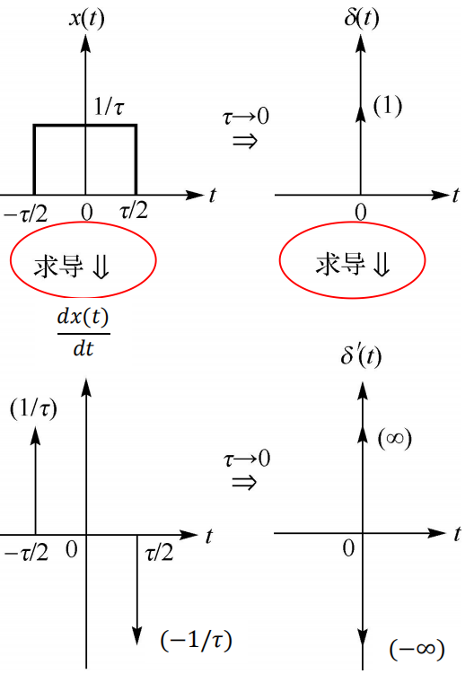

1. 冲激偶的积分

    

2. 尺度变换

    

    

3. 奇函数性

    

4. 抽样性

    

5. 微分特性

    

### 卷积及其性质

#### 卷积

#### 卷积的性质

### 信号的分解

### 系统模型及其分类

#### 时域框图的基本单元

#### 由系统框图写成微分方程

#### 系统的分类

### 线性时不变系统

#### 线性系统与非线性系统
1. 定义

    

2. 判断方法

    

#### 时变系统与时不变系统
1. 定义

    

2. 判断方法

    

#### 线性时不变系统的微、积分特性

#### 因果系统与非因果系统

1. 因果信号：$t = 0$接入系统的信号称为因果信号

    

## 第二章

### 微分方程的时域解法

#### LTI连续系统的微分方程

#### 微分方程的时域解法

### 起始点的跳变

### 零输入响应与零状态响应

#### 零输入与零状态响应

#### 零输入响应

#### 零状态响应

### 冲激响应与阶跃响应

## 第三章

### 信号的正交分解

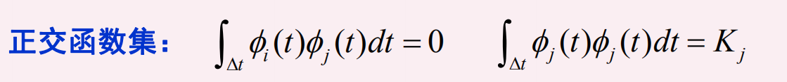

### 周期信号的傅里叶级数分析

#### 三角形式的傅里叶级数

* $f(t)$为奇函数，则傅里叶级数只含有正弦分量

* $f(t)$为偶函数，则傅里叶级数只含有余弦分量

* $f(t)$为奇谐函数，则傅里叶级数只含有基波和奇次谐波分量
    > $f(t)$平移$\frac{T}{2}$后为奇函数

* $f(t)$为偶谐函数，则傅里叶级数只含有直流和偶次谐波分量
    > $f(t)$平移$\frac{T}{2}$后为偶函数

#### 指数形式的傅里叶级数

#### 两种系数之间的关系

#### 幅频特性和相频特性

#### 频谱图

### 典型周期信号的傅里叶级数

#### 频谱结构

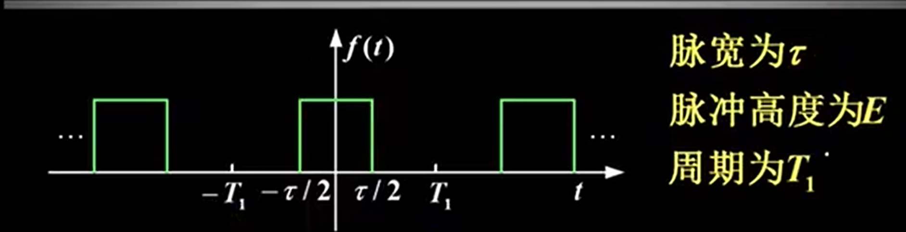

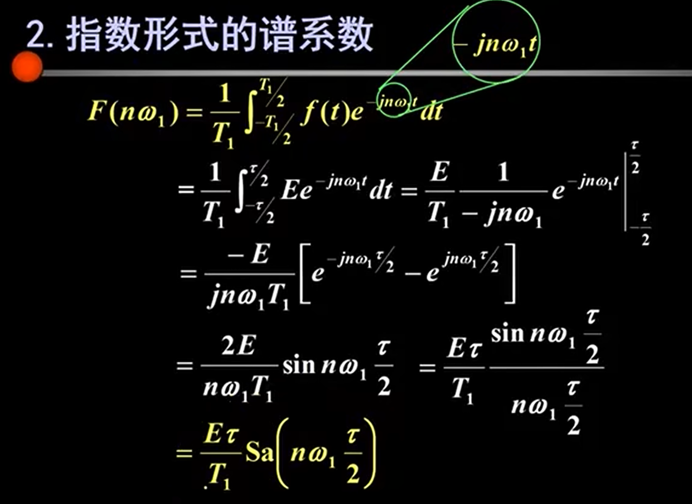

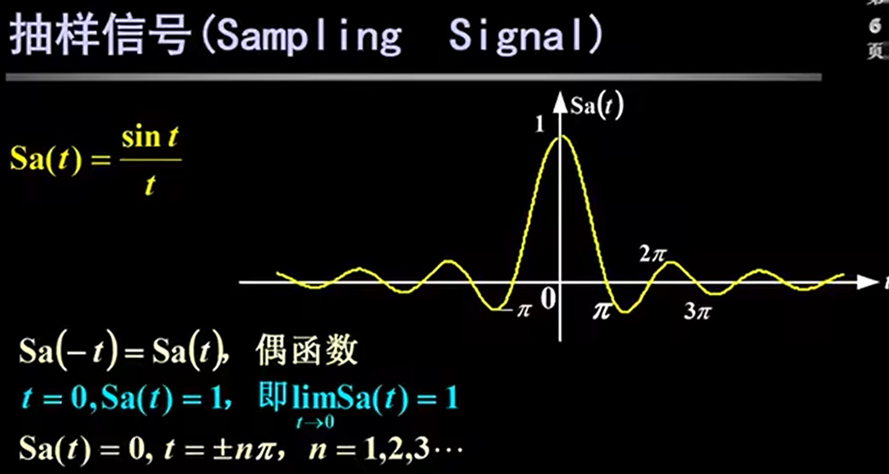

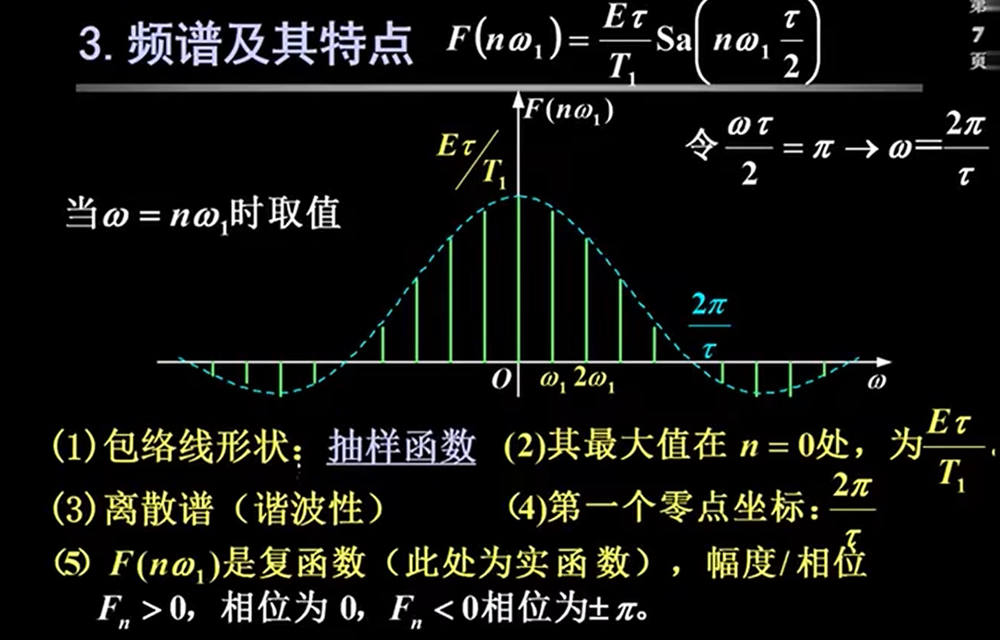

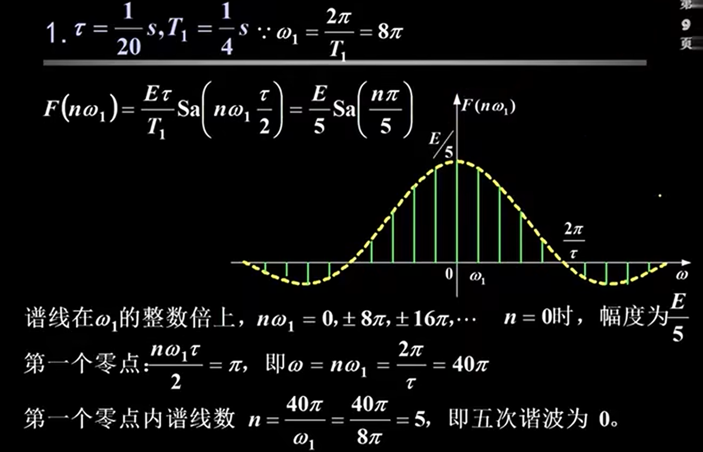

#### 频谱随参数的变化

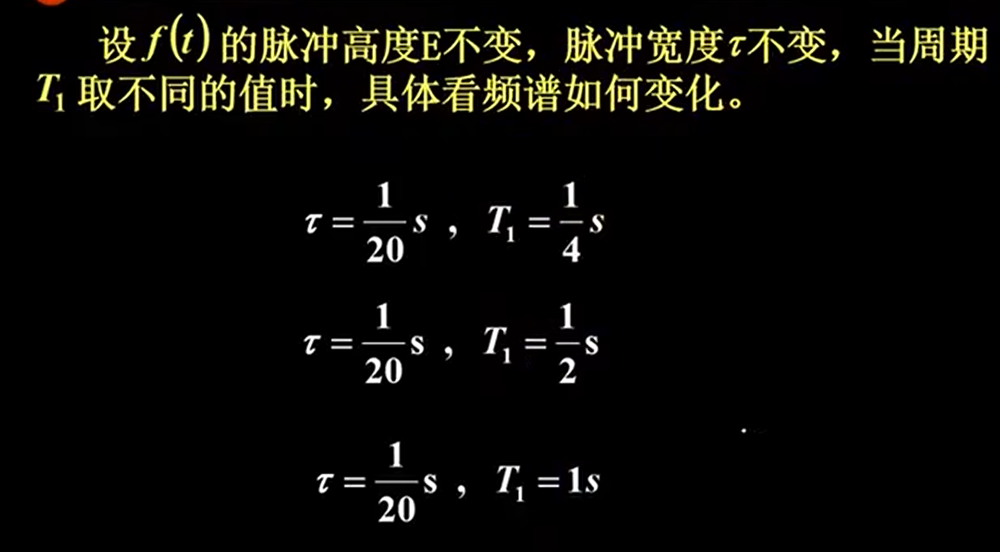

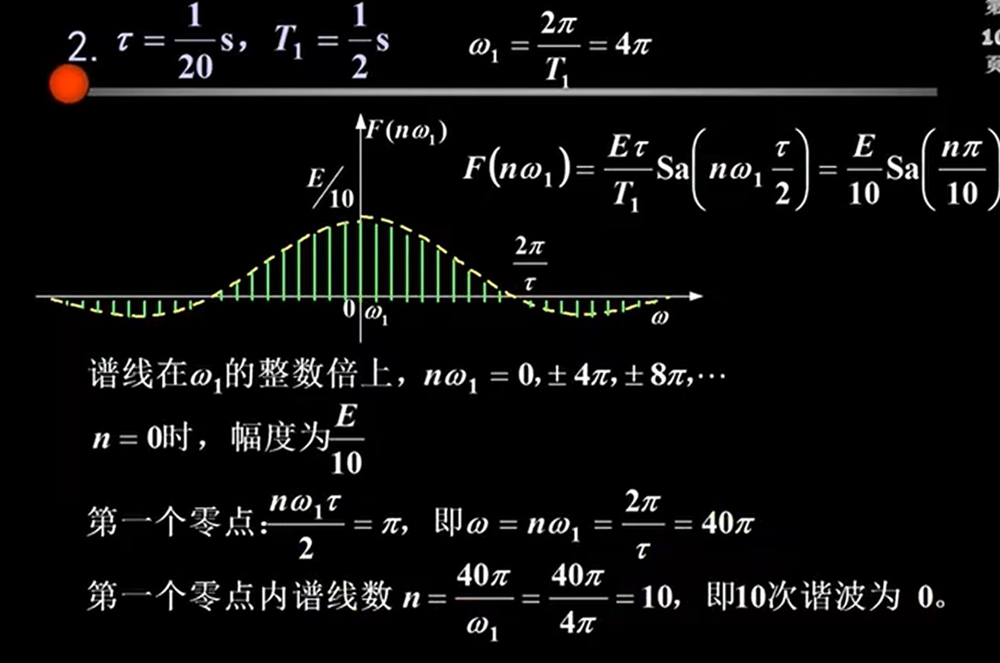

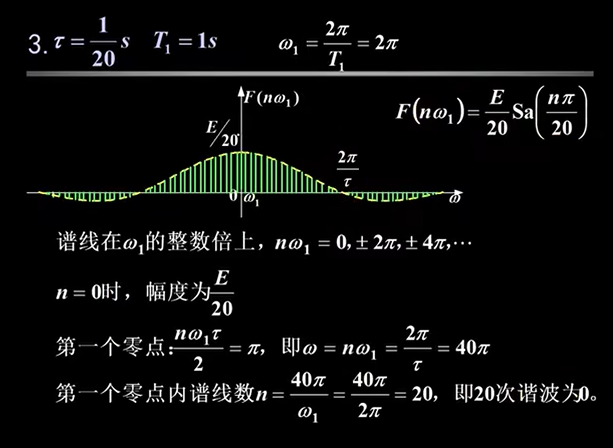

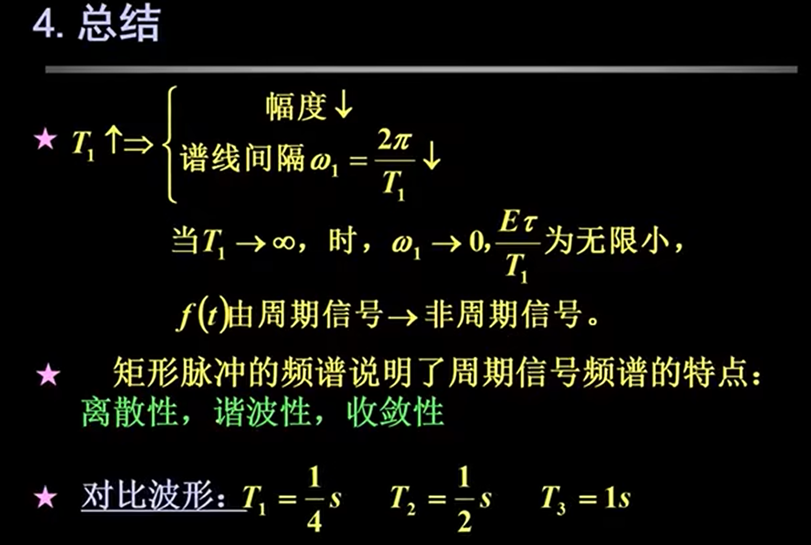

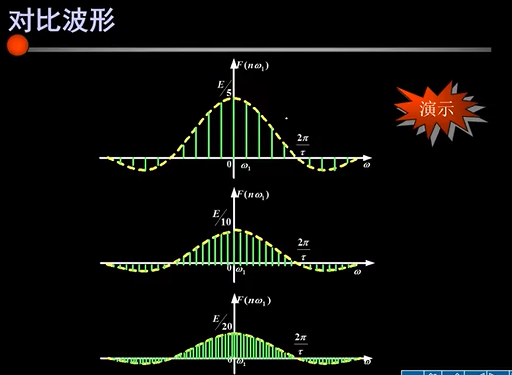

#### 频带宽度

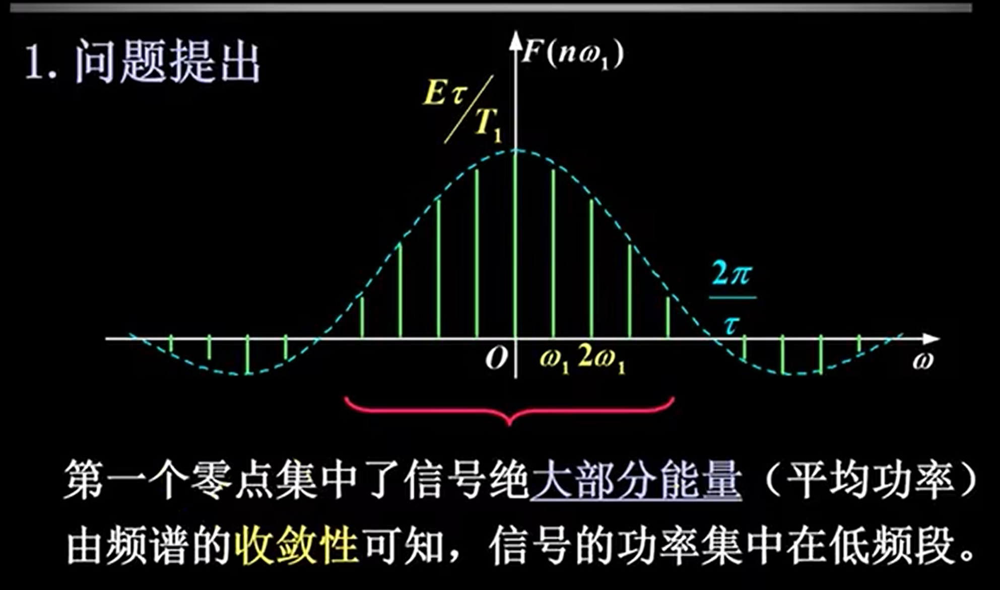

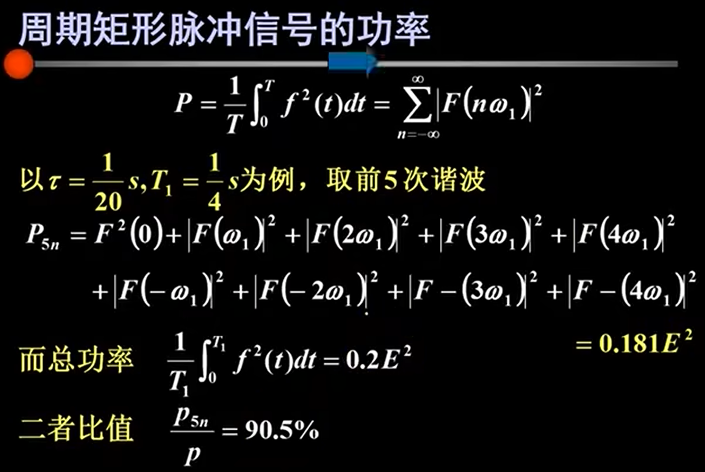

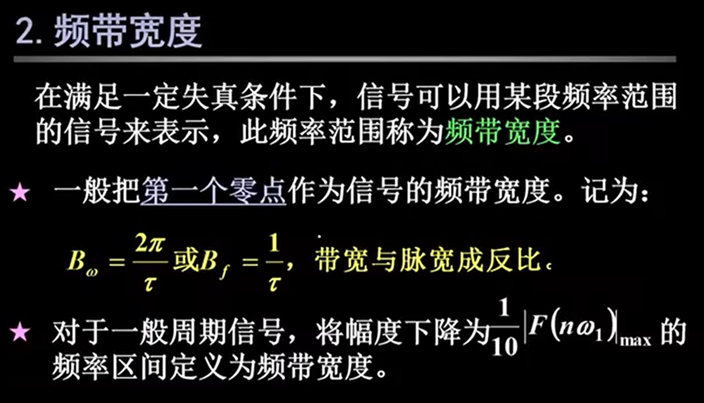

### 傅里叶变换

### 傅里叶变换的基本性质

#### 对称性质

#### 线性性质

#### 奇偶虚实性

#### 尺度变换性质

#### 时移性质

#### 时移加尺度变换

#### 微分性质

* 时域微分性质

    

* 频域微分性质

    

#### 频移性质

#### 时域积分性质

### 卷积定理

### 连续LTI系统的频域分析

#### 频域分析

#### 例题

### 抽样定理

#### 脉冲抽样

#### 矩形抽样

#### 抽样定理

## 第四章

### 拉普拉斯变换

### 拉普拉斯变换的收敛域

### 拉普拉斯变换性质

#### 线性性质

#### 尺度变换特性

#### 时移特性

#### 频移特性

#### 时域微分性质

#### 时域积分性质

#### 卷积定理

#### 初值定理

#### 终值定理

 

#### 复频域微分

#### 复频域积分

### 拉普拉斯逆变换

#### 留数定理

* 比如说留下$a$，则方程两端同乘以$s + 1$，然后取$s = -1$，这样的话，方程右边除了第一项的$a$留下来其它都消掉了

#### 部分分式展开法

### 拉普拉斯变换与傅里叶变换

### 连续LTI系统的复频域分析

#### 复频域分析

#### 例题

### 系统函数与时域响应特性

#### 系统时域与频域特性

#### 例题

