# 数据结构与算法

## 线性结构

### 线性表

#### 线性表   


#### 线性表的顺序存储结构


#### 线性表的链式存储结构


#### 总结


### 栈和队列

#### 栈


#### 队列


#### 表达式
1. 前缀表达式：运算符位于操作数之前
    * 从**右至左**扫描，遇到数字时压入堆栈，遇到运算符时弹出栈顶的两个数，用运算符进行运算，并将结果入栈，直到表达式最左端，输出结果

        |未读取的输入|栈|
        |:-|:-|
        |$- ~* ~+ ~3 ~4 ~5~ 6 $||
        |$-~ *~ +~ 3 ~4 ~5 $|$6 $|
        |$- ~* ~+~ 3 ~4 $|$6~ 5 $|
        |$-~ *~ +~ 3 $|$6~ 5~ 4 $|
        |$- ~* ~+ $|$6~ 5~ 4 ~3 $|
        |$-~ * $|$6 ~5 ~7$|
        |$- $|$6~ 35$|
        ||$29 $|

2. 中缀表达式：运算符位于操作数之间

3. 后缀表达式：运算符位于操作数之后
    * 从**左至右**扫描表达式，遇到数字时压入堆栈，遇到运算符时，弹出栈顶的两个数，用运算符进行运算,并将结果入栈，直到表达式的最右端，输出结果

        |未读取的输入|栈|
        |-:|:-|
        |2 3 8 + 4 * * ||
        |3 8 + 4 * * |2 |
        |8 + 4 * * |2 3 |
        |+ 4 * * |2 3 8 |
        |4 * * |2 11 |
        |* * |2 11 4 |
        |* |2 44 |
        ||88 |

#### 中缀表达式转换为后缀表达式
* 优先级：乘$=$除$>$加$=$减

* 对象是数字：直接输出

* 对象是高优先级：直接入栈

* 对象是低或同优先级：栈顶出栈并输出，再同新栈顶比较

* 对象是左括号：左括号在**栈外**为**最高优先级**，在**栈内**为**最低优先级**

* 对象是右括号：持续将栈顶出栈并输出，直到遇到左括号为止，**括号始终不输出**

* 无新对象时，持续将栈顶出栈并输出

    |未读取的输入|栈|输出|
    |-:|:-|:-|
    |$2*(6/3+4)-5$|||
    |$*(6/3+4)-5$||$2 ~$|
    |$(6/3+4)-5$|$*$|$2 $|
    |$6/3+4)-5$|$*($|$2$|
    |$/3+4)-5$|$*($|$2 ~6 $|
    |$3+4)-5$|$*(/$|$2 ~6 $|
    |$+4)-5$|$*(/$|$2 ~6 ~3 $|
    |$4)-5$|$*(+$|$2 ~6 ~3 ~/ $|
    |$)-5$|$*(+$|$2 ~6 ~3 ~/ ~4$| 
    |$-5$|$*$|$2 ~6 ~3 ~/ ~4 ~+ ~$|
    |$5$|$-$|$2 ~6 ~3 ~/ ~4 ~+ ~* $|
    ||$-$|$2 ~6 ~3 ~/ ~4 ~+ ~* ~5 $|
    |||$2 ~6 ~3 ~/ ~4  ~+ ~* ~5 ~- $|

## 排序

### 冒泡排序和插入排序

#### 冒泡排序
* 定义一个 $p$ 指针指向数组末尾，每次从头开始交换，直至使得 $1$ 到 $p$ 范围内的最小/大值到达 $p$ 处，然后 $p-1$，不断重复直至 $p$ 指向起始位置

* 加速操作：如果在遍历的过程中没有进行交换操作，则已经排好序，直接退出循环

```cpp
void BubbleSort(ElementType A[],int N)
{
    for(int p = N - 1; p >= 0; p--)
    {
        flag = false;
        for(i = 0; i < p; i++)
        {
            if(A[i] > a[i + 1])
            {
                Swap(A[i], A[i + 1]);
                flag = true;
            }
        }
        if(flag == false)
            break;
    }
}
```

#### 插入排序
* 定义一个指针 $p$ 指向数组开头，将 $p$ 位置的元素不断往左移动直到有比它大/小的，或者到数组开头，然后$ p + 1$，不断重复直至 $p$ 指向数组末尾

```c
void InsertionSort(ElementType A[], int N)
{
    int i;
    ElementType tmp;
    for(int p = 1; p < N; p++)
    {
        tmp = A[p];
        for(i = p; i > 0 && A[i-1] > Tmp; i--)
        {
            A[i] = A[i-1];
        }
        A[i] = Tmp;
    }
}
```

### 快速排序
```cpp
void swap(int &a, int &b)
{
    int t = a; 
    a = b;
    b = t;
}

int partition(int arr[], int low, int high)
{
    // pivot可取其它元素，此处为arr[high]
    int pivot = arr[high], i = low; 
    for(int j = low; j < high; j++)
    {
        if(arr[j] < pivot)
        {
            swap(arr[j], arr[i++]);
        }
    }
    swap(arr[i], arr[high]);
    return i;
}

void quick_sort(int arr[], int low, int high)
{
    if(low < high)
    {
        int k = partition(arr, low, high);
        quick_sort(arr, low, k - 1);
        quick_sort(arr, k + 1, high);
    }
}
```

### 归并排序


```c
void merge(int arr[], int left, int middle, int right)
{
    int i, j;
    int len1 = middle - left + 1, len2 = right - middle;
    int L[len1], R[len2]; // 左半部分和右半部分
    for(i = 0; i < len1; i++)
    {
        L[i] = arr[left + i];
    }
    for(j = 0; j < len2; j++)
    {
        R[j] = arr[middle + 1 + j];
    }
    int pa = 0, pb = 0;

    // 将L[]和R[]从小到大放入arr[]中
    for(int i = left; i <= right; i++)
    {
        if(pa < n1 && pb < n2)
        {
            if(L[pa] < R[pb])
            {
                arr[i] = L[pa++];
            }
            else
            {
                arr[i] = R[pb++];
            }
        }
        else if(pa < n1)
        {
            arr[i] = L[pa++];
        }
        else
        {
            arr[i] = R[pb++];
        }
    }
}

void merge_sort(int arr[], int left, int right)
{
    if(left < right)
    {
        int middle = (left + right) / 2;
        merge_sort(arr, left, middle);
        merge_sort(arr, middle + 1, right);
        merge(arr, left, middle, right);
    }
}
```

## 补充

### KMP算法

#### next数组

* next[i]表示字符串的**第1个字符到第i个字符**的最大相等前缀和后缀（长度小于字符串本身长度）

* next数组从0开始，定义next[0]为-1，next[1]=0

* 模式串p的下标从0开始

* 假设对于模式串的位置j，有next[j]=k，则对于模式串的位置j+1，有两种情况
    1. 若`p[k]==p[j]`，则有`next[j+1]=next[j]+1`
        * 已经直到next[j]=k，即模式串的第一个字符到第j个字符的最大相同前后缀为k，这时p[k]==p[j]，对应着模式串第j+1个字符等于第k+1个字符（相对于上一个新比较的字符），使得最大相同前后缀+1，即有next[j+1]=next[j]+1

    2. 若`p[k]!=p[j]`，则令`k=next[k]`，若`p[k]==p[j]`，则`next[j+1]=k+1`，否则重复此过程
        * 模式串的第j+1个字符不等于第k+1个字符，就不能再上一个子串的最大前后缀加1了

        * 既然不能在上一个子串的基础上加1，那么就试图寻找更短的基础，直到能加上1。试图找更短的基础就是next[.....next[next[k]]]，这里就是**在原来最大相同前后缀的缀里再求最大相同前后缀**，以达到寻找更短基础的目的。

```cpp
void getNext(const string& p,int next[])//常引用节省空间，保证值不变
{

    int len=strlen();
    next[0]=-1;
    int k=-1;//用来比较，初始值-1是为了让next[1]=0
    int j=0;//j用来迭代next数组
    while(j < len - 1)
    {
        if(k==-1||p[j] == p[k])
        {
            ++j,++k;//相加是为了下一次字符比较和赋值给next，因为p的下标从0开始，k++这样k就能表示最大相同前后缀了
            next[j] = k;
        }
        else
        {
            k = next[k];//变换为更小的最大相同前后缀基础
        }
    }
}
```

#### KMP

* 返回匹配成功的第一个元素的位置，否则为-1

```cpp
int kmp(const string& s, const string& pattern)
{
    int n = strlen(s);
    int ans = -1;//匹配不到就返回-1
    int i = 0;//文本的索引
    int j = 0;//模式串的索引
    int patternLen = strlen(pattern);

    int next[patternLen] = {0};
    getNext(pattern,next);

    while(i < n)
    {
        if(j == -1 || s[i] == pattern[j])
        {
            ++i;++j;
        }
        else
        {
            j = next[j];//相当于将模式串开头滑动到目前匹配成功的最大相同后缀的位置
        }

        if(j == patternLen)//j扫描到了末尾，意味着匹配成功
        {
            ans = i - patternLen;
            break;
        }
    }
    return ans;
}
```

### 时间复杂度

#### 渐近时间复杂度


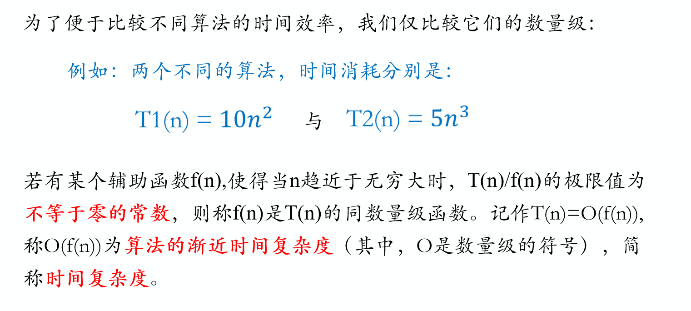


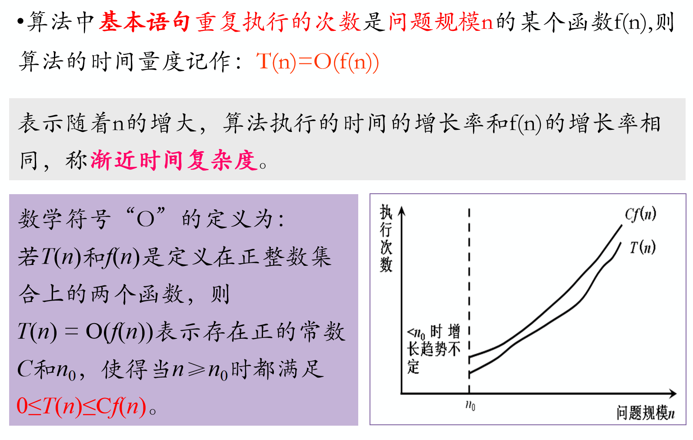


#### 渐近空间复杂度


### 贪心算法
* 一般步骤：
    1. 将问题分解为若干子问题

    2. 找出适合的贪心策略

    3. 求解每一个子问题的最优解
    
    4. 将局部最优解堆叠成全局最优解

* 1.分发饼干

    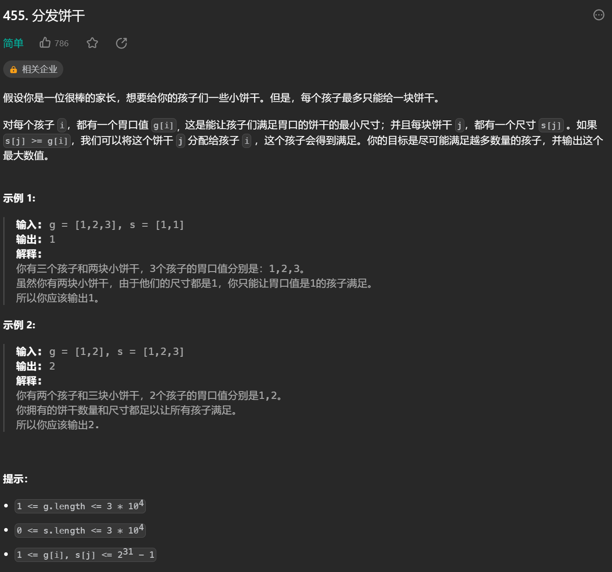

    思路1：将剩下最小尺寸的饼干给剩下最小胃口且满足胃口的孩子，保证饼干最小程度没有浪费

    思路2：将剩下最大尺寸的饼干给剩下最大胃口且满足胃口的孩子，保证饼干能喂饱尽可能多的孩子

* 2.摆动序列

    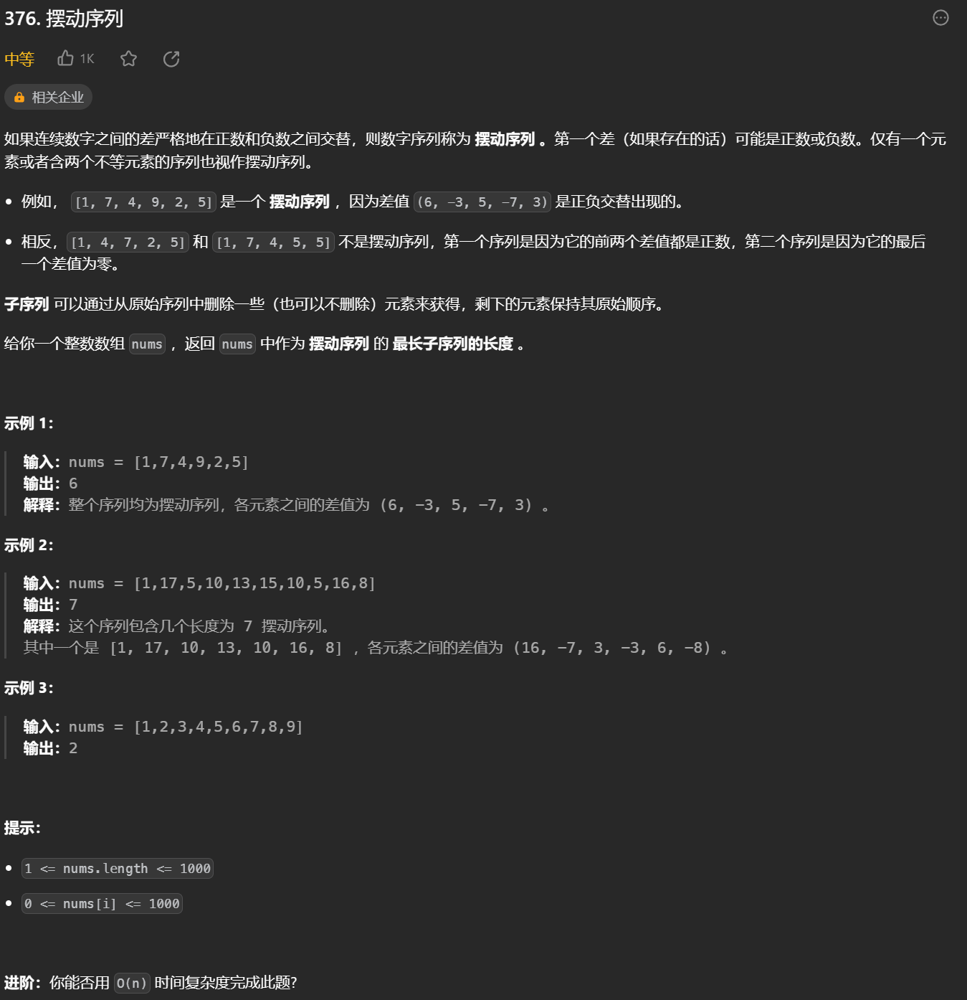

    * 思路：序列中有一段段摆动序列，把每段摆动序列连接起来即可，只需要删除连接处的数字

* 3. 最大子数组和

    

    * 思路：一段一段找子序列的和，当和为负时划分下一段，最后取出最大的和

### 动态规划
* 一般步骤：
    1. 确定dp数组以及下标的含义

    2. 确定递推公式

    3. dp数组如何初始化

    4. 确定遍历顺序

    5. 举例推导dp数组


1. 斐波那契数

    

    * 思路：
        1. 数组表示：dp[i]表示第i个斐波那契数为dp[i]

        2. 递推公式：dp[i]=dp[i-1]+dp[i-2]

        3. 边界条件：dp[0]=0，dp[1]=1

        4. 递推过程：i从2开始i++递推

        5. 递推举例：dp[2]=d[1]+dp[0]=1，dp[3]=dp[2]+dp[1]=2，dp[4]=dp[3]+dp[2]=3

2. 爬楼梯

    

    * 思路：
        1. 数组表示：dp[i]表示爬到第i阶有dp[i]种方法

        2. 递推公式：dp[i]=dp[i-1]+dp[i-2]

        3. 边界条件：dp[1]=1，dp[2]=2

        4. 递推过程： i从3开始i++递推

        5. 递推举例：dp[3]=dp[2]+dp[1]=3，dp[4]=dp[3]+dp[2]=5，dp[5]=dp[4]+dp[3]=8

### 哈希表


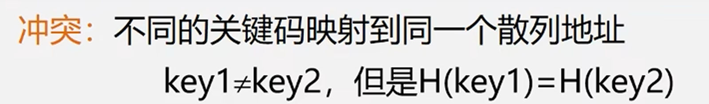


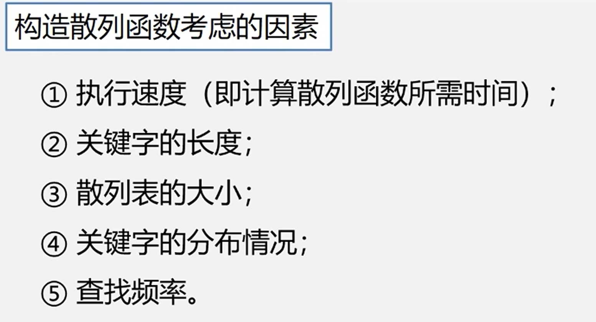

## 稀疏矩阵

### 稀疏矩阵

#### 稀疏矩阵的顺序存储结构

```cpp
typedef struct node
{
    int i;
    int j;
    int v;
}matrix;
```

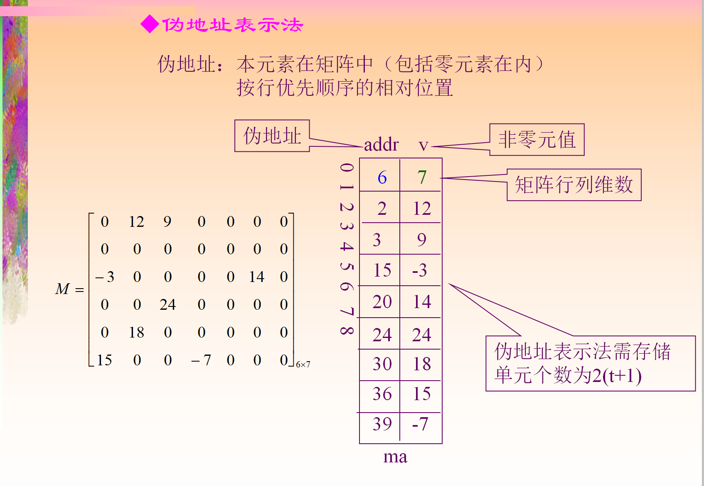

#### 三元组表的转置

* 低级重复扫描，不断扫三元组的列从 1 到 n

```cpp
void trans(matrix a[], matrix b[])
{
    int m =  a[0].i;
    int n = a[0].j;
    int amt = a[0].v;
    int k = 1;

    b[0].i = n;
    b[0].j = m;
    b[0].v = amt;

    for(int col = 1; col <= n; col++)
    {
        for(int p = 1; p <= t; p++)
        {
            if(a[p].j == col)
            {
                b[k].i = col;
                b[k].j = a[p].i;
                b[k].v = a[p].v;
                k++;
            }
        }
    }
}
```

* 快速转置

```cpp
// 提前确定a中每一列第一个非零元素在b中的位置，这样读到a的哪个都知道填到b的哪里

int num[col]; // a中第col列中非零元个数
int cpot[col]; // a中的第col列第一个非零元b中的位置，还会更新

// num和cpot有如下关系

{{
    if(col == 1)
    {
        cpot[1] = 1;
    }
    else if(2 < col && col <= a[0].j)
    {
        cpot[col] = cpot[col - 1] + num[col - 1];
    }
}}


void trans(matrix a[], matrix b[])
{
    int m =  a[0].i;
    int n = a[0].j;
    int amt = a[0].v;

    b[0].i = n;
    b[0].j = m;
    b[0].v = amt;

    for(int col = 0; col <= n; col++)
    {
        num[col] = 0;
    }
    for(int p = 1; p<= amt; p++)
    {
        num[a[p].j]++;
    }

    cpot[1] = 1;
    for(int col = 2; col <= n; col++)
    {
        cpot[col] = cpot[col - 1] + num[col - 1];
    }

    for(int p = 1; p <= t; p++)
    {
        int col = a[p].j;
        int k = cpot[col];
        cpot[col]++;
        b[k].i = a[p].j;
        b[k].j = a[p].i;
        b[k].v = a[p].v;
    }
}
```

### 行逻辑联接的顺序表

#### 添加rpos，其值为各行第一个非零元素在三元组中的位置

```cpp
typedef struct
{
    matrix data[MAXSIZE + 1]; // 上一个md的三元组
    int rpos[MAX + 1];
    int mu;
    int nu;
    int tu;
}newMatrix;
```

* 给定下标，返回值

```cpp
int value(newMatrix a, int x, int y)
{
    int p = a.rpos[x];
    while(a.data[p].i == x && a.data[p].j < c)
    {
        p++;
    }
    if(a.data[p].i == x && a.data[p].j == y)
    {
        return a.data[p].v;
    }
    return 0;
}
```

### 矩阵乘法

#### 三元组的矩阵乘法


* 思路：以矩阵a为基准，遍历a的每行，用每一行乘以b矩阵，

```cpp
// newMatrix为上个md中带有首个非零元行位置的三元组

bool multiply(newMatrix a, newMatrix b, newMatrix &ret)
{
    if(a.data[0].j != b.data[0].i)
    {
        return false; // 无法相乘
    }

    // 矩阵信息
    ret.data[0].i = a.data[0].i;
    ret.data[0].j = b.data[0].j;
    ret.data[0].v = 0;

    for(int row = 1; row <= a.data[0].i; row++)
    {
        int temp[b.data[0].j] = {0}; // 存放a中向量和b矩阵对应位置的乘积
        ret.rpos[row] = ret.data[0].v + 1; // 记录当前行位置

        int last1 = a.rpos[row + 1]; // a下一行第一个元素的位置
        if(row == a.data[0].i)
        {
            last1 = a.data[0].v + 1; // 没有下一行
        }

        for(int k = a.rpos[row]; k < last1; k++) // 遍历该行
        {
            int q = a.data[k].j; // 利用当前a的列号找对应b的行号
            int last2 = b.rpos[q + 1]; // b下一行第一个元素的位置
            if(q == b.data[0].i)
            {
                last2 = a.data[0].v + 1;
            }
            for(int j = b.rpos[q]; j < last2; j++)
            {
                temp[b.data[j].j] += a.data[k].v * b.data[j].v;
            }
        }

       for(int col = 1; col <= ret.data[0].j; col++)
        {
            if(temp[col] != 0)
            {
                ++ret.data[0].v;
                int i = ret.data[0].v;
                ret.data[i].i = row;
                ret.data[i].j = col;
                ret.data[i].v = temp[col];
            }
        }
    } 
}
```

## 树

### 树

#### 树

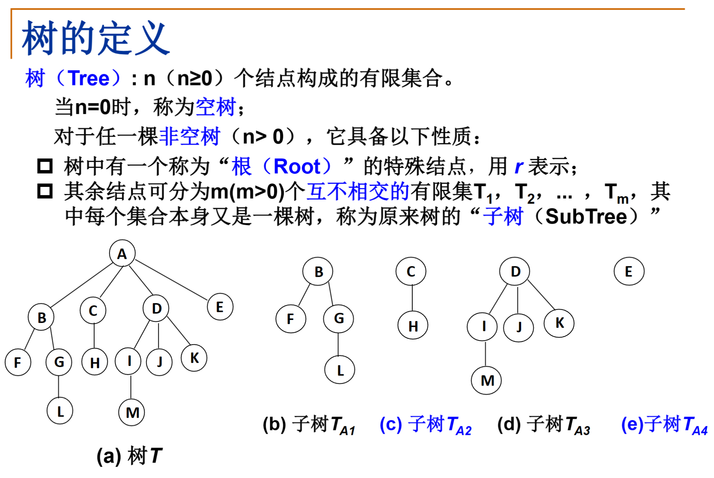

* 子树是不相交的，除了根结点外，每个结点**有且仅有**一个父结点

* 一棵**N**个结点的树有**N-1**条边

#### 树的基本用语
* 结点的度：结点的子树个数

* 树的度：树的所有结点中最大的度数

* 叶结点：度为**0**的结点

* 父结点：一个有子树的结点，是它子树的根结点的父结点

* 子结点：若A结点是B结点的父结点，则B结点是A结点的子结点

* 兄弟结点：具有同一父结点的结点相互是兄弟结点

* 路径和路径长度：从结点 $n_1$ 到 $n_k$ 的路径为一个结点序列 $n_1,n_2,...,n_k$，其中 $n_i$ 是 $n_{i+1}$ 的父结点，路径所包含边的个数为路径的长度

* 祖先结点：沿树根到某一结点路径上的所有结点都是这个结点的祖先结点

* 子孙结点：某一结点的子树中的所有结点是这个结点的子孙

* 结点的层：根结点在1层，其他结点的层数是它父结点的层数加1（从上往下数）

* 树的深度：树中所有结点中的最大层次是这棵树的深度

* 结点的高度：叶结点的高度为1，往上累加，有冲突取最大值
    
### 二叉树

#### 二叉树


* 一个二叉树第 $n$ 层的最大结点数为 $2^{n-1}$

* 深度为 $n$ 的**满二叉树**的**结点总数**为 $2^n-1$

#### 二叉树的递归遍历

##### 先序遍历（根左右）

1. 访问根结点

2. 先序遍历其左子树

3. 先序遍历其右子树

```cpp
void PreOrderTraversal(BinTree BT)
{
    if(BT)
    {
        printf("%d",BT->Data);
        PreOrderTraversal(BT->Left);
        PreOrderTraversal(BT->Right);
    }
}
```

##### 中序遍历（左根右）
* 中序遍历其左子树

* 访问根结点

* 中序遍历其右子树

```cpp
void InOrderTraversal(BinTree BT)
{
    if(BT)
    {
        InOrderTraversal(BT->Left);
        printf("%d",BT->Data);
        InOrderTraversal(BT->Right);
    }
}
```

##### 后序遍历（左右根）
* 后序遍历其左子树

* 后序遍历其右子树

* 访问根结点

```cpp
void PostOrderTraversal(BinTree BT)
{
    PostOrderTraversal(BT->Left);
    PostOrderTraversal(BT->Right);
    printf("%d",BT->Data);
}
```

#### 二叉树的非递归遍历

##### 中序遍历

```cpp
void InOrderTraversal(BinTree BT)
{
    Bintree T=BT;
    Stack S=CreateStack(MAXSIZE);
    while(T||!IsEmpty(S))
    {
        while(T)//当前结点一直向左入栈
        {
            Push(S,T);
            T=T->Left;
        }
        if(!IsEmpty(S))//左都读取完了，开始输出根，这里不是while，因为输出完中要读取右
        {
            T=Pop(S);
            printf("%5d",T->Data);
            T=T->Right;
        }
    }
}
```

##### 先序遍历

```cpp
void PreOrderTraversal(BinTree BT)
{
    BinTree T=BT;
    Stack S=CreateStack(MAXSIZE);
    while(T||!IsEmpty(S))
    {
        while(T)//一直向左输出
        {
            printf("%5d",T->Data);
            Push(S,T);
            T=T->Left;
        }
        if(!IsEmpty(S))
        {
            T=Pop(S);//从根的左结点回到根结点，以进入根的右结点
            T=T->Right;
        }
    }
}
```

##### 后序遍历 
```cpp

void PostOrderTraversal(Tree tree)
{
    Stack stack=new SNode;
    stack->last=-1;
    Tree pT=tree,lastVisited=NULL;
    while(pT!=NULL||StackIsEmpty(stack)==false)
    {
        while(pT!=NULL)
        {
            //第一次经过
            StackPush(stack,pT);
            pT=pT->left;
        }
        if(StackIsEmpty(stack)==false)
        {
            Tree temp=StackTop(stack);
            if(temp->right!=NULL&&temp->right!=lastVisited)
            {
                pT=temp->right;
            }
            else//temp的右为空或temp的右被读取过
            {
                StackPop(stack);
                printf("%d ",temp->data);
                lastVisited=temp;
            }
        }
    }
}
```

##### 二叉树的层序遍历
* 遍历从根结点开始，首先根结点入队，然后开始执行循环：结点入队，访问该结点，其左右结点入队

```cpp
void LevelOrderTraversal(BinTree BT)
{
    Queue Q;
    BinTree T;
    if(!BT)
    {
        return;
    }
    Q=CreatQueue(MAXSIZE);
    AddQ(Q,BT);
    while(!IsEmpty(Q))
    {
        T=DeleteQ(Q);
        printf("%d\n",T->Data);
        if(T->Left)
        {
            AddQ(Q,T->Left);
        }
        if(T->Right)
        {
            AddQ(Q,T->Right);
        }
    }
}
```

### 二叉树的遍历问题

#### 已知二叉树的前序遍历和中序遍历，求它的后序遍历
<https://www.luogu.com.cn/problem/P1827>

* 思路
    * 前序遍历是先**访问**根结点，再遍历根结点的左右子树，那么**前序序列的第一个结点一定是根结点**

    * 找到根结点，再确定根结点在中序序列中的位置，就可以**分出左右子树**

```cpp
# include <iostream>
using namespace std;

void tree(string middle, string front)
{
    if(front.size() < 1) // 树为空，停止递归
    {
        return;
    }
    int m = middle.find(front[0]); // 找根结点在中序序列上的位置
    
    // 拆分成左右子树递归调用tree()函数
    tree(middle.substr(0, m), front.substr(1, m)); 
    tree(middle.substr(m + 1, middle.size() - m - 1), front.substr(m + 1, middle.size() - m - 1));
    
    // 由于要求输出后序遍历，故先进行左右子树的访问，再输出根结点
    cout << front[0];
}

int main()
{
    string front, middle;
    cin >> middle >> front;
    tree(middle, front);
    return 0;
}
```

#### 已知二叉树的中序遍历和后序遍历，求它的前序遍历


```cpp
void pre_order(int mid_front, int mid_rear, int last_front, int last_rear)
{
    if(last_rear < last_front)    // 树为空
    {
        return ;
    }
    int root_pos = find_position(mid_order, last_order[last_rear]); // 根结点在中序序列上的位置
    
    cout << last_order[last_rear] << ' ';  // 根 
    pre_order(mid_front, root_pos - 1, last_front, last_rear - mid_rear + root_pos - 1);    // 左
    pre_order(root_pos + 1, mid_rear, last_rear - mid_rear + root_pos, last_rear - 1);      // 右
    //左子树有1 + root_pos - 1 - mid_front = root_pos - mid_front
    //右子树有 1 + mid_rear - root_pos - 1 = mid_rear - root_pos
        //右子树后序的前位置 1 + last_rear - 1 - x == mid_rear - root_pos   ->  x = last_rear - mid_rear + root_pos
        //左子树后序的后位置就是上一行的值-1
}
```

### 平衡二叉树

#### 什么是平衡二叉树


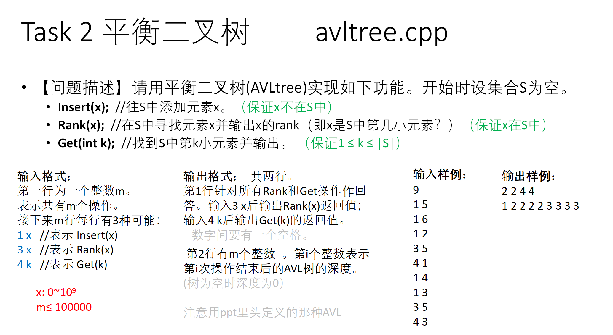

```cpp
#include <stdio.h>
#include <malloc.h>

const int maxm = 100000;
int m;				// m次操作
int res[maxm + 1]; // 返回3、4的查询结果
int h[maxm + 1];   // 保存每次操作的树的深度

struct treeNode
{
	int val;			// 结点对应的值
	int depth = 1;		// 高度差，右减左
	int numNodes = 1;	// 结点总数
	treeNode *parent = NULL;	// 父结点
	treeNode *lchild = NULL;	// 左结点
	treeNode *rchild = NULL;	// 右结点
} *root;

// 计算AVL树的高度差（右减左）
int computeBF(treeNode *x)
{
	return (x->rchild == NULL ? 0 : x->rchild->depth) -
		   (x->lchild == NULL ? 0 : x->lchild->depth);
}

// 更新深度和包含结点数
void update(treeNode *x)
{
	int a = x->rchild == NULL ? 0 : x->rchild->depth;
	int b = x->lchild == NULL ? 0 : x->lchild->depth;
	int c = x->rchild == NULL ? 0 : x->rchild->numNodes;
	int d = x->lchild == NULL ? 0 : x->lchild->numNodes;
	x->depth = (a > b ? a : b) + 1;
	x->numNodes = c + d + 1;
}

/// 插入一个结点后需要使用此函数，从下往上平衡
void rebalance(treeNode *x)
{
	int BF = computeBF(x);
	while (BF <= 1 && BF >= -1)
	{
		if (x == root)
			return;	/// 找到根结点都没发现不平衡的，说明此AVL已平衡
		x = x->parent;
		update(x); /// 因为此前已插入数据，故要不断更新结点信息
		BF = computeBF(x);
	} // 得到最深的不平衡的点 x;

	treeNode *p = x->parent; // 将待平衡点的父亲结点进行保存
	treeNode *y, *z;
	if (BF == 2) /// 麻烦结点在右子树
		if (computeBF(x->rchild) == 1) /// 在右子树的右边
		{
			y = x->rchild;
			x->rchild = y->lchild;
			if(x->rchild)
			{
				x->rchild->parent = x; // 父亲从y变成x。要注意结点变换后有关父亲结点的信息
			}
			y->lchild = x;
			x->parent = y; /// 不要忘了结点保存了父亲结点的信息
			update(x); /// 先更新x在更新y，因为现在x是y子结点
			update(y);
			x = y;
		}
		else /// 在右子树的左边
		{
			y = x->rchild;
			z = y->lchild;
			y->lchild = z->rchild;
			if(y->lchild)
			{
				y->lchild->parent = y;
			}
			z->rchild = y;
			y->parent = z;
			x->rchild = z->lchild;
			if(x->rchild)
			{
				x->rchild->parent = x;
			}
			z->lchild = x;
			x->parent = z;
			update(x);
			update(y);
			update(z);
			x = z;
			// Fill this by your self.
		}
	else if (computeBF(x->lchild) == -1)  /// 在左子树的左边
	{
		// Fill this by your self.
		y = x->lchild;
		x->lchild = y->rchild;
		if(x->lchild)
		{
			x->lchild->parent = x;
		}
		y->rchild = x;
		x->parent = y;
		update(x);
		update(y);
		x = y;
	}
	else /// 在左子树的右边
	{
		// Fill this by your self.
		y = x->lchild;
		z = y->rchild;
		x->lchild = z->rchild;
		if(x->lchild)
		{
			x->lchild->parent = x;
		}
		y->rchild = z->lchild;
		if(y->lchild)
		{
			y->lchild->parent = y;
		}
		x->parent = y->parent = z;
		z->lchild = y;
		z->rchild = x;
		update(x);
		update(y);
		update(z);
		x = z;
	}

	// 更新根的父亲有关信息
	if (p == NULL)
		root = x; // 如果改变的是根结点，需要更新root结点的指向。
	else if (x->val > p->val)
		p->rchild = x;
	else
		p->lchild = x;
	x->parent = p;
}
// 往S中添加元素x
void insert(int x)
{
	treeNode *node = new treeNode();
	node->val = x;
	if (root == NULL)
		root = node;
	else
	{
		treeNode *p = root, *q = NULL; /// q指向p的父亲结点
		while (p != NULL)
		{
			q = p;
			q->numNodes++; /// 更新结点总数
			if (x < p->val)
				p = p->lchild;
			else
				p = p->rchild; /// 题目不考虑重复元素的插入
		}
		if (x < q->val)
			q->lchild = node;
		else
			q->rchild = node;
		node->parent = q;
	}
	rebalance(node);
}
// 在S中寻找元素x并输出x的rank
int rank(int x)
{
	treeNode *q = root;
	int cnt = 0;
	while (true)
	{
		int n = (q->lchild == NULL ? 0 : q->lchild->numNodes); /// 左子树的总数，即当前排名
		if (x > q->val)
		{
			cnt += n + 1;
			q = q->rchild;
		}
		else if (x < q->val)
			q = q->lchild;
		else
			return cnt + n + 1;
	}
}
// 找到S中第k小元素并输出
int get(int k)
{
	// Fill this part by yourself.
	treeNode *q = root;
	while(true)
	{
		int n = (q->lchild == NULL? 0 : q->lchild->numNodes);
		if(k > n + 1)
		{
			k -= n + 1;
			q = q->rchild;
		}
		else if(k <= n)
		{
			q = q->lchild;
		}
		else
		{
			return q->val;
		}
	}
	// Hint: similar to rank(int x).
}

int main()
{
	root = NULL;
	scanf("%d", &m);
	int 	j = 1; // j表示第一行输出的长度
	int x, y; // x表示操作, y为对应的数
	for (int i = 1; i <= m; i++)
	{
		scanf("%d %d", &x, &y);
		if (x == 1)
		{
			insert(y);
		}
		else if (x == 3)
		{
			res[j++] = rank(y);
		}
		else
		{
			res[j++] = get(y);
		}
		h[i] = root->depth;
	}
	for (int i = 1; i < j; i++)
	{
		printf("%d ", res[i]);
	}
	printf("\n");
	for (int i = 1; i <= m; i++)
	{
		printf("%d ", h[i]);
	}
	return 0;
}
```

### 伸展树

#### 伸展树
<https://zhuanlan.zhihu.com/p/346741421>

* Splay树不关心二叉排序树是否时刻平衡，而是通过在每次操作时进行微调来使得树趋于平衡

* 每当对二叉排序树进行一次操作（查询、插入、删除等）时，将操作的结点通过**旋转**操作挪到根节点上，并且使得整棵树依旧满足二叉排序树的性质，这一系列过程**为splay操作**

* splay操作不单单是将操作节点挪到根节点，还将从原根节点到操作节点路径上的所有节点都进行了一次优化，使得其深度缩减，通过这一方法来使得二叉排序树不至于退化为链


#### 伸展树实现

```c
/* 以下五个数组用来存splay 树。numNodes是附加信息：用来存子树的节点数，方便执行Get和Rank操作 */
int parent[maxm];	// 父亲
int lchild[maxm];	// 左孩子
int rchild[maxm];	// 右孩子
int val[maxm];		// 数据
int numNodes[maxm]; // 以该点为根的结点个数

int splay[maxm]; // 记录每次操作splay的次数.即输出的第2行。

int m, root = null, count = 0; // count为最新节点的序号。

inline void update(int x)
{ // 更新结点数
	numNodes[x] = numNodes[lchild[x]] + numNodes[rchild[x]] + 1;
}

void splayTree(int x)
{
	int f = parent[x];
	if (f == null)
		return;
	splay[m_count]++; // 第m_count次的splay的次数

	int g = parent[f];
	if (g == null)
	{ /*zig or zag*/
		if (lchild[f] == x)
		{	/*zig*/
			lchild[f] = rchild[x];
			parent[lchild[f]] = f;
			rchild[x] = f;
			parent[f] = x;
		}
		else
		{	/*zag*/
			rchild[f] = lchild[x];
			parent[rchild[f]] = f;
			lchild[x] = f;
			parent[f] = x;
		}
		update(f);
		update(x);
		parent[x] = null;
		root = x;
		return;
	}

	int h = parent[g];
	if (lchild[g] == f && lchild[f] == x)
	{	/*zig-zig*/
		lchild[g] = rchild[f];
		parent[lchild[g]] = g;
		lchild[f] = rchild[x];
		parent[lchild[f]] = f;
		rchild[f] = g;
		parent[g] = f;
		rchild[x] = f;
		parent[f] = x;
	}
	else if (rchild[g] == f && rchild[f] == x)
	{	/*zag-zag*/
		rchild[g] = lchild[f];
		parent[rchild[g]] = g;
		rchild[f] = lchild[x];
		parent[rchild[f]] = f;
		lchild[f] = g;
		parent[g] = f;
		lchild[x] = f;
		parent[f] = x;
	}
	else if (lchild[g] == f && rchild[f] == x)
	{	/*zig-zag*/
		rchild[f] = lchild[x];
		parent[rchild[f]] = f;
		lchild[g] = rchild[x];
		parent[lchild[g]] = g;
		lchild[x] = f;
		parent[f] = x;
		rchild[x] = g;
		parent[g] = x;
	}
	else if (rchild[g] == f && lchild[f] == x)
	{	/*zag-zig*/
		rchild[g] = lchild[x];
		parent[rchild[g]] = g;
		lchild[f] = rchild[x];
		parent[lchild[f]] = f;
		lchild[x] = g;
		parent[g] = x;
		rchild[x] = f;
		parent[f] = x;
	}

	update(g);
	update(f);
	update(x);
	if (h == null)
	{
		root = x;
		parent[root] = null; // 更新根节点
	}
	else
	{
		parent[x] = h;
		if (val[x] < val[h])
			lchild[h] = x;
		else
			rchild[h] = x;
		splayTree(x);
	}
}

int search(int x)
{ // 调用search时确保root!=null
	int p = root;
	while (val[p] != x)
	{
		if (x < val[p])
		{
			if(lchild[p] == null)
			{
				return p;
			}
			p = lchild[p];
		}
		else
		{
			if(rchild[p] == null)
			{
				return p;
			}
			p = rchild[p];
		}
	}
	return p;
}

void Insert(int x)
{
	count++;
	numNodes[count]++;
	val[count] = x; // 创建结点，count为其索引
	lchild[count] = rchild[count] = null;
	if (root == null)
	{ // 根节点为空
		root = count;
		parent[root] = null;
	}
	else
	{
		int p = search(x);
		if(x < val[p])
			lchild[p] = count;
		else
			rchild[p] = count;
		parent[count] = p;
		splayTree(count);
	}
}

void Delete(int p)
{
	if (lchild[p] != null && rchild[p] != null)
	{ // 待删除节点2个孩子
		int s = lchild[p];
		while (rchild[s] != null)
			s = rchild[s];
            //此时待删除节点变为了s。f仍然是p的父亲。 p只有<=1个孩子了。
		p = s;
	}
	int f = parent[p], s = lchild[p] + rchild[p]; // s是空(当p为叶子）或者是p的唯一的孩子
	if (f == null)
	{ /*删除的节点p是根节点*/
		root = s;
		parent[root] = null;
	}
	else
	{
		if(lchild[f] == p)
			lchild[f] = s;
		else
			rchild[f] = s;
		parent[s] = f;
		int t = f;
		while(t != null)
		{
			numNodes[t]--;
			t = parent[t];
		}
		splayTree(f);
	}
}

int Rank(int x)
{
	int q = root;
	int cnt = 0;
	while (true)
	{
		int n = numNodes[lchild[q]];
		if (x > val[q])
		{
			cnt += n + 1;
			q = rchild[q];
		}
		else if (x < val[q])
			q = lchild[q];
		else
		{
			splayTree(q);
			return cnt + n + 1;
		}
	}
}

int Get(int k)
{ // 找第k小的数
	int q = root;
	while (true)
	{
		int n = numNodes[lchild[q]];
		if (k > n + 1)
		{
			k -= n + 1;
			q = rchild[q];
		}
		else if (k <= n) 
			q = lchild[q];
		else // k == n + 1
		{
			splayTree(q);
			return val[q];
		}
	}
}
```

### 堆

#### 优先队列
* 特殊的队列，取出元素的顺序是依照元素的优先权（关键字）大小，而不是元素进入队列的先后顺序（类似对字典的key排序）

#### 堆的两个特性
* 结构性：用**数组**表示的**完全二叉树**
* 有序性：任一结点的关键字是其子树所有结点的**最大值**（或**最小值**）

#### 最大堆的操作

```cpp
struct Heap_struct
{
    ElementType *Elements;    //存储堆元素的数组
    int Size;    //元素个数
    int Capacity;
};
```

* 最大堆的创建

```cpp
MaxHeap Create(int MaxSize)
{
    MaxHeap H=new Node;
    H->Size=0;
    H->Capacity=MaxSize;
    H->Elements[0]=MaxData;
    return H;
}
```

* 最大堆的插入
    > 先暂时放在最后一个位置，然后不断向上调整
```cpp
void Insert(MaxHeap H,ElementType item)
{
    int i;
    if(IsFull(H))
    {
        printf("最大堆已满");
        return;
    }
    i=++H->Size;
    for(;H->Elements[i/2]<item;i/=2)//本来需要循环条件i>1，但有哨兵H->Elements[0]代替了
    {
        H->Elements[i]=H->Elements[i/2];//从堆的最后一位往上找，直到找到合适的位置
    }
    H->Elements[i]=item;
}
```

* 最大堆删除堆顶
    > 不断重复把最大元素拿走，并将较大的**子结点**填进去的操作，直到空位刚好是以temp元素为堆顶的最大堆，把temp填进去（temp为堆中最后一个元素）

```cpp
ElementType DeleteMax(MaxHeap H)
{
    int Parent,Child;
    ElementType MaxItem,temp;
    if(IsEmpty(H))
    {
        printf("最大堆已空");
        return;
    }
    MaxItem=H->Elements[1];
    temp=H->Elements[H->Size--];
    for(Parent=1;Parent*2<=H->Size;Parent=Child)
    {
        Child=Parent*2;
        if((Child!=H->Size)&&(H->Elements[Child]<H->Elements[Child+1]))
        {
            Child++; // 找最大的子结点
        }
        if(temp>=H->Elements[Child])
        {
            break;
        }
        else
        {
            H->Elements[Parent]=H->Elements[Child];
        }
    }
    H->Elements[Parent]=temp;
    return MaxItem;
}
```
 
* 建造最大堆

```cpp
void PercDown(MaxHeap H,int p)//下滤：将H中以H->Data[p]为根的子堆调整为最大堆
{//从下往上过滤成最大堆的思路：每次调用此函数时，把堆顶拿出来再插回堆里最能变成最大堆，因为左子堆和右子堆都已经是最大堆，只要把堆顶放好位置就能变成最大堆
    int Parent,Child;
    ElementType X;
    X=H->Data[p];
    for(Parent=p;Parent*2<=H->Size;Parent=Child)
    {
        Child=Parent*2;
        if((Child!=H->Size)&&(H->Data[Child]<H->Data[Child+1]))
        {
            Child++;
        }
        if(X>=H->Data[Child])
        {
            break;
        }
        else
        {
            H->Data[Parent]=H->Data[Child];
        }
    }
    H->Data[Parent]=X;
}
void BuildHeap(MaxHeap H)
{
    int i;
    for(i=H->Size/2;i>0;i--)//从下到上，从最后递减到根结点过滤
    {
        PerDown(H,i);
    }
}
```

### 哈夫曼树

#### 哈夫曼树

* 所有叶子结点的路程乘以权值的和


#### 哈夫曼树的构造


```cpp
HuffmanTree Huffman(MinHeap H)
{
    HuffmanTree T;
    BuildMinHeap(H);//按权值建立最小堆
    for(int i = 1; i < H->Size; i++)//如果有N个结点，那么要合并N-1次
    {
        T=new TreeNode;//内部结点
        T->Left = DeleteMin(H), T->Right=DeleteMin(H);//每次拿最两个最小的就行
        T->Weight = T->Left->Weight + T->Right->Weight;
        Insert(H,T);//把新权值插进堆，用于下次比较
    }
    T = DeleteMin(H);//堆只剩一个元素，即哈夫曼树的根结点
    return T;
}
```

#### 哈夫曼编码
* 给定一段字符串，如何对字符进行编码，可以使得该字符串的编码存储空间最少？

* 权值表示字符串出现的频率，路径长度表示字符串的编码长度

* 前缀码：**任何字符的编码都不是另一个字符编码的前缀**可以无二义地解码


### 并查集

#### 并查集

```cpp
struct
{
    ElementType Data;
    int Parent;
}
```

* 查找元素的根结点

```cpp
int Find(SetType S[],ElementType X)
{
    int i;
    for(i = 0; i < MAXSIZE; S[i].Data != X; i++);
    if(i >= MAXSIZE)
    {
        return -1;
    }
    for(;S[i].Parent != i;i = S[i].Parent);//找到根结点，可以设置根结点的父亲为自己
    return i;
}
```

* 并运算：将两元素合并在一个图里

```cpp
void Union(SetType S[], ElementType X1, ElementType X2)
{
    int Root1, Root2;
    Root1 = Find(S,X1);
    Root2 = Find(S,X2);
    if(Root1 != Root2)
    {
        S[Root2].Parent = Root1;//让X2的根指向X1的根，实现合并
    }    
}
```

#### 并查集的优化
* 按秩合并

```cpp
int rank[MAXSIZE] = {0}; // 初始化每个结点的秩为0

// 合并时，将rank小的结点连接到rank大的结点，若相等则选一个被连结点并使其rank + 1
void Union(int x1, int x2)
{
    r = Find(x1);
    s = Find(x2);
    if(r == s)
    {
        return ;
    }
    if(rank[r] > rank[s])
    {
        parent[s] = r;
    }
    else if(rank[r] > rank[s])
    {
        parent[r] = s;
    }
    else
    {
        parent[r] = s;
        rank[s]++;
    }
}
```

* 路径压缩

```cpp
// 查询到的根结点的路径上，将所有结点直接指向根结点，从而减小树的高度

int Find(int x)
{
    if(x != parent[x])
    {
        parent[x] = Find(parent[x]);
    }
    return parent[x];
}
```

### 全排列

#### 使用DFS进行全排列

```c
int n; // 共有n个数，即1, 2, ..., n
int ret[MAX]; // 存储排列结果
bool used[MAX]; // 记录数是否被使用

void dfs(int depth) // 参数depth表示当前已访问的深度，即ret[]已保存的数字数量
{
    if(depth == n)  // dfs的层数等于最大深度，得出排列结果
    {
        for(int i = 0; i < n; i++)
        {
            printf("%d ", ret[i]);
        }
        printf("\n");
        return ;
    }

    // 深度优先遍历
    for(int i = 1; i <= n; i++)
    {
        if(!used[i])
        {
            ret[depth] = i;
            used[i] = true;
            dfs(depth + 1);
            used[i] = false;
        }
    }
}
```

## 图

### 图

#### 图的定义

* 有向图

    

* 无向图

    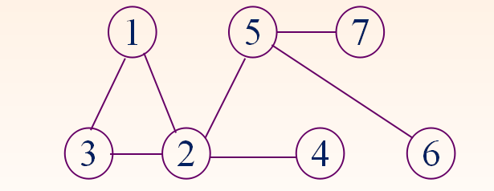

* 有向完全图

    

* 无向完全图

    

* 无向图和有向图的度

    

* 术语

    

* 连通与连通分量

    

* 强连通图

    

* 无向图生成树
    * 生成树：一个无向连通图的生成树是一个极小的、含有图中全部n个顶点的连通子图。它构成一棵树；有n-1条边。

* 无向图的生成森林
    * 生成森林: 各连通分量的一棵生成树构成G的生成森林。  注意，它的连通性与原图相同；但含有最少的边。

* 有向图的有向生成树

    

#### 图的存储结构
* 邻接矩阵法

    

    
    
* 邻接表

    

    
    
### 图的遍历

#### 深度优先搜索DFS
* 一直朝一个没被标记过的方向走，如果四周全被标记过，则原路返回直到遇到有没被标记过的方向，对往该方向走，不断重复该过程直到最终返回终点

```cpp
void DFS(LGraph Graph, Vertex V)
{
    if(Visited[V])//已经访问过
    {
        return;
    }
    Visited[u] = true;
    for(int i=0; i < Graph->NumVertex; ++i)
    {
        if(!Visited[i] && Graph->G[u][i] != INFNITY)
        {
            DFS(i);
        }
    }
}
```

#### 广度优先搜索BFS
* 类似二叉树层序遍历，从起点开始一层一层访问，直到最后一层

```cpp
void BFS(MGraph Graph, Vertex S)
{
    Queue Q = CreateQueue(MAXSIZE);
    Visit(S);
    Visited[S] = true;//标记当前结点
    AddQ(Q,S);//入栈，用于下一层访问
    while(!IsEmpty(Q))
    {
        Vertex V = DeleteQ(Q);
        for(Vertex W = 0; W < Graph->NumVertex; W++)
        {
            if(!Visited[W] && Graph->G[V][W] != INFNITY)
            {
                Visit(W);
                Visited[W] = true;
                AddQ(Q,W);
            }
        }
    }
}
```

### 生成树及最小生成树

#### 生成树


* 深度优先生成树和广度优先生成树

    

    

    

#### 最小生成树
* 定义：找到一棵生成树，它的每条边上的权值之和最小

##### Prim算法


##### Kruskal算法

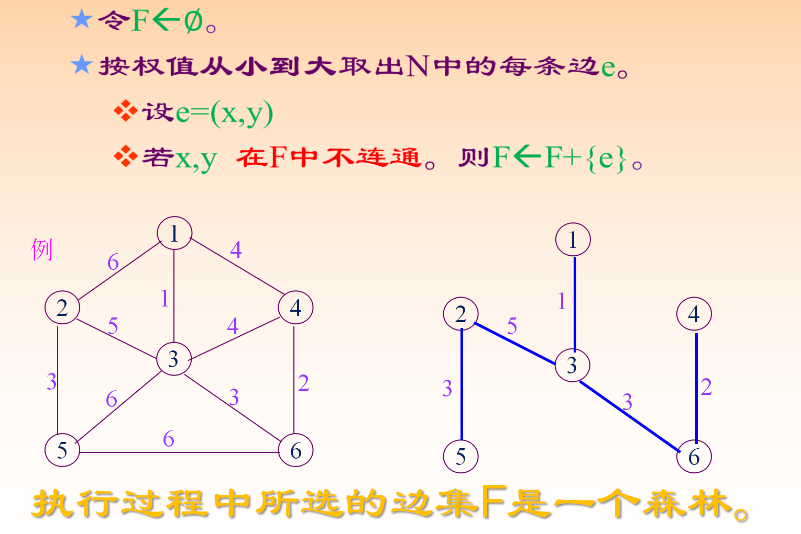

### 拓扑排序

#### 拓扑排序
* 拓扑排序是一个**有向无环图**

* 每个顶点仅出现一次

* 若存在一条从$A$到$B$的路径，那么**在序列中$A$出现在$B$的前面**


> 1. 从图中选择一个没有前驱（入度为0）的顶点并输出

> 2. 从图中删除该顶点和所有以它为起点的边

> 3. 重复1和2直到**当前图为空**或**当前图中不存在无前驱的顶点为止**，其中后一种情况说明有向图中必然存在环

#### 拓扑排序的实现

```c
int V; // 顶点个数
bool topological_sort()
{
    for(int i = 1; i <= V; i++)
    {
        if(indegree[i] == 0)
        {
            push(i)// 将所有入度为0的顶点入队
        }
    }

    int count = 0; // 记录已输出顶点数
    while(!is_empty())
    {
        int v = pop(); // 从队列中取出一个顶点
        cout << v << endl;
        count++;

        // 将所有v指向的顶点的入度减1，并将入度为0的顶点入栈
        for i in v: // 这里使用python代替，根据实际数据结构进行修改
        {
            indegree[i]--;
            if(indegree[i] == 0)
            {
                push(i);
            }
        }
    }
    if(count != V)
    {
        return false; // 没有输出全部顶点，有向图中存在回路
    }
    return true;
}
```

### 关键路径

#### 关键路径


#### 求解关键路径需要的4个描述量


#### 求关键路径步骤
* 先求出到每个顶点的最早时间（从起点推向终点）（到达顶点前确保入度都被访问过）

* 根据最早时间，求出到每个顶点的最晚时间（从终点推向起点）

* 求出每个边的最早开始时间（等于它的起点的最早到达时间）

* 求出每个边的最晚开始时间（等于它的终点的最晚到达时间减去边的活动时间）


### Dijkstra算法

#### Dijkstra算法
<https://www.bilibili.com/video/BV1ha4y1T7om/?spm_id_from=pageDriver&vd_source=c65196c22fdd3605640aeccf1b3b4a0e>

1. 数组声明
    * 声明数组`dis`保存从起点到各个顶点的最短距离

    * 声明数组`T`保存已经找到最短路径的顶点

2. 初始化条件
    * 起始点`dis[start]`的最短路径初始化为0，将与起始点`start`的邻边保存到`dis[]`中，其它顶点`dis[v]`的最短路径初始化为**无穷大**

    * 数组`T`只有起始点`start`

3. 循环
    * 从`dis[]`选取最小值，该值表示从起点`start`到该值对应顶点的最短路径

    * 把该点加入`T`中

    * 检查新加入的顶点是否可以到达其它顶点，并比较是否比从源点直达短，如果是，则**更新**`dis[]`的数值

    * 不断重复循环过程，直到`T`包含所有顶点

#### Dijkstra算法实现

```c
void dijkstra()
{
	put(1);
	dis[1] = 0;
	while (heap_size > 0)
	{
		int top = get();
		if (top == t) 						/// 到达某个点就终止，此题没用到
		{
			break;
		}
		Edge *temp = first[top];
		while (temp != NULL)				/// 遍历当前点的边
		{
			if(temp->v + dis[top] < dis[temp->to])
			{
				dis[temp->to] = temp->v + dis[top];
				if(in_heap[temp->to])
				{
					shift_up(pos[temp->to]);/// 该点已入堆但没被当成最小值弹出
				}
				else
				{
					put(temp->to);          /// 该点没入堆则入堆
				}
			}
			temp = temp->next;
		}
	}
}
```

### Bellman-ford算法

#### Bellman-ford算法
<https://www.bilibili.com/video/BV18C4y137ck/?spm_id_from=333.999.0.0&vd_source=c65196c22fdd3605640aeccf1b3b4a0e>

* 初始化距离数组：将起始顶点到所有其它顶点的距离初始化为无穷大，将起始顶点到自身的距离为0

* **进行$n - 1$次松弛操作**：**对于每条边**$（u，v）$，如果从起始顶点到$u$的距离加上边$（u，v）$小于起始顶点到$v$的距离，**则覆盖**

* 检测负权环：再进行一次松弛操作，如果仍然存在从起始顶点到某个顶点可以更新，则**说明图中存在负权环**

* 输出最短路径：如果不存在负权环，则距离数组中存储的即为起始顶点到各个顶点的最短距离

#### Bellman-ford算法实现

```c
void Bellman_ford()
{
	for (int i = 1; i <= n; i++)
	{
		dist[i] = MAXINT;						/// 初始化到所有点的距离为无穷大
	}
	dist[1] = 0;								/// 到起点的距离为0
	for (int i = 1; i <= n - 1; i++)			/// 进行n - 1次松弛操作
	{
		for(int j = 1; j <= n; j++)				/// 对每条边进行松弛操作（遍历顶点的出边）
		{
			for(int k = f[j] + 1; k <= f[j + 1]; k++)/// k为顶点j的邻接点
			{
				int v = linkto[k];
				if(dist[j] + cost[k] < dist[v])	/// 进行松弛操作
				{
					dist[v] = dist[j] + cost[k];
				}
			}
		}
	}
	for (int j = 1; j <= n; j++)				/// 检查是否存在负环
	{
		for(int k = f[j] + 1; k <= f[j + 1]; k++)
		{
			int v = linkto[k];
			if(dist[j] + cost[k] < dist[v])
			{
				printf("negative cycle!\n");
				break;
			}
		}
	}
}
```

### Floyd算法

#### Floyd算法
<https://www.bilibili.com/video/BV1mM4y117mS/?spm_id_from=333.337.search-card.all.click&vd_source=c65196c22fdd3605640aeccf1b3b4a0e>

* 主要步骤
    1. 初始化：对于图中的每一对结点$i$和$j$，如果存在一条边连接$i$和$j$，则将这条边的权重作为结点$i$和结点$j$之间的初始最短路径长度。如果不存在连接$i$和$j$的边，则将结点$i$和结点$j$之间的初始化最短路径长度初始化为无穷大

    2. 逐步更新最短路径：对于每个结点$k$，考虑结点对$i$和$j$之间的最短路径，其中路径允许经过结点$k$。如果结点$k$能够缩短结点$i$和结点$j$之间的路径长度，则更新结点$i$和结点$j$之间的最短路径长度为经过结点$k$的路径长度

    3. 重复步骤2，直到对于每一对结点$i$和$j$，都**经过了所有的中间结点**（包括结点$k$和之前的中间结点）进行考虑

#### Floyd算法实现
```c
void floyd(int n)
{
	for(int k = 1; k <= n; k++)			/// k为中间结点
	{
		for(int i = 1; i <= n; i++)		/// i为起始结点
		{
			for(int j = 1; j <= n; j++)	/// j为目标结点
			{
				if(dis[i][k] + dis[k][j] < dis[i][j])
				{
					dis[i][j] = dis[i][k] + dis[k][j];
					path[i][j] = k;
				}
			}
		}
	}
}
```

### Tarjan强连通分量算法

#### Tarjan强连通分量算法

* 连通：**无向图中**，从任意点$i$可到达任意点$j$

* 强连通：**有向图中**，从任意点$i$可到达任意点$j$

* 弱连通：**把有向图看作无向图时**，从任意点$i$可到达任意点$j$

<https://www.bilibili.com/video/BV19J411J7AZ?p=4&spm_id_from=pageDriver&vd_source=c65196c22fdd3605640aeccf1b3b4a0e>

* 主要步骤
    1. 初始化：对每个结点进行标记，初始标记为未访问状态，同时设置一个全局的访问计时器`count`和一个空栈

    2. 对每个未访问的结点`u`，执行步骤3

    3. 深度优先搜索：从结点`u`开始进行深度优先搜索，首先将结点`u`标记为已访问，并将其加入栈中。然后遍历`u`的所有邻接结点`v`，如果`v`未被访问，则递归执行步骤3，将`v`加入栈中

    4. 回溯处理：当结点`u`的所有邻接结点都被访问过后，检查是否存在一个结点`v`，满足`v`是`u`的祖先结点，并且`v`的访问顺序小于等于`u`的访问顺序。如果存在这样的结点`v`，说明`u `和`v`之间存在一个强连通分量。此时从栈中连续弹出结点，直到结点`v`被弹出为止，并将这些结点组成一个强连通分量。将每个弹出的结点标记为已访问状态，并记录它们属于哪个强连通分量

    5. 重复步骤3和步骤4，直到图中的所有结点都被访问过

    > 当节点w未被访问过时，我们使用节点w所在强连通分量中的最小访问顺序low[w]作为参考值来更新节点v的low值。而当节点w已经被访问过时，我们使用节点w的访问顺序index[w]（如果w在栈中）或者节点w所在强连通分量中的最小访问顺序low[w]（如果w不在栈中）作为参考值来更新节点v的low值。

    

#### Tarjan强连通分量算法的实现

```c
void tarjan_scc(int v)
{
	index[v] = low[v] = count++;
	stack[top++] = v;
	on_stack[v] = 1;
	for (int i = p[v] + 1; i <= p[v + 1]; i++)
	{
		int w = linkto[i];
		if(!index[w])
		{
			tarjan_scc(w);
			low[v] = min(low[v], low[w]);
		}
		else if(on_stack[w])
		{
			low[v] = min(low[v], low[w]);
		}
	}
	if (index[v] == low[v])	
	{
		int j;
		do
		{
			j = stack[--top];
			on_stack[j] = 0;
			size[tComponent]++;
		} while (j != v);
		tComponent++;
	}
}
```
