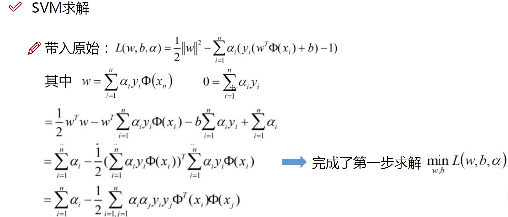
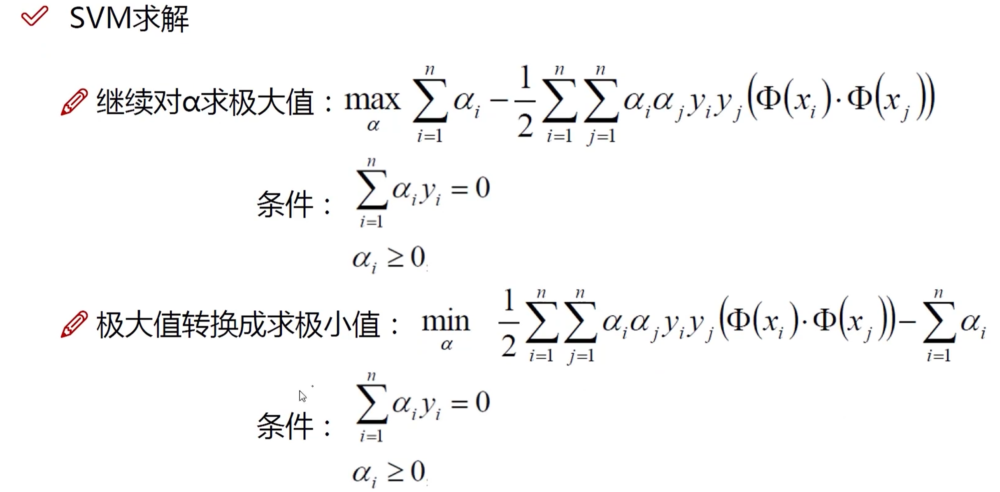
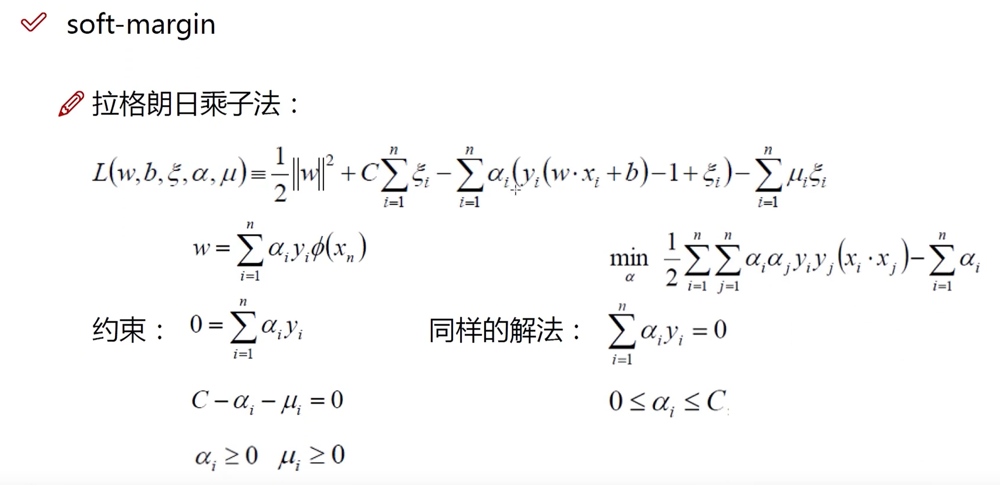
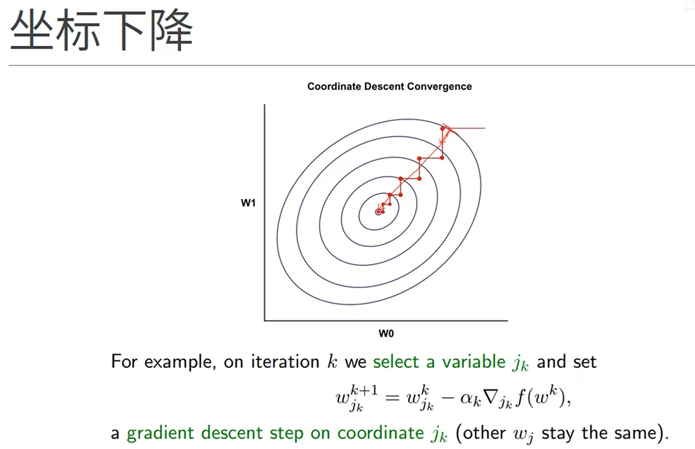
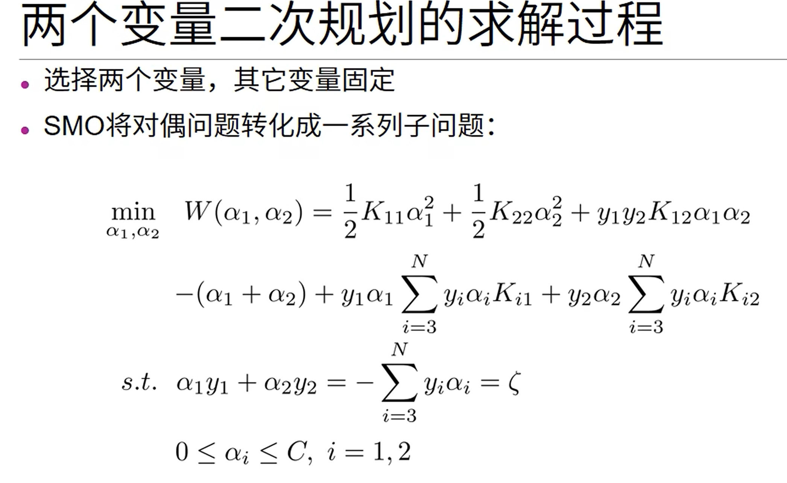
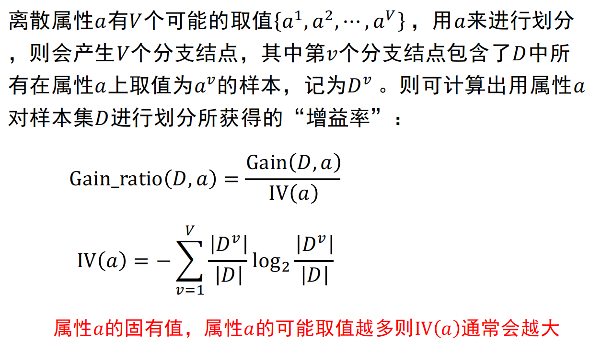
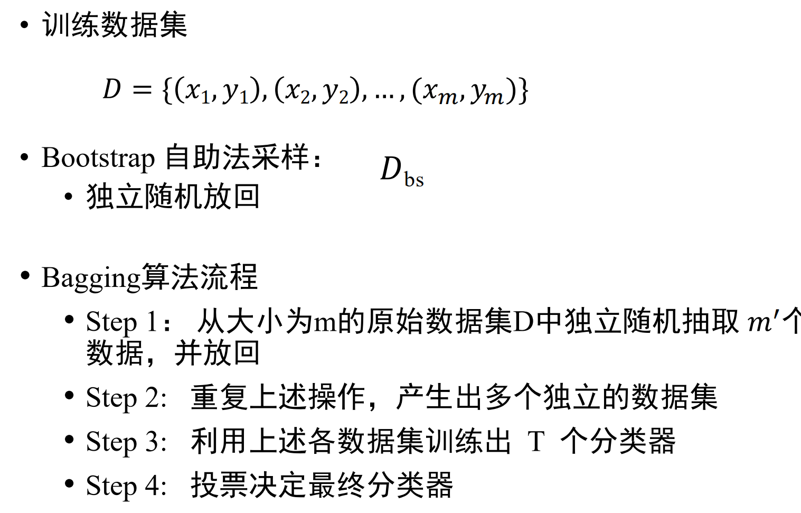

# 机器学习

## 机器学习绪论

### 机器学习定义
* 假设用$P$来评估计算机程序在某任务类$T$上的性能，若一个程序通过利用自身经验$E$在$T$任务中获得性能改善，则我们就说关于$T$和$P$，该程序对$E$进行了学习

### 机器学习算法分类
1. 监督学习：输入数据带有标签

2. 无监督学习：输入数据没有标签

3. 强化学习：输入数据没有标签，**通过环境给出的奖惩进行学习**

### 机器学习关键要素（数据、模型、策略、算法）
1. 数据
    * 令$D = \{ x_1, x_2, ..., x_m\}$为有$m$个样本的数据集，每个样本有$d$个属性，每个样本是样本空间中的一个（列）向量，$d$成为样本的**维数**

    * 用$(x_i, y_i)$表示第$i$个样例，$y_i$为样本$x_i$的标签

2. 模型
    * 模型是需要学习的**条件概率分布**或**决策函数**，**假设空间**包含了所有可能的**条件概率分布**或**决策函数**的集合

    * 参数向量表示模型，决定了模型的具体形式，**参数取不同的值，从而得到不同的模型**

3. 策略：学习或选择**优秀的模型**所采用的方法
    * 损失函数：度量模型**一次**预测的好坏
        1. 0-1损失函数：
            $$
            L(y_i,f(x_i))=\begin{cases}

            1,y_i≠f(x_i); \\
            
            0,y_i=f(x_i).
            \end{cases}
            $$

        2. 平方损失函数：
            $L(y_i,f(x_i))=(y_i-f(x_i))^2$

    * 期望损失：度量**平均**意义下模型的好坏

    * 监督学习的两个基本策略：
        * 经验风险最小化（ERM）
            * ERM策略认为经验风险最小化的模型是最优模型

                

                > 当样本容量足够大时，经验风险最小化能够保证有很好的学习效果

        * 结构风险最小化（SRM）
            * SRM策略在经验风险的基础上加上**表示模型复杂度的正则化项形成结构风险**，认为结构风险最小的模型是最优的模型

                

                > $Ω(f)$为模型的复杂度，模型f越复杂`Ω(f)`越大

                > $λ≥0$是系数，用来权衡经验风险和模型复杂度

        * 当样本容量较小时，ERM的效果可能很差，会产生**过拟合**现象，SRM就是为了**防止过拟合**而产生的

4. 算法
    * 根据学习策略，从假设空间中选择最优模型，通过**算法**求解最优模型的**参数**（如梯度下降法）

## 模型评估与选择

### 训练误差和测试误差
* 训练误差：**对于训练集的平均损失**，过大则没法很好学习到训练集中的规律，存在**欠拟合**

* 测试误差：**对于测试集的平均损失**，反映了模型对未知的测试数据集的预测能力，测试误差小的方法有着更好的预测能力（也叫**泛化能力**）

### 过拟合与模型选择
* 模型选择的典型方法是**正则化**。正则化是**损失结构风险最小**策略的实现，是在经验分析上加一个正则化项或罚项
    * 正则化项一般是模型复杂度的单调递增函数，**模型越杂正则化值越大**

    

       

* 模型验证方法（**评估模型性能**）
    1. 留出法
        * 直接将数据集划分为两个互斥集合，如70%为训练集30%为测试集，进行若干次随机划分，重复实验取平均值
        
    2. 交叉验证法
        * k折交叉验证：将数据集分层采样划分为k个大小相似的互斥子集，每次用k-1个子集的并集作为训练集，余下子集作为测试集，最终返回k个测试结果的均值，k常用的取值是10

            

        * 假设数据集D包含m个样本，若令k=m，则得到留一法
            > 不受随机样本划分方式的影响，结果往往比较准确

            > 当数据集较大时，计算开销难以忍受
    
    3. 自助法
        * 设样本全集容量为m，对样本全集有放回采样m次得到自主抽样样本集D'

            * 有的样本可能被多次重复抽到，而也有的样本一次也没被抽到（概率约为1/3），这些没被抽到的样本可被用来当作测试集

                

            * 优势：可以获取更多的、超出原样本容量的样本，在针对小样本集或难以有效划分训练集和样本集非常有用

            * 缺点：自助法产生的训练集改变了初始数据集的分布，会引入估计偏差

### 性能度量

#### 查准率和查全率


* 查准率：$P=TP/(TP+FP)$
    > 分类为**正**的**正样本**占**分类为正的样本**的比例

* 查全率：$P=TP/(TP+FN)$
    > 分类为**正**的**正样本**占**所有正样本**的比例

#### P-R曲线
* 根据学习器的预测结果对样例按**正例可能性大小**排序，设置一个阈值，大于这个阈值的值分类为1，小于这个阈值的值分类为0，对每个阈值进行预测，则可以得到**查准率-查全率曲线（P-R曲线）**


* 平衡点是曲线上“查准率=查全率”时的取值，可用于度量P-R曲线有交叉的分类器的性能高低

#### F1度量


* 比F1度量更一般的形式$F_β$：

    

#### ROC曲线和AUC值
* 根据学习器预测结果对样例排序，并逐个作为正例进行预测（和上面阈值一样），以“假正例率”（对负例把负例预测为正例概率）为横轴，“真正例率”（查全率）为纵轴可得ROC曲线

* 若某个学习器的ROC曲线被另一个学习器的曲线包住，则后者性能优于前者；若曲线交叉，可根据ROC曲线下的面积大小比较，即**AUC值**


### 偏差和方差
* 泛化误差可以分解为**偏差**、**方差**和**噪声**之和
    * 偏差：预测与真实的偏离程度
    
    * 方差：训练集变化导致的性能变化

    * 噪声：学习问题本身的难度
    
## 线性模型

### 线性回归
* 一般形式
    * $f(x)=\omega_1 x_1+\omega_2 x_2+...+\omega_d x_d+b$

* 向量形式
    * $f(x)=\omega^T x+b$
        > $\omega =(\omega_1; \omega_2; ...; \omega_d)$
        
        > $x = (x_1; x_2; ...; x_d)$

> $f_{好瓜}(x)=0.2\cdot x_{色泽}+0.5\cdot x_{根蒂}+0.3\cdot x_{敲声}+1$

### 回归问题
* 线性回归：找到一条直线（或一个超平面）使得误差最小

    

* 均方误差：$E_{(\omega ,b)}=\frac 1m \sum_{i=1}^m (f(x_i)-y_i)^2$
    * 解决线性回归问题就是求得均方误差的最小值对应的$(\omega^*,b^*)$

* 平方损失：$L(f(x_i),y_i)=\frac 12(f(x_i)-y_i)^2$

    

#### 线性回归问题求解
1. 单变量线性回归
    * 数据：$D=\{(x_i,y_i)\}^m_{i=1}$

    * 模型：$f(x_i)=\omega x_i+b$

    * 策略：平方损失$L(y_i,f(x_i))= (y_i-f(x_i))^2$
        * 最小二乘法（基于均方误差最小来对模型进行求解的方法）
            * $目标函数=\sum（观测值-理论值）^2$
        $$
        (\omega^*,b^*)=\mathop{argmin}\limits_{(\omega,b)}\sum_{i=1}^m(y_i-f(x_i))^2

        \\=\mathop{argmin}\limits_{(\omega,b)}\sum_{i=1}^m(y_i-\omega x_i-b)^2
        $$
    
    * 算法：求解$\omega$和$b$使$E_{(\omega,b)}=\sum_{i=1}^m(y_i-\omega x_i-b)^2$最小化的过程

        
        
        

2. 线性回归-矩阵形式
    * 线性回归问题：
        * 找$(\omega^*, b^*)$去满足$min~\{E_{(\omega, b)}\} = \sum^m_{i = 1} (f(x_i) - y_i) ^ 2$

    * 将问题转化为矩阵形式：
        > 范数：
        > $$
        \begin{Vmatrix}
            x
        \end{Vmatrix}_2
         = \sqrt{\sum ^ n _ {i = 1} {x_i} ^ 2}\\
         x^T x = \begin{Vmatrix} x \end{Vmatrix}^ 2 _ 2
          $$


        $$
        E_{(\omega, b)} = \sum^m_{i = 1} (f(x_i) - y_i) ^ 2
        \\
        = \sum ^ m _ {i = 1} (\omega ^ T x_i - y_i) ^ 2 
        \\
        = \sum ^ m _ {i = 1} (x_i ^ T \omega - y_i) ^ 2
        \\
        = \begin{Vmatrix}
            x_1^T\omega - y_1   \\
            x_2^T\omega - y_2   \\
            ...                 \\
            x_m^T\omega - y_m   \\
          \end{Vmatrix}_2^2
        \\
        = \begin{Vmatrix}
            \begin{pmatrix}
                x_1^T   \\
                x_2^T   \\
                ...     \\
                x_m^T   \\
            \end{pmatrix} w - 
            \begin{pmatrix}
                y_1 \\
                y_2 \\
                ... \\
                y_m \\
            \end{pmatrix}
          \end{Vmatrix}^2_2
          \\
          = \begin{Vmatrix}
                X \omega - Y
          \end{Vmatrix} ^2 _2
        $$

    

    * 矩阵问题求解：
        * 找$(\omega^*, b^*)$去满足$min~\{E_{(\omega, b)}\} = \begin{Vmatrix} X\omega - Y\end{Vmatrix} = (X \omega - Y)^T (X \omega - Y)$

        

        [点击查看推导过程](https://zhuanlan.zhihu.com/p/74157986)

        > 必须记忆的公式：
            >$$
            \frac{\partial \beta^T x}{\partial x}=\beta\\
            ~\\
            \frac{\partial x^T x}{\partial x}=2x\\
            ~\\
            \frac{\partial x^T Ax}{\partial x}=(A+A^T)x
            $$

    * 使用**正则化**解决过拟合问题
        
        
        
        * 矩阵形式

        

3. 梯度下降法
    * 在每一轮计算当前点的梯度，并沿着**与梯度相反的方向**按照**一定步长**移动
        ```python
            while 终止条件:
                w = w - η * 当前点的梯度
        ```

    1. 批量梯度下降法：
        * 特点：**所有样本**都有贡献，可以达到一个全局最优，样本多的情况下收敛速度慢

        

    2. 随机梯度下降法：
        * 特点：每次更新**用1个样本**，计算得到的并不是准确的一个梯度，整体的方向是全局最优解的方向，最终结果往往在全局最优解附近，方法更快，更快收敛
        
        

    3. mini-batch梯度下降法：
        * 特点：**使用一个以上而又不是全部的训练样本**，批量梯度下降法与随机梯度下降法的结合，将所有数据分割成k个mini-batches

        * 对每个mini-batch k，做一次批量梯度下降法

            

            

### 逻辑回归

#### 什么是分类问题
* 分类问题：

    
    
* 线性回归输出：
    * $f(x)=\omega^Tx+b=z$
    * $g(z)\in \{0,1\}$

* 最理想的函数-**单位阶跃函数**，**但是在$z=0$处不连续**
    $$
    g(z)=\begin{cases}
        0,&z<0\\
        0.5,&z=0\\
        1,&z>0\\
    \end{cases}
    $$

* 替代函数-**对数几率函数**，**单调可微，任意阶可导**

    

    $$
    g'(z)=g(z)(1-g(z))\\
    $$

* 标签判别规则
    * 预测：$y=1~~~~~g(x)>=0.5~~~~~\omega^Tx+b>=0$

    * 预测：$y=0~~~~~g(x)<0.5~~~~~\omega^Tx+b<0$

    * 判别边界：$\omega^Tx+b=0$

#### 对数几率回归模型建立
* $P(y_i)=y_i P(y=1)+(1-y_i) P(y=0)$

* 似然函数
    * $L(y|x;\omega)=\prod^m_{i=1}P(y_i|x_i;\omega)$

* 对数似然函数
    * $L(y|x;\omega)=\sum_{i=1}^m ln(y_i|x_i;\omega)$

* 最大化对数似然函数
    * $max~L(y|x;\omega)\to 习惯解决最小化问题\to min~L(y|x;\omega)=-\sum_{i=1}^m lnP(y_i|x_i;\omega)$

* 交叉熵损失

    

    

    

#### 多分类学习


##### 多分类学习：一对一


##### 多分类学习：一对其余


## 神经网络

### 神经元模型
* 神经元模型

    

    * 输入：来自其它$n$个神经元传递过来的输入信号

    * 处理：输入信号通过带**权重**的连接进行传递，神经元接受到总输入值将其与神经元的阈值进行比较

    * 输出：通过**激活函数**的处理得到输出
        > Q：`Z2 = A1.dot(w2) + b2;  A2 = Z2`，为什么不是`A2 = sigmoid(Z2)`？其中`A2`为输出结果，表示红酒的品质，为**连续值**
        
        > A:在回归问题中，目标是预测一个**连续的值**，而不是将输入样本分为不同的类别，因此**不需要**使用激活函数来进行类别的划分，**而是直接将线性变换的结果作为输出**

    * Sigmoid激活函数

        

    * ReLU激活函数

        

* 神经网络模型
    * 将若干**神经元**按一定**层次结构**连接起来，得到神经网络模型

        

### 感知机与多层网络
* 感知机是**二类分类**的线性分类模型，输入为实例的特征向量，输出为实例的类别，感知机学习旨在求出将训练数据进行线性划分的分离超平面


* 感知机求解**与、或、非问题**，但是不能求解异或问题


### 误差逆传播算法
* 多层前馈神经网络

    

<https://www.bilibili.com/video/BV12b4y1X7Wv/?spm_id_from=333.788&vd_source=c65196c22fdd3605640aeccf1b3b4a0e>


> 此处$x$为隐含层的输出值


## 支持向量机

### 线性可分支持向量机与硬间隔最大化







### 线性可分支持向量机与软间隔最大化




### 非线性支持向量机与核函数


### 序列最小优化算法（SMO算法）

[参考连接](https://www.bilibili.com/video/BV1bK4y187hG/?spm_id_from=333.337.search-card.all.click&vd_source=c65196c22fdd3605640aeccf1b3b4a0e)







## 决策树

### 基本流程
* 决策树模型呈树型结构，主要由结点（根结点、内部结点和叶结点）和边组成

    

    

* 基本思想
    1. 构建根结点，将所有训练数据放在根结点

    2. **选择一个最优属性**，按照这一属性将训练集**分割**成子集，使得各个子集有一个**当前条件下最好的分类**
        * 如果这些子集已能被基本正确分类，那么**构建叶结点**，并将这些子集分到所对应的叶结点中

        * 如果还有子集不能被正确分类，那么**构建中间结点**，对这些子集选择新的最优属性，继续分割

    3. 如此**递归下去**，直到所有训练数据子集被基本正确分类，或者没有合适的属性为止

    4。 最后**构建叶结点**，每个子集**都被分到叶结点得到各自的类**
### 划分选择

#### 信息增益ID3
* 对于样本$D$中第$k$类样本所占的比例为$p_k$，信息熵为
    $$Ent(D) = -\sum^{|y|}_{k = 1} p_k log_2p_k$$

    * $Ent(D)$的值越小，则$D$的纯度越高
    
    * 计算信息熵时约定：若$p_k = 0$则$p_k log_2p_k = 0$

    * $Ent(D)$的最小值为0，最大值为$log_2|y|$

        

* 数据纯度越高，信息熵越小

* 信息增益（**因某一属性使数据集分类的“纯度提升”程度**）
    
    

#### 增益率C4.5
* 增益率

    

#### 基尼指数CART
* 基尼值
    $$Gini(D) = 1 - \sum ^{|y|}_{k = 1} p^2_k$$

    * $Gini(D)$越小，数据集$D$的纯度越高

* 属性$a$的基尼指数
    $$Gini\_index(D,a) = \sum ^V _{v = 1} \frac{|D^v|}{|D|} Gini(D^v)$$

    * 应选择使划分后基尼指数最小的属性作为最优划分属性
    
## 集成学习
https://www.bilibili.com/video/BV13S4y1t7aY/?spm_id_from=333.337.search-card.all.click&vd_source=c65196c22fdd3605640aeccf1b3b4a0e

### 个体与组成


### Boosting


### Bagging与随机森林





## 朴素贝叶斯法


## 聚类
