# 凸轮机构的应用和类型
* 凸轮机构的组成：凸轮、从动件、机架

    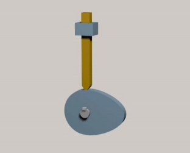

# 从动件的运动规律
* 凸轮机构的基本参数和运动过程

    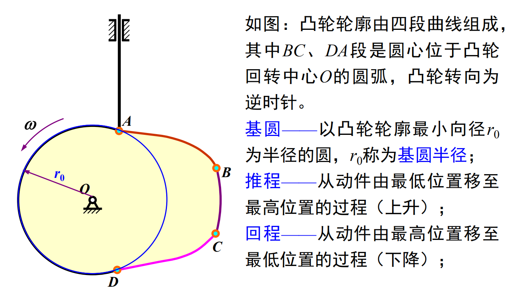

    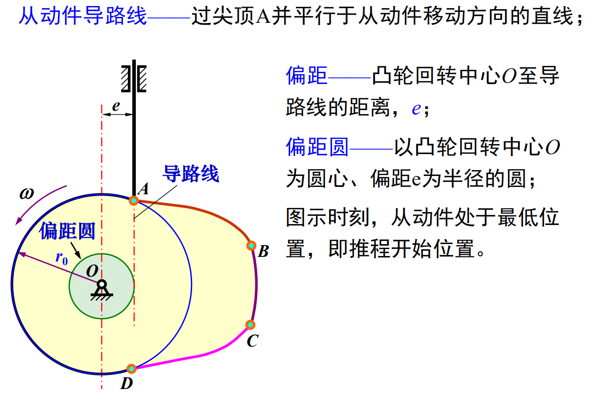

    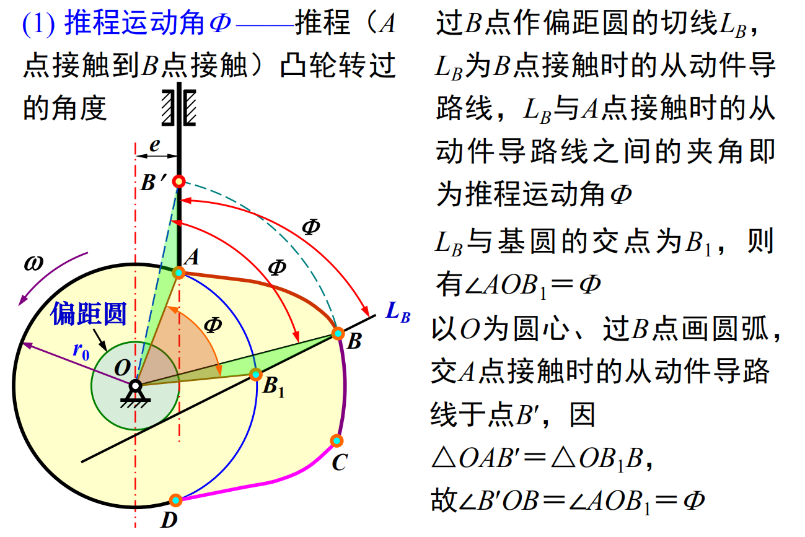

    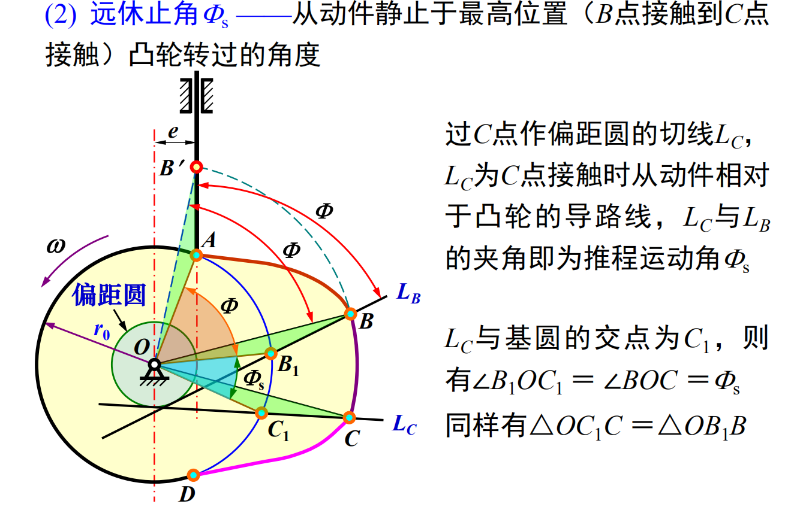

    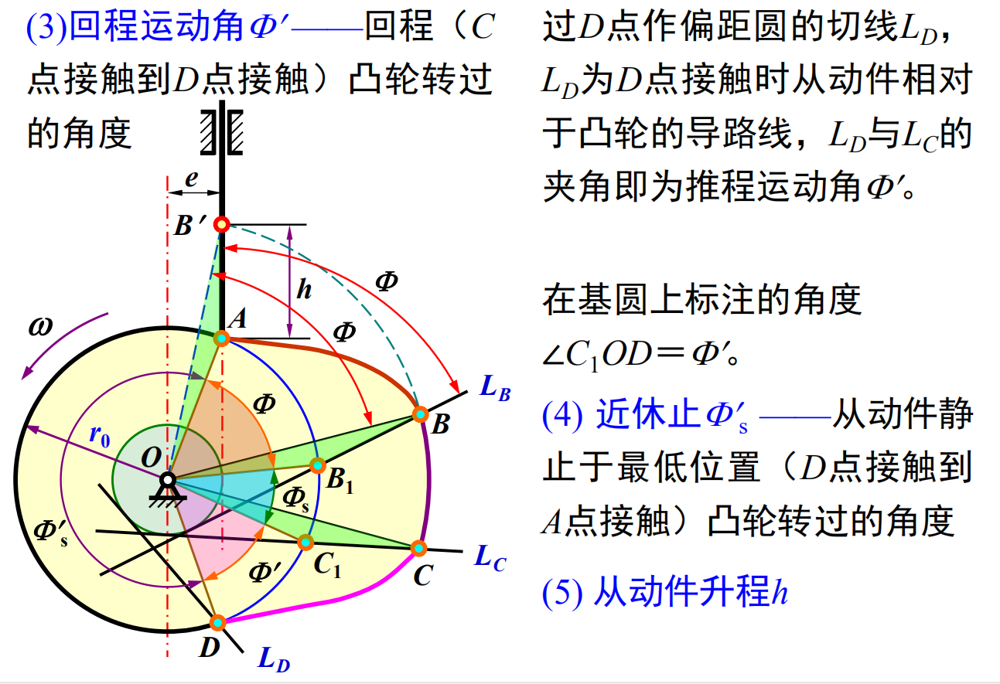

    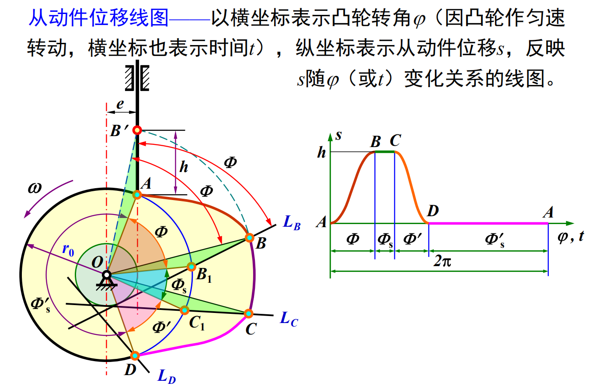

# 凸轮机构的压力角
* 压力角$\alpha$：驱使从动件运动的作用力方向与受力点**速度**方向之间的夹角（锐角）

* 压力角与作用力的关系

    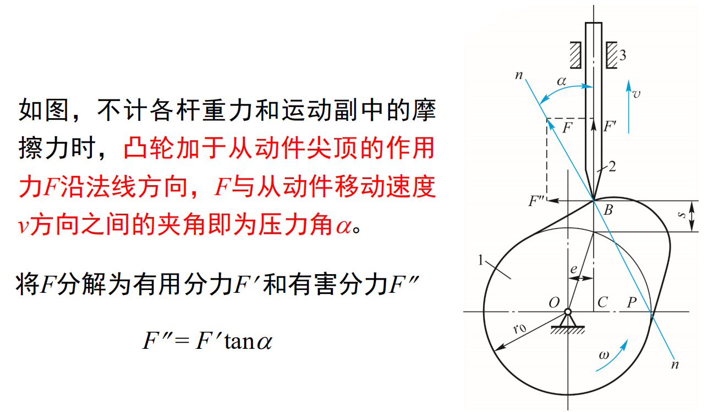

    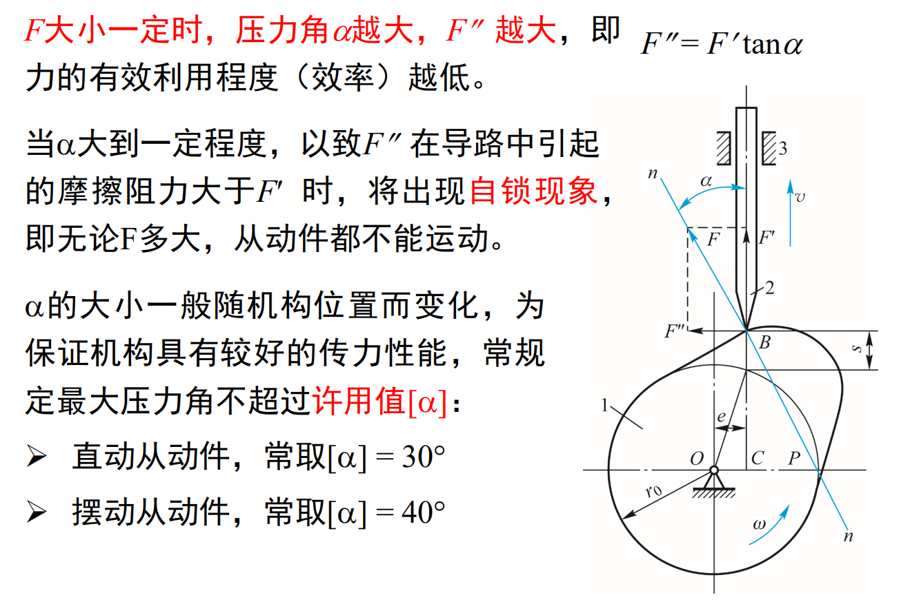

# 图解法设计凸轮轮廓

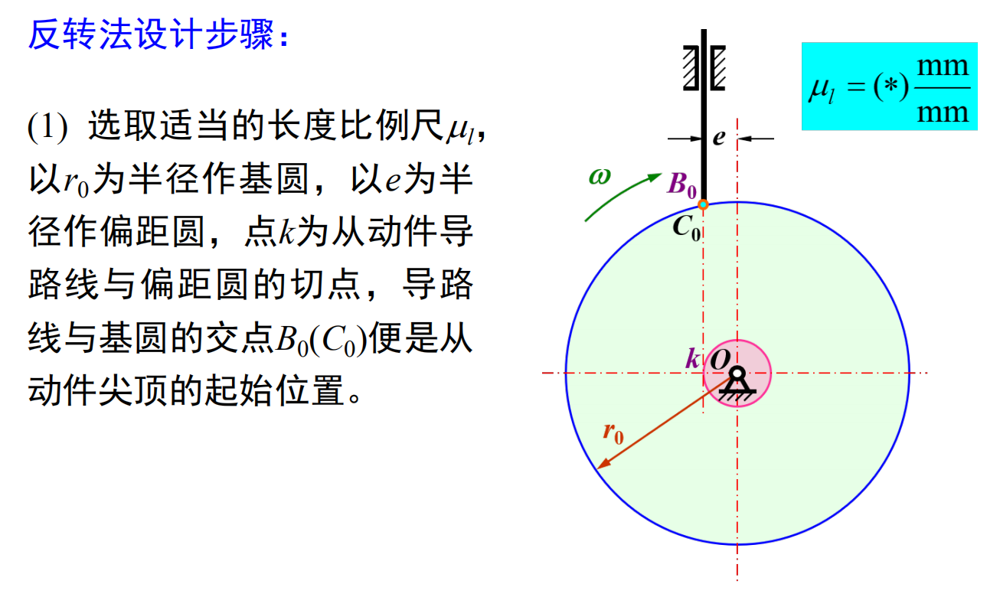

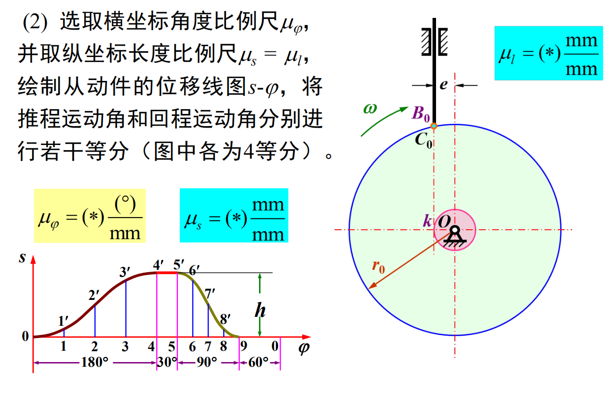

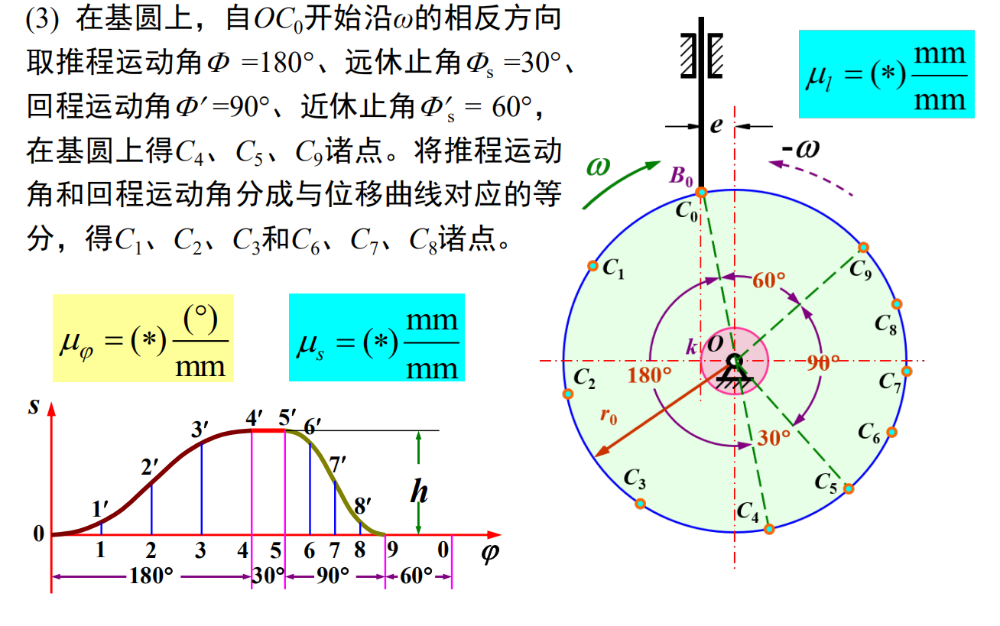

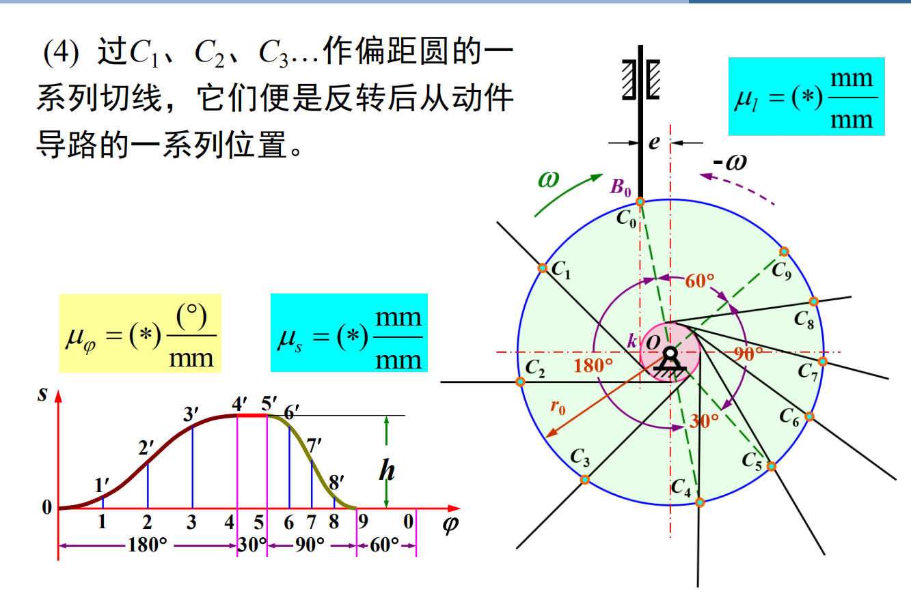

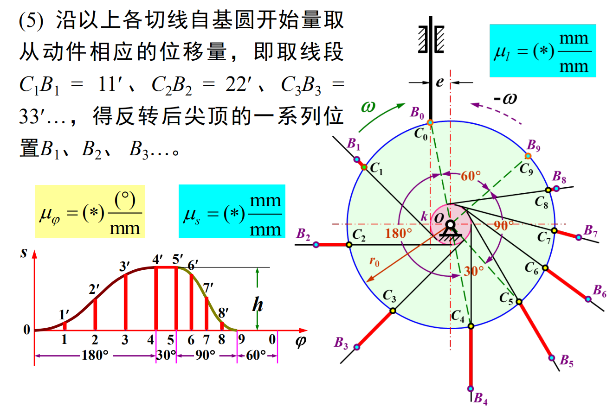

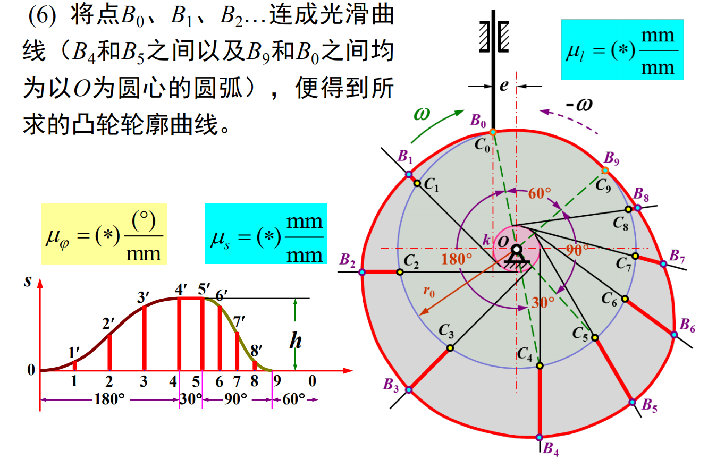
