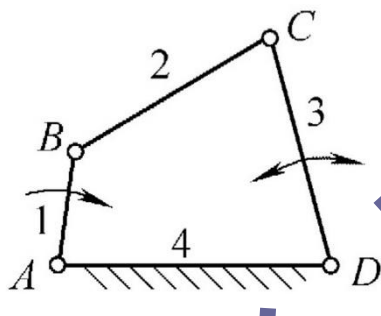
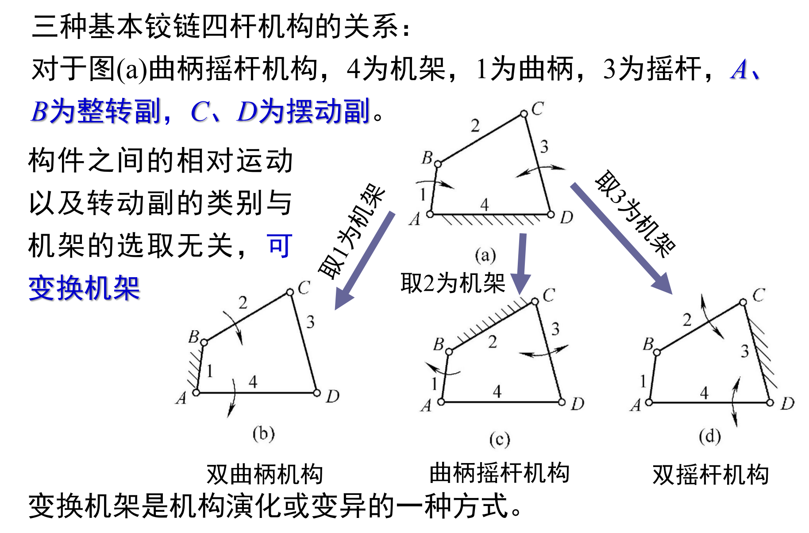
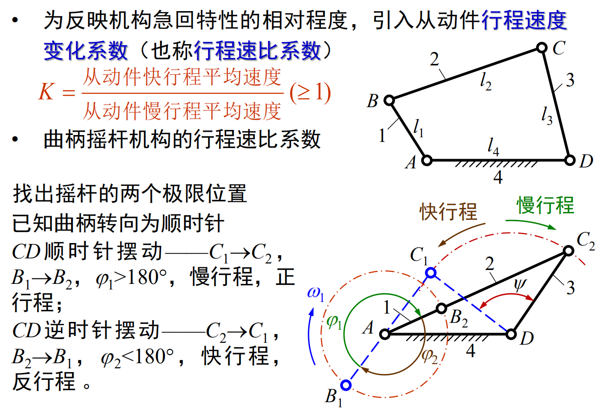
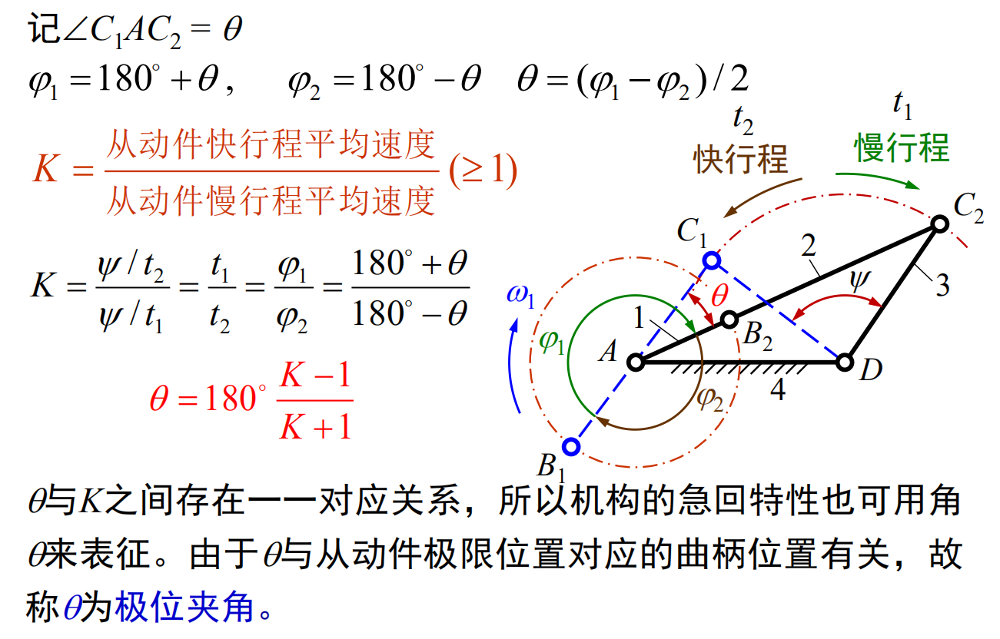
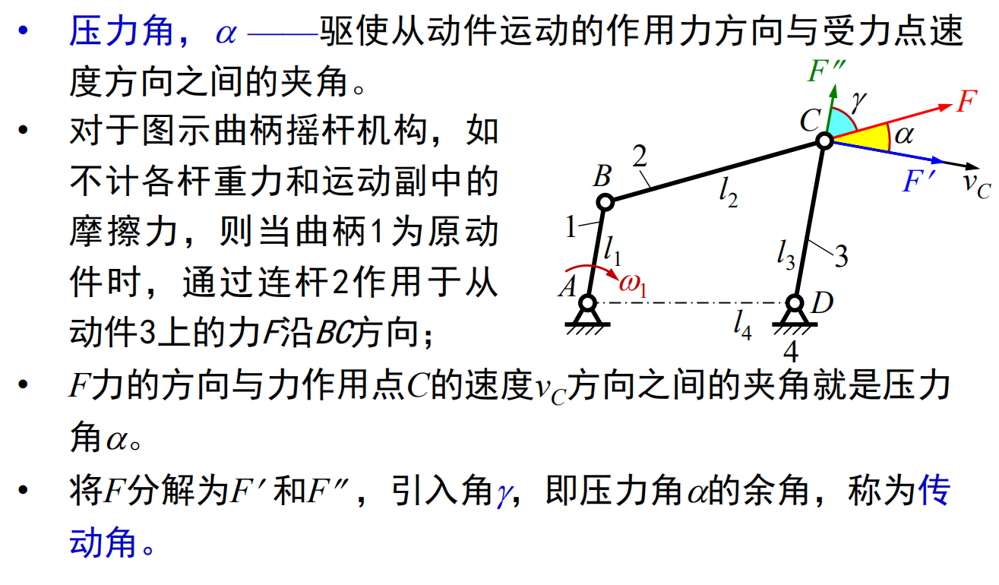
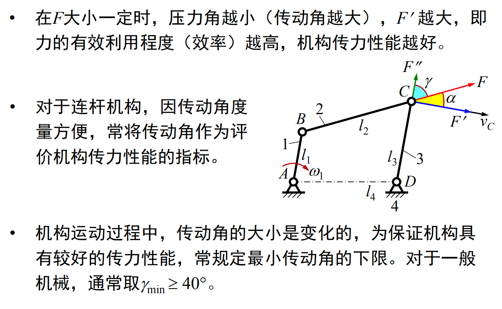

# 平面四杆机构的基本类型
* 铰链四杆机构：所有运动副均为转动副的平面四杆机构
    
    

    * 连架杆：与机架组成运动副的构件

    * 连杆：不与机架组成运动副的构件

    * 整转副：**组成转动副的两构件**能作整周**相对**转动

    * 摆动副：非整转副

    * 曲柄：与机架组成**整转副**的**连架杆**

    * 摇杆：与机架组成**摆动副**的**连架杆**

* 铰链四杆机构可分为三种基本形式
    1. 曲柄摇杆机构
        * 两连架杆一为曲柄另一为摇杆，$A、B$为整转副，$C、D$为摆动副

        

    2. 双曲柄机构
        * 两连架杆均为曲柄，$A、D$为整转副，$B、C$可为**摆动副或整转副**

        

    3. 双摇杆机构
        * 两连架杆均为摇杆，$A、D$为摆动副，$B、C$可为**摆动副或整转副**

        

    

# 平面四杆机构的基本特性
* 铰链四杆机构有整转副的条件
    1. 最长杆与最短杆的长度之和应$\leq$其它两杆长度之和，连架杆或机架之一为最短杆，则**最短杆参与构成的转动副都是整转副**，剩下为**摆动副**

    2. 不满足以上杆长之和条件时，无论取哪个杆作为机架，均为**双摇杆机构**

* 急回特性

    

    

    

* 压力角和传动角

    

    

    

* 死点位置

    
