# 机械设计基础

## 平面机构的自由度和速度分析

### 运动副和分类
* 自由度：
    * 平面运动有三个自由度：x轴、y轴、转动

* 运动副：两构件**直接接触**并能产生**一定相对运动**的连接
    1. 低副：两构件通过**面**接触组成的运动副
        1. 转动副（也称铰链）：组成运动副的两构件只能在**平面**内相对转动

        2. 移动副：组成运动副的两构件只能沿**某一轴线**相对移动

    2. 高副：两构件通过**点**或**线**接触组成的运动副

### 平面机构运动简图
* 一般构件的表示方法

    

    

    

    

    

* 圆圈表示转动副，其圆心代表相对转动的轴线。
    * 如果两构件都是活动件，则用a表示

    * 如果其中一个为机架，则在代表机架的构件上加上阴影线，如b和c

    

* 移动副的导路必须和**相对移动方向**一致，并在代表机架的构件加上阴影线

    

* 两构件组成**高副**时，应当画出两构件接触处的曲线轮廓

    

* 机构中的构件可分为三类：
    1. 固定构件（机架）：用来**支撑**活动构件（运动构件）的构件

    2. 原动件（主动件）：按给定运动规律运动的构件

    3. 从动件：机构中**随原动件运动而运动**的其余活动构件
    
### 平面机构的自由度
* **机构**：具有确定运动的运动链

* **机构的自由度**：保证机构具有确定运动时所必须给定的独立运动参数
    * 机构具有确定运动的条件为：**自由度=原动件数**，平面单个自由构件的**自由度为3**

* 平面机构自由度计算公式
    > 平面内的**转动副**剩下**一个自由度**（转动）

    > 平面内的**移动副**剩下**一个自由度**（沿一轴方向的移动）

    > 平面内的**高副**只约束沿接触处公法线方向移动的自由度，保留**绕接触处转动**和**沿接触处公切线方向移动**的**两个自由度**

    * **低副**减少**两个**自由度，**高副**减少**一个**自由度，若机构中活动构件数为$n$，低副数为$P_L$，高副数为$P_H$，则机构自由度为$F=3n-2P_L-P_H$

* 三个注意事项
    1. 复合铰链
        * **两个以上**构件同时在一处用**转动副**相连接

        * $K$个构件的复合铰链具有$K-1$个转动副

    2. 局部自由度
        * 机构中出现一种与输出运动无关的自由度，称为局部自由度（或称多余自由度），在计算机构自由度**应排除**

        

        * 从动件2是输出构件，而滚子3不影响输出构件2的运动，故滚子绕轴C的运动是一个**局部自由度**$F_p = 1$。计算时把滚子与从动件成为一体，$F=3n-2P_L-P_H-F_p=3*2-2*2-1-1=1$

    3. 虚约束
        * 对机构的运动实际不起**任何限制作用**的约束

        1. 两构件联接前后，联接点的轨迹重合，联接点不会发生移动或变化，保持在同一个位置上

            

        2. 两构件构成多个移动副，且道路平行

            

        3. 两构件构成多个转动副且同轴

            

        4. 运动时，两构件上的两点距离始终不变

            

        5. 对运动不起作用的对称部分

            

### 速度瞬心及其应用
* 速度瞬心
    * 相对瞬心：重合点**绝对速度不为零**

    * 绝对瞬心：重合点**绝对速度为零**

    * 若机构由$K$个构件组成，则瞬心数为$C^2_K=\frac{K(K-1)}{2}$
    
* 速度瞬心求法：
    1. 直接观察法：**直接相联的两构件**

        

    2. 三心定理：作相对平面运动的三个构件共有三个瞬心，**这三个瞬心位于同一直线上**
        > 证明：设构件1为固定构件，则$P_{12}$和$P_{13}$分别为构件1、2和构件1、3之间的绝对瞬心。**假定**$P_{23}$不在直线$P_{12}P_{13}$上，而在其他任一点C，重合点$C_2$和$C_3$的绝对速度$v_{C_2}$和$v_{C_3}$各垂直于$CP_{12}$和$CP_{13}$，显然这时的$v_{C_2}$和$v_{C_3}$的方向不一致。**瞬心应是绝对速度相同的重合点**，故C点不可能是瞬心。只有位于$P_{12}P_{13}$直线上的重合点**速度方向才可能一致**，所以瞬心$P_{23}$必在$P_{12}$和$P_{13}$的连线上

        

## 平面连杆机构

### 平面四杆机构的基本类型
* 铰链四杆机构：所有运动副均为转动副的平面四杆机构
    
    

    * 连架杆：与机架组成运动副的构件

    * 连杆：不与机架组成运动副的构件

    * 整转副：**组成转动副的两构件**能作整周**相对**转动

    * 摆动副：非整转副

    * 曲柄：与机架组成**整转副**的**连架杆**

    * 摇杆：与机架组成**摆动副**的**连架杆**

* 铰链四杆机构可分为三种基本形式
    1. 曲柄摇杆机构
        * 两连架杆一为曲柄另一为摇杆，$A、B$为整转副，$C、D$为摆动副

        

    2. 双曲柄机构
        * 两连架杆均为曲柄，$A、D$为整转副，$B、C$可为**摆动副或整转副**

        

    3. 双摇杆机构
        * 两连架杆均为摇杆，$A、D$为摆动副，$B、C$可为**摆动副或整转副**

        

    

### 平面四杆机构的基本特性
* 铰链四杆机构有整转副的条件
    1. 最长杆与最短杆的长度之和应$\leq$其它两杆长度之和，连架杆或机架之一为最短杆，则**最短杆参与构成的转动副都是整转副**，剩下为**摆动副**

    2. 不满足以上杆长之和条件时，无论取哪个杆作为机架，均为**双摇杆机构**

* 急回特性

    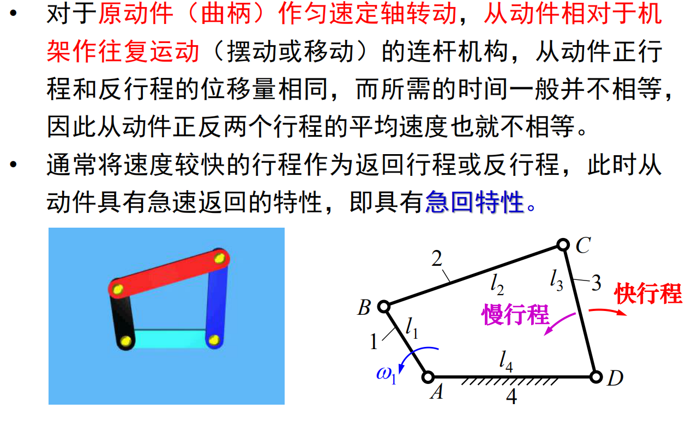

    

    

* 压力角和传动角

    

    

    

* 死点位置

    

## 凸轮机构

### 凸轮机构的应用和类型
* 凸轮机构的组成：凸轮、从动件、机架

    

### 从动件的运动规律
* 凸轮机构的基本参数和运动过程

    

    

    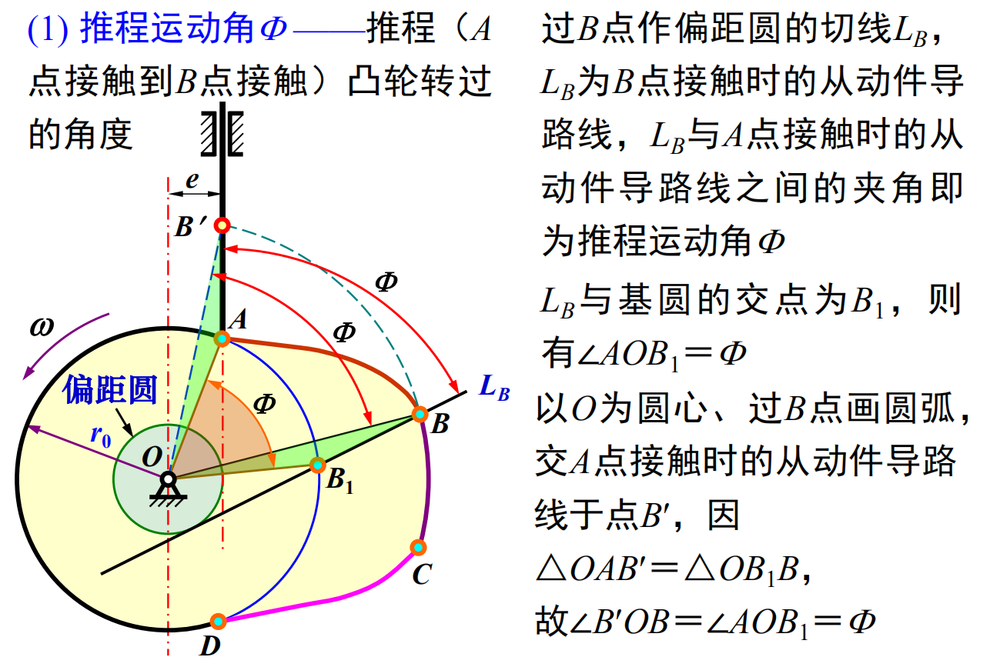

    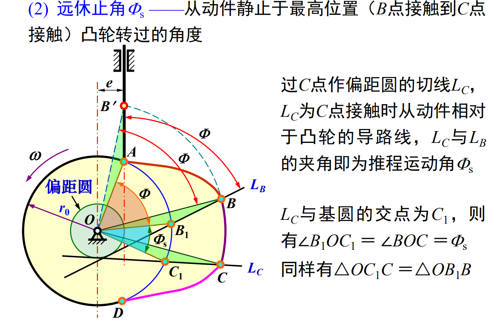

    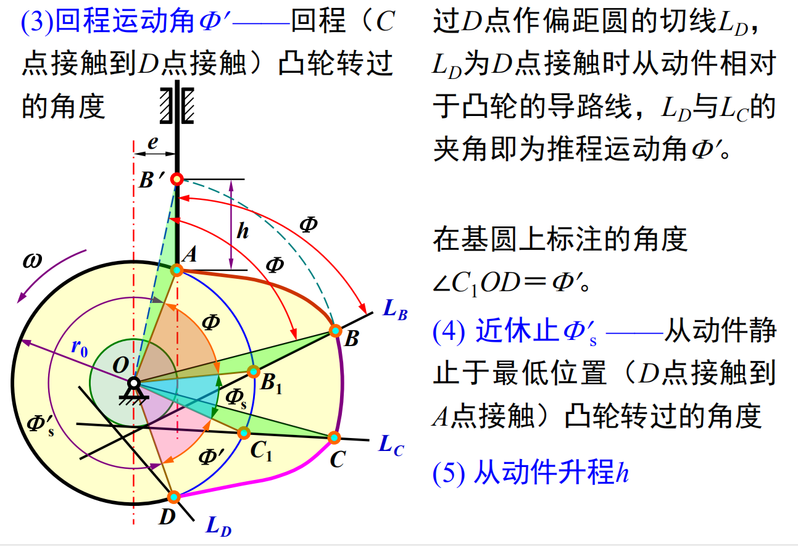

    

### 凸轮机构的压力角
* 压力角$\alpha$：驱使从动件运动的作用力方向与受力点**速度**方向之间的夹角（锐角）

* 压力角与作用力的关系

    

    

### 图解法设计凸轮轮廓

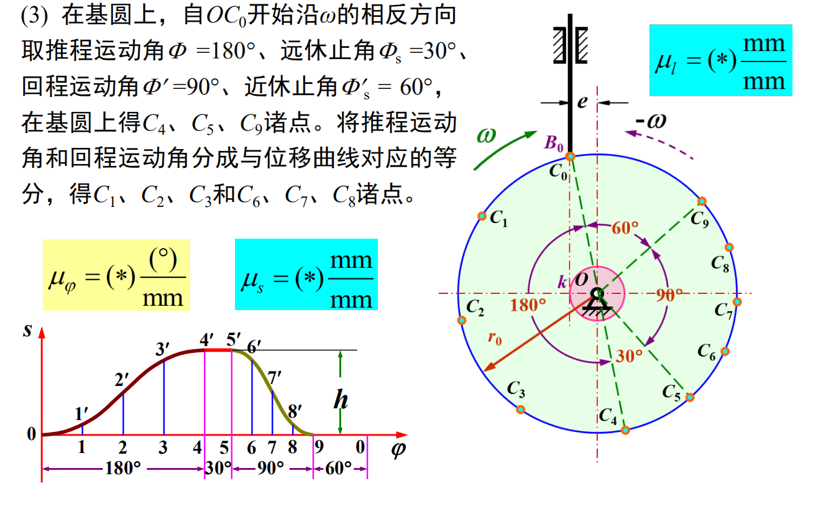

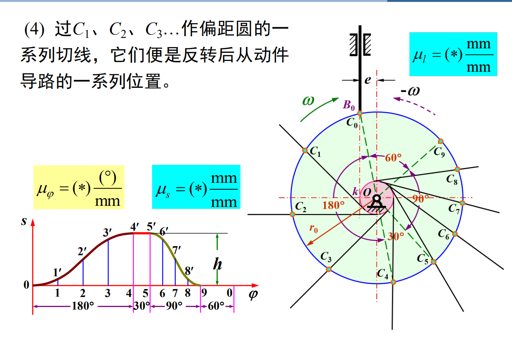

## 齿轮机构

### 齿廓实现定角速比传动的条件

### 渐开线齿廓

* 渐开线特性
    
    

    

    

* 渐开线齿廓满足定角速比要求

    

    

    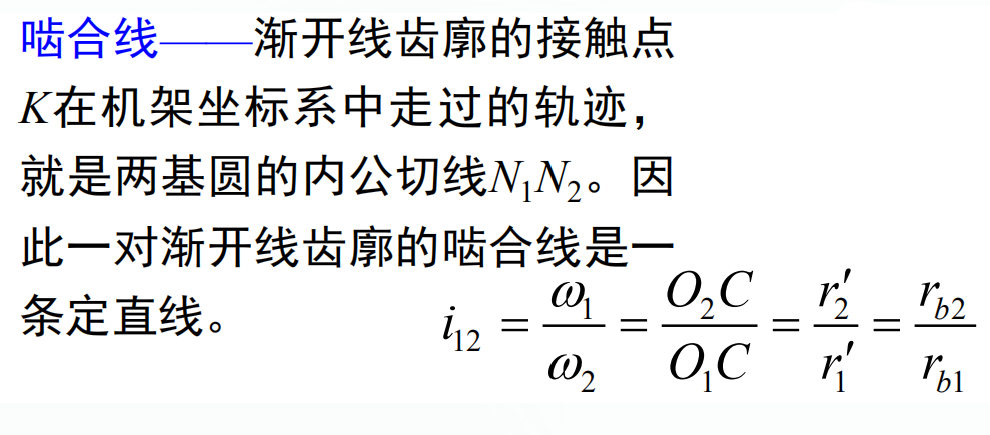

    

### 齿轮各部分名称及渐开线标准齿轮的基本尺寸

* 标准参数

    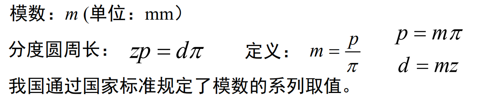

    
    
### 计算
* 已知一对外啮合正常齿制标准直齿圆柱齿轮$𝑚 = 3mm$，$z_1 = 19$，$z_2 = 41$，试
计算这对齿轮的分度圆直径、齿顶高、齿根高、顶隙、中心距、齿顶圆直径、
齿根圆直径、基圆直径、齿距、齿厚和齿槽宽。

$$

分度圆直径（𝑑）: [𝑑 = 𝑚 × 𝑧]\\

齿顶高（h1）: [h1 = 𝑚]\\

齿根高（h2）: [h2 = 1.25 × 𝑚]\\

顶隙（c）: [c = 0.25 × 𝑚]\\

中心距（𝑐）: [𝑐 = \frac{{𝑚 × (𝑧1 + 𝑧2)}}{2}]\\

齿顶圆直径（𝑑1）: [𝑑1 = 𝑑 + 2𝑚]\\

齿根圆直径（𝑑2）: [𝑑2 = 𝑑 - 2.5𝑚]\\

基圆直径（𝑑0）: [𝑑0 = 𝑑 × \cos(\phi)] 其中，(\phi) 为压力角，对于一般的直齿圆柱齿轮，(\phi = 20^\circ)\\

齿距（p）: [p = \pi × 𝑑]\\

齿厚（s）: [s = \frac{{\pi × 𝑑}}{{2𝑧}}]\\

齿槽宽（f）: [f = \frac{{𝑚 × \pi}}{2}]\\

分度圆上的渐开线齿廓的压力角（αt）可以通过以下公式计算：\\

[ \tan(\alpha_t) = \tan(\alpha) \cdot \cos(\phi) ]\\

其中，α是标准压力角，对于一般的直齿圆柱齿轮，α = 20°，m是模数，z是齿数，φ是实际压力角。\\

基圆上的渐开线齿廓的压力角（αn）可以通过以下公式计算：\\

[ \tan(\alpha_n) = \tan(\alpha) / \cos(\phi) ]\\

现在我们可以使用这些公式来计算分度圆和基圆上的渐开线齿廓的压力角。
$$

## 轮系

### 轮系的类型
* 轮系：由一系列互相啮合的齿轮所组成的齿轮传动系统

* 定轴轮系：运转时，各齿轮几何轴线的位置固定不动

* 周转轮系：运转时，至少有一个齿轮的几何轴线是绕着其它定轴齿轮的轴线转动

### 定轴轮系及其传动比
* 平行轴定轴轮系：仅由平面齿轮机构组成，各齿轮轴线平行

* 非平行轴定轴轮系：含有空间齿轮机构

* 蜗杆蜗轮旋向：将蜗杆或蜗轮轴线竖起，螺旋线右面高为右旋，左高为左旋

    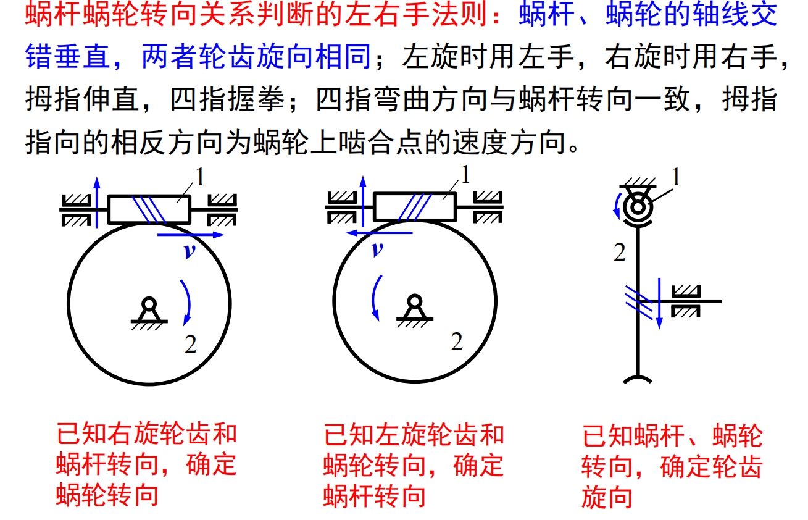

### 周转轮系及其传动比
* 周转轮系的组成
    * 行星轮$2$

    * 行星架或转臂$H$

    * 中心轮或太阳轮$1、3$

    * 行星架与中心轮的集合轴线重合

    

    

* 周转轮系传动比的计算

    

    

    

    
    
## 间歇运动机构
* 间歇运动机构：将主动件的连续转动或往复运动变换为**具有一定运动和禁止时间比的**从动件间歇运动

### 棘轮机构
* [棘轮机构-哔哩哔哩](https://b23.tv/ljuu1JQ)

### 槽轮机构
* [槽轮机构-哔哩哔哩](https://b23.tv/ovcoamg)

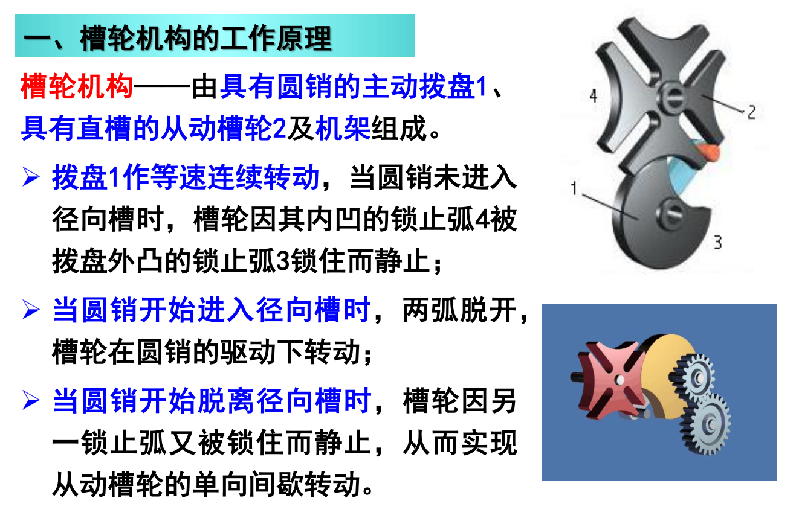

### 不完全齿轮机构

### 凸轮间歇运动机构

## 齿轮传动

### 轮齿的失效形式和设计计算准则
* 齿轮的失效形式
    1. 轮齿折断

        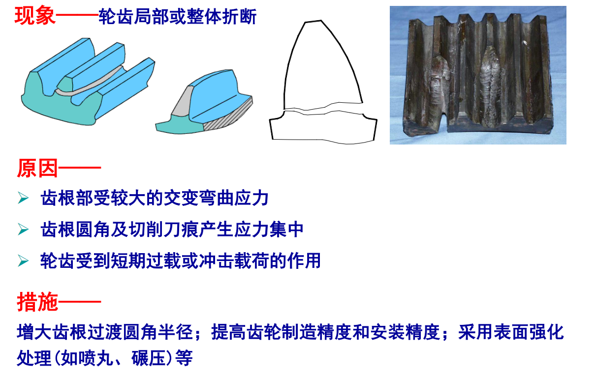

    2. 齿面点蚀

        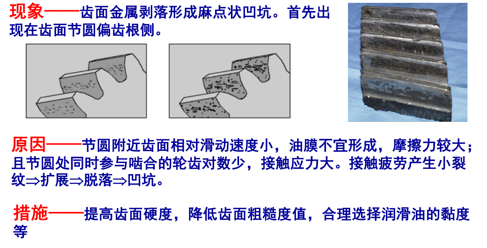

    3. 齿面胶合

        

    4. 齿面磨损

        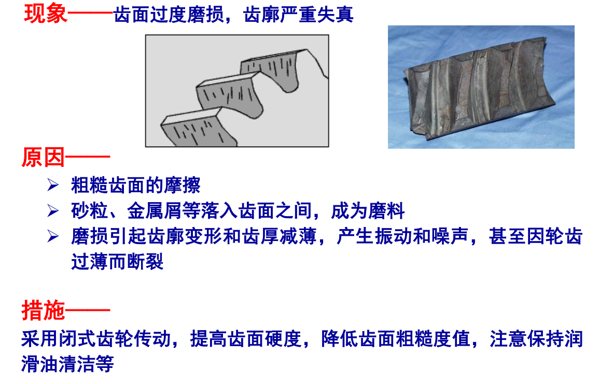

    5. 齿面塑性变形

        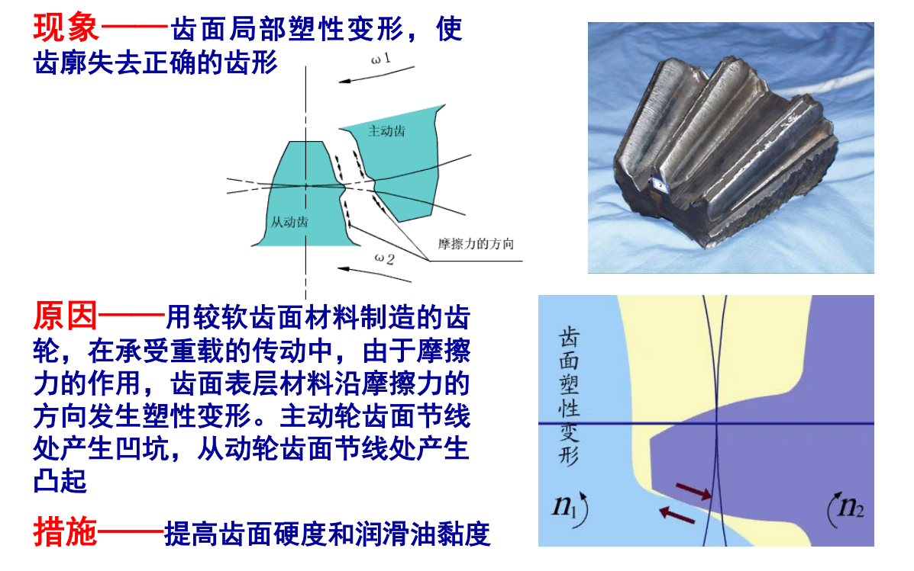

* 齿轮设计计算准则
    * 闭式齿轮：通常都是装在经过精确加工且封闭严密的箱体（齿轮箱）内，或全部侵入油池中

        

    * 开式齿轮：齿轮完全暴露在空气中，没有加防尘罩或机壳之类的保护装置

        

## 机械零件设计概论

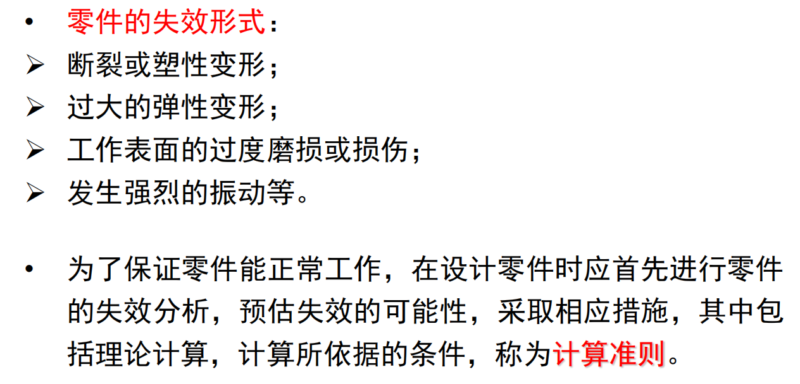

## 轴、滑动轴承和滚动轴承

### 轴

### 滑动轴承

### 滚动轴承

## 联轴器、离合器、制动器和弹簧

### 联轴器、离合器

### 弹簧

## 蜗杆传动

### 涡轮蜗杆
* 竖起来看，右边高为右旋蜗杆，左边高为左旋蜗杆

* 右旋蜗杆时，用**右手**握住蜗杆，4指转向蜗杆旋转方向，则大拇指的**反方向**为涡轮的旋转方向

* 左旋蜗杆时，用**左手**握住蜗杆，4指转向蜗杆旋转方向，则大拇指的**反方向**为涡轮的旋转方向

### 蜗杆传动
* 蜗杆头数：蜗杆上螺旋线的个数

* 当蜗杆为**主动**时的传动比：$i_{12} = \frac{n_1}{n_2} = \frac{z_2}{z_1}$，$z_1$为蜗杆头数，$z_2$为涡轮齿数
