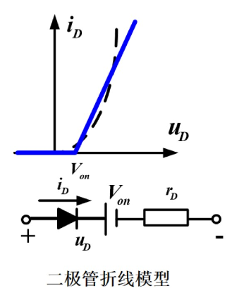
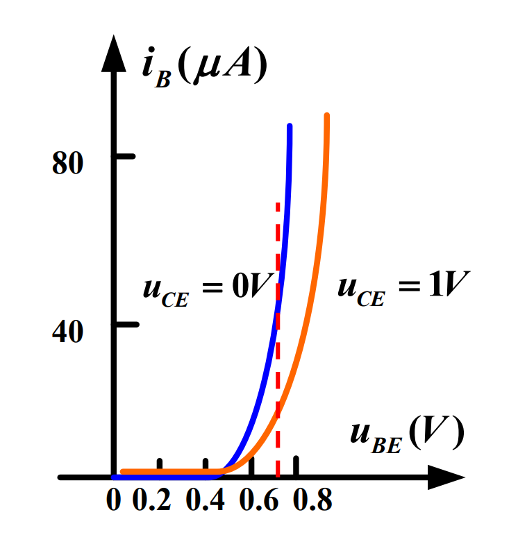
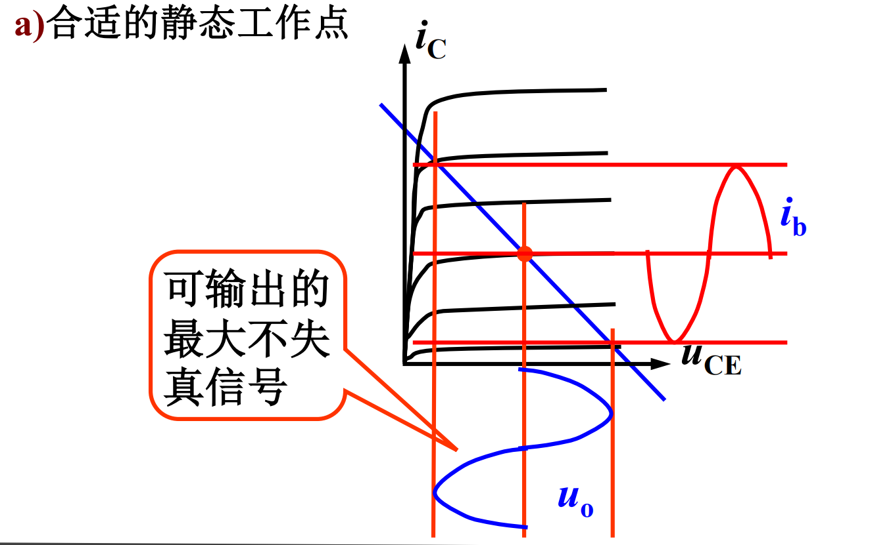
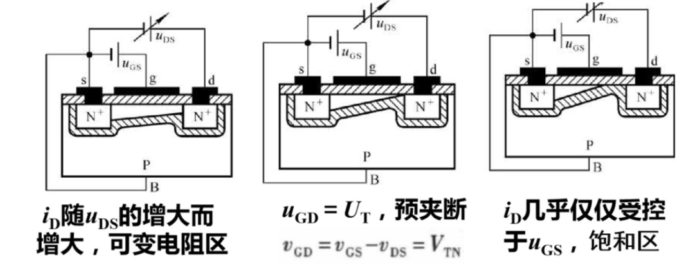
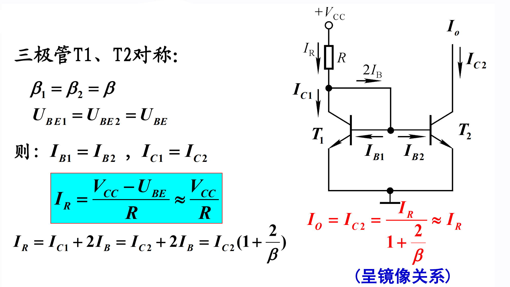

# 模拟电路

## 半导体器件及其应用

### 半导体的特性
*  根据电阻率的不同，物质可分为导体、绝缘体和半导体三大类

*  半导体的导电能力介于导体和绝缘体之间

*  半导体**受外界光和热的刺激时**，导电能力发生显著变化

*  在纯净的半导体中，**加入微量的杂质，导电能力会急剧增强**

### 本征半导体（不含其它杂质的半导体）
* 本征半导体特点
    1. 电阻率大，导电能力很低

    2. 导电性能随温度变化大

    3. **本征半导体不能在半导体器件中直接使用**

* 室温下，本征半导体共价键中的价电子获得足够的能量，挣脱共价键的束缚成为自由电子，在原位留下一个空穴，这种现象称为**本征激发** 

        

* 运载电荷的粒子称为**载流子**，本征半导体中存在**带负电的自由电子**和**带正电的空穴**两种载流子，且**浓度相等**

* 载流子有两种运动方式：扩散运动（浓度差）和漂移运动（电场激发）

* 空穴的移动方向和电子移动的方向是**相反**的，分别形成**空穴电流和电子电流**

### 杂质半导体（本征半导体掺入杂质）
1. N（Negative）型半导体：掺入**五价**杂质
    * 半导体中产生大量的**自由电子**和**正离子**
    
    * 自由电子是多数载流子，主要由**杂质原子**提供
    
    * 空穴是少数载流子，由**热激发**(**本征激发**)形成

2. P（Positive）型半导体：掺入**三价**杂质
    * 半导体中产生大量的**空穴**和**负离子**
    
    * **空穴是多数载流子**，主要由**杂质原子**提供；自由电子是少数载流子，由热激发(本征激发)形成

* 在**杂质半导体**中，多数载流子浓度主要取决于**杂质浓度**，少数载流子浓度主要取决于**温度**，N型和P型在总体上都保持**电中性**

### PN结及其单向导电性
* 把本征硅片一边做成P型半导体，另一边N型半导体，交界处会形成一个很薄的特殊物理层（PN结）

        

    * N区中的电子扩散到P区，结果在P区和N区交界面上留下了一个不能移动的振幅粒子（电子空穴中和）

        

    * N区少了电子呈正极，P区多了电子呈负极，电中性被破坏，形成内电场（PN结的位置）

        

    * PN结内电场一方面**阻碍了多子的扩散**，另一方面**加速了少子的漂移**

* PN结的单向导电性
    1. PN结正向偏置：正极接P区，负极接N区
        * **内电场被削弱，使空间电荷区变薄**，PN结对外呈现较小的阻值，处于正向导通状态    
    
    2. PN结反向偏置：正极接N区，负极接P区
        * 因少子浓度主要与**温度**有关，反向电流与反向电压几乎无关，此电流称为反向饱和电流，记为$I_s$
        
        

### 二极管
* 二极管的伏安特性
    * 正向特性
        1. 近似呈现为指数曲线：$i_D\approx I_Se^{\frac{u_D}{U_T}}$   

        2. 有死区($i_D$约等于0的区域)
            * 死区电压约为(**硅管0.5V**)(锗管0.1V)

        3. 导通压降(硅管0.6~**0.7V**)(锗管0.2~0.3V)

           

    * 反向特性

        

        1. 当$|u_D|<U_{(BR)}$时，$|i_D|\approx I_S$

        2.  当$|u_D|>U_{(BR)}$时，反向电流急剧增大，二极管反向击穿

        * 击穿根据击穿可逆性分为电击穿和热击穿
            1. 热击穿（不可逆击穿）：不加限流措施，PN结因过热而损坏

            2. 电击穿（可逆击穿）：即反向击穿，指的是反向电压达到一定数值，反向电流急剧增加的现象

* 温度对二极管伏安特性的影响
    * 温度升高时，二极管特性减弱（**减弱正向压降能力，减弱反向阻碍能力**）

      

### 二极管的四种模型  
1. 理想模型
    * 在正向偏置时，其管压降为$0V$，而在反向偏置时，认为电阻无穷大（当$u_D>>U_{on}$时）    

        

2. 恒压降模型
    * 二极管导通后，其管压降认为是恒定的，且不随电流的变化，典型值是**0.7V**（硅管压降）

        

3. 折线模型
    * 二极管的管压降**不是恒定的**，而是随着通过二极管电流的增加而增加，$V_{on}$约为**0.7V**（启动电压），其中，$r_D$的值是固定不变的$r_D=\frac{Δu_D}{Δi_D}$（相当于内阻）    

        

4. 小信号模型
    * 二极管对叠加在$Q$点上的微小增量而言，等效为一电阻$r_d$，其值为该直线段斜率的倒数

    * 小信号模型仅限于计算叠加在$Q$点上**微小增量电压或电流**的响应

         

    * 二极管正向偏置，有交流小信号$u_s$输入，且$u_D>>U_T$(二极管的开启电压)时:

        

    * $r_d\approx \frac{U_T}{I_D}=\frac{26(mV)}{I_D(mA)}$

### 开关电路
* 在开关电路中，利用二极管的单向导电性以接通或断开电路。**判断电路中二极管处于导通状态还是截止状态，可以先将二极管断开，然后观察（或计算）阴、阳两极间的极性和大小，来判断电路中的二极管处于导通状态还是截止状态**

### 稳压二极管
* 稳压二极管又称**齐纳二极管**，正向特性曲线与普通二极管相似，反向击穿特性曲线**很陡**，$U_z$表示反向击穿电压，即稳压管的稳定电压（**反向击穿后电压很稳定**）

        

* 稳压二极管原理：**当电流有很大增量时，二极管两端的电压基本上稳定在击穿电压附近，只引起很小的电压变化**

#### 稳压二极管的主要参数
1. 稳定电压$U_z$
    * 指稳压管工作在反向击穿区时的稳定工作电压

2. 稳定电流$I_z(I_{zmin}\sim I_{zmax})$
    * 指稳压管正常工作时的参考电流。若工作电流小于$I_{zmin}$，则不能稳压；若工作电流大于$I_{zmax}$，则会因功耗过大而烧坏

    

#### 稳压管电路分析（并联式稳压电路）
* 限流电阻R的计算

    

    1. 当输入电压最小，负载电流最大（$R_I$最小）时，流过稳压二极管的电流最小。此时$I_z$不应该小于$I_{zmin}$，由此可得**限流电阻的最大值**

        * $R_{max}=\frac{U_{Imin}-U_Z}{I_{Zmin}+{I_{Lmax}}}$

    2. 当输入电压最大，负载电流最小（$R_L$最大）时，流过稳压二极管的电流最大。此时$I_Z$不应超过$I_{Zmax}$，由此可得**限流电阻的最小值**

        * $R_{max}=\frac{U_{Imax}-U_Z}{I_{Zmax}+{I_{Lmin}}}$

    3. 得出限流电阻的取值范围

        * $R_{min}<R<R_{max}$

## 双极结型三极管及其放大电路

### 双极型三极管（BJT）

#### 三极管的结构
* NPN型

    

* PNP型

    

#### 三极管的放大作用和载流子的运动
1. 内部结构
    1. 发射区掺杂浓度**最高**，故其中的多数载流子浓度很高（作用：**发射载流子**）

    2. 基区做得很薄，而且掺杂浓度**最低**，即基区中多子 浓度很低（作用：**传送和控制载流子**）

    3. 集电结结面积**比较大**，且集电区多子浓度远比发射区多子浓度低（作用：**收集载流子**）

2. 外部条件
    1. 发射结正偏：由$V_{BB}$保证：$U_{BE}=U_B-U_E>0.7V$

    2. 集电结反偏：由$V_{CC}$、$V_{BB}$保证：$U_{CB}=U_C-U_B>0$

    * BJT内部的载流子传输过程
        1. 因为发射结正偏，所以发射区向基区注入电子，形成**扩散电流$I_{EN}$**。同时从基区向发射区也有空穴的扩散运动，形成的电流为$I_{EP}$，但其数量小，**可忽略**。所以**发射极电流**$I_E=I_{EP}+I_{EN}≈I_{EN}$

            

        2. 发射区的电子注入基区后，变成了少数载流子，**少部分电子**遇到空穴被复合掉，发射结正偏使得基区产生空穴用以复合**上述的少部分电子**，形成**基区复合电流$I_{BN}$**。所以**基极电流**$I_B=I_{BP}+I_{BN}≈I_{BN}$。**大部分电子**到达了集电极的边缘

            

        3. 由于集电极反偏，促进少子扩散（基区少子电子，集电区少子空穴），集电区收集从基区漂移到集电区的电子，形成**收集电流$I_{CN}$**。集电区的少子空穴和少子电子的漂移形成**集电结方向饱和电流$I_{CBO}$**（CBO表示反向截止状态时从C集电区到B基区的微小电流），$I_C=I_{CN}+I_{CBO}$

            

    * BJT三个电极上电流分配关系
        1. 三电流之间的关系
            * $I_E=I_{EN}+I_{EP}=I_{CN}+I_{BN}+I_{EP}$：$I_{EN}$（发射区的电子）分散为$I_{CN}$（反向截止促进偏移的基区的电子）和$I_{BN}$（发射区的电子与基区的空穴复合）
            
            * $I_C=I_{CN}+I_{CBO}$
            
            * $I_B=I_{EN}-I_{CN}+I_{EP}-I_{CBO}=I_{BN}+I_{EP}-I_{CBO}$

            * 由上面三式可得：$I_E=I_B+I_C$

            * 当忽略$I_{EP}$时可得到：$I_E≈I_{CN}+I_{BN}$，$I_E$在B极和C极之间的分配比例主要**取决于基区宽度、基区多子浓度**

            

    * 电流分配关系（忽略各区少子产生的电流（$I_{EP}$、$I_{CBO}$）
        * $\bar{\alpha}=\frac{I_C}{I_E}$，称为**共基极**直流电流放大系数,显然$\bar α$小于小于1而接近1

        * $\bar \beta=\frac{I_C}{I_B}=\frac{\bar\alpha}{1-\bar{\alpha}}$，称为共**发射极**直流电流放大倍数

### BJT的伏安特性曲线（共发射极接法）
1. 输入特性曲线（$i_B$与$u_{BE}$之间的关系）
    1. $u_{CE}=0V$时，**相当于两个PN结并联**，从中间P向两侧正向导通
        
    2. $u_{CE}=1V$时，集电结反偏，开始收集电子，所以**基区复合减少**，在同一$u_{BE}$电压下，**$i_B$减小**。特性曲线将向右稍微移动一些

        

    3. $u_{CE}≥1V$再增加时，曲线右移很不明显

2. 输出特性曲线（$i_C$与电压$u_{CE}$之间的关系）
    * 以$I_B=60μA$为例

    

    

    1. 当$u_{CE}=0V$时，因集电极无收集作用，故$i_C=0$

    2. 当$u_CE$上升时，$i_C$也随值增大

    3. 当$u_{CE}>1V$后，收集电子的能力足够强。此时发射到基区的电子**都被集电极收集**，形成$i_C$。**故$u_{CE}$再增加，$i_C$基本保持不变**

    * 输出特性曲线可以分为三个区域：
        1. 饱和区：$I_C$受$U_{CE}$显著控制的区域，该区域内$U_{CE}<0.7V$。此时**发射结正偏，集电结也正偏或零偏**

        2. 截止区：$I_C$接近零的区域，即$I_B=0$的曲线的下方，此时**发射结反偏或零偏，集电结反偏**

        3. 放大区：曲线基本平行等距，此时，**发射结正偏，集电结反偏**，该区中有：

            

### 杂项
* 温度对输出特性的影响

    

1. 三极管结偏置判定法

    

2. 三极管电流关系判定法

工作状态|$I_B$|$I_C$|$I_E$
-|-|-|-
截止|0|0|0|
|放大|>0|$\beta I_B$|$I_B+I_C=(1+\beta)I_B$|
|饱和|$I_B\geqslant I_{BS}$|$<\beta I_B$|$<(1+\beta)I_B$|

* $I_{BS}$称为三极管临界饱和时基极应该注入的电流

* 用电流关系判断三极管的工作状态时，可先假设三极管处于放大状态，求出$I_B$。然后根据$U_{CES}$电压求出临界饱和时的$I_{BS}$，若$I_B>I_{BS}$，则三极管处于饱和状态；若$I_B<I_{BS}$，则是放大状态

### BJT的主要参数
1. 电流放大系数
    1. 共发射极放大系数：
        * 直流：$\bar{\beta}=\frac{I_C}{I_B}$，交流：$\beta=\frac{\Delta i_C}{\Delta i_B}$

    2. 共基极电流放大系数：
        * 直流：$\bar{\alpha}=\frac{I_C}{I_E}$，交流：$\alpha=\frac{\Delta i_C}{\Delta i_E}$

3. 极限参数
    1. 集电极最大允许电流$I_{CM}$
        * $I_C$过大时，$β$要下降。当$β$下降到线性放大区$β$值的$70\%$时，所对应的集电极电流称为集电极最大允许电流$I_{CM}$

    2. 集电极最大允许功率损耗$P_{CM}$
        * 集电极电流通过集电结时所产生的损耗：$P_C=I_CU_{CE}<P_{CM}$

        

### 静态、动态电路
1. 静态
    * 在没有加输入信号（$u_i=0$）时，放大电路的工作状态称为**静态**，又称为**直流工作状态**

2. 动态
    * 在电路的输入端加上输入信号后，电路的工作状态称为**动态**，**各电极的电流和各级间的电压都在静态值的基础上叠加了随输入信号变化的交流量**

### 放大电路的分析
1. 图解法
    * 图解法分析**静态**
        * 静态工作点
            * 当$I_C=0$时，$U_{CE}=V_{CC}$，与横坐标的交点为$(V_{CC},0)$
            
            * 当$UCE=0$时，$I_C=V_{CC}/R_C$，与纵坐标的交点为$(0,V_{CC}/R_C)$

            * 连接两点所得到的直线与**输出特性曲线**的交点$Q(U_{CEQ},I_{CQ})$就是静态工作点

                
                
    * 图解法分析**动态**
        
        

        * 交流负载线

            

        2. 交流放大工作情况（设输出空载）

            

        3. 非线性失真与Q的关系

            

            * 小信号$u_{ce}$使得$u_{CE}$增大但不能超过$v_{CC}$，否则会截断

                

            * 小信号$u_{ce}$使得$u_{CE}$减小，导致$u_{CB}$反偏电压增大使电流$i_C$增大，但$u_{CB}$大到一定程度时$i{_B}$饱和几乎不变，使$u_{BE}$几乎不变

                

2. 微变等效电路法（条件：交流**低频小信号**）
    1. 简化的H参数等效电路

    

    2. $r_{be}$的计算

        

        * 由PN结的电流公式$I_E=I_S(e^{\frac{u_{b'e'}}{U_T}}-1)$

        
        

### 三种放大电路的比较

## 场效应三极管及其放大电路

### 结型场效应管（JFET）
1. JFET结构和符号

    

2. JFET工作原理

    

    1. **当$U_{DS}=0$时**，栅源电压$U_{GS}$对**导电沟道**的**控制**作用
        * $U_{GS}$越小（$U_{GS}<0$），PN结反偏电压越大，则PN结越厚，直到夹断电压$U_{P}$使得沟道电流$i_G$几乎为0

        

    2. $U_{GS}$固定时，$U_{DG}$对漏极电流的影响：$U_{GD}$越负，DG处沟道越窄，直到夹断电压$U_P$
        1. $U_{DG}<|U_P|$：**DS端**呈现电阻特性
        
        2. $U_{DG}=|U_P|$预夹断：$I_D$呈现**恒流状态**，$I_D$与$U_{DG}$基本无关，只受$U_{GS}$的影响    
        
            

3. 特性曲线-输出特性

    * 低频跨导：$g_m=\frac{\Delta i_D}{\Delta u_{GS}}|_{U_{DS}=常量}$，$g_m$是变化的，不像$\beta$基本固定。$V_{GS}$越大，$g_m$越大
    
    * $I_{DSS}$是$V_{GS}=0$时的$I_{DS}$,即沟道最宽时的电流值

    

4. JEFT分类

    

### 绝缘栅型场效应管（MOSFET）
1. N沟道**增强型**MOS管
    1. 结构与符号

        

    2. 工作原理
        1. $U_{GS}$对导电沟道的控制（$U_{DS}=0)$
            * 开启电压$U_T$：**漏源电压**作用下导电时的**栅源电压**

            

        2. $U_{DS}$对$I_D$的控制（$U_{GS}>U_T$）

            

        3. 输出特性曲线
            * 低频跨导：$g_m=\frac{\Delta i_D}{\Delta u_{GS}}|_{u_{DS}=常量}$

            

        4. 转移特性曲线

            * $V_{TN}$为：在漏源电压一定时，开始导电时的**栅源**电压$V_{GS}$称为开启电压$V_{TN}$(N表示N沟道)

            

2. N沟道**耗尽型**MOS管
    1. 结构和符号

        

    2. 特性曲线（耗尽型预埋了微粒，需要相对于增强型额外克服）

        

3. MOSFET四种类型

    

    

### 场效应三极管放大电路及其动态分析

### 计算

## 频率响应

### 波特图

## 直流偏置技术

### 直流偏置电路

### 镜像电流源

## 差动放大电路

### 差分式放大电路

### BJT差动放大电路

#### 双端输入/双端输出的差动放大电路

#### 双端输入/单端输出的差动放大电路

### 单端输入差动放大电路

### 总结

## 反馈放大电路

### 反馈的基本概念

### 反馈的分类

### 四种交流负反馈

### 反馈的判断

### 负反馈对输入输出电阻的影响

## 运算放大器

### 运算放大器

### 信号运算

#### 比例运算

#### 加减运算

#### 微积分运算

