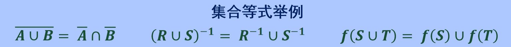
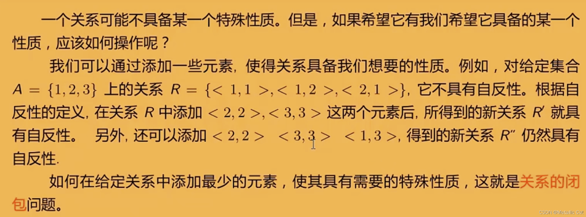
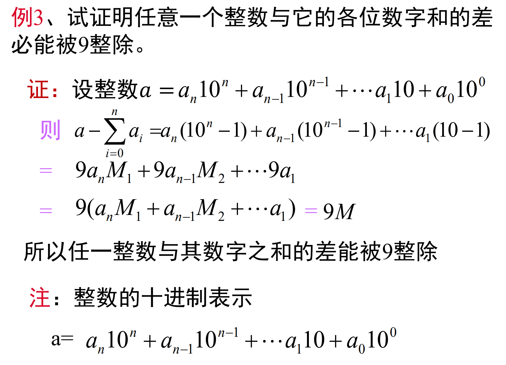
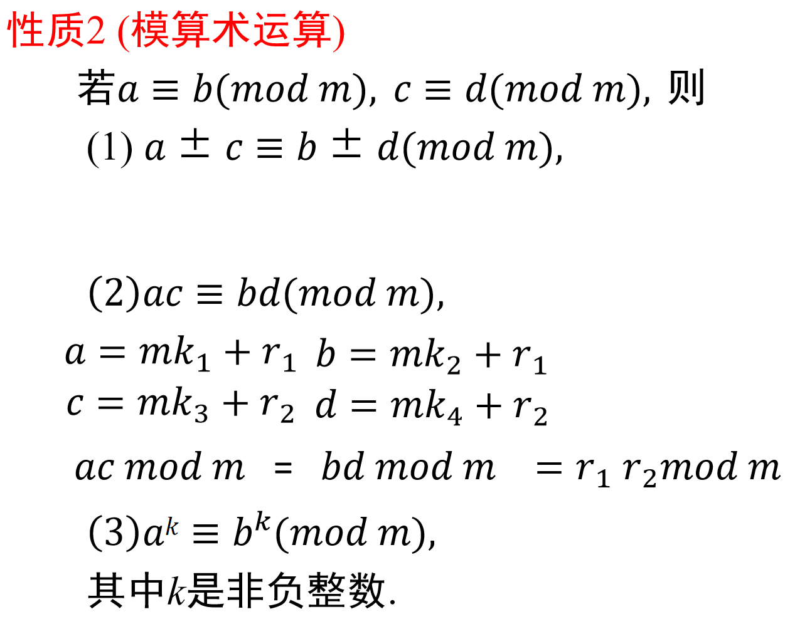

# 离散数学

## 集合代数基础

### 命题与逻辑符号
* 命题：对某个事物进行判断，有**真假值**的**陈述句**

* 逻辑连结词：`与∧`，`或∨`，`非¬`，`蕴涵(如果,那么)→`，`双蕴涵(等价于)⟷`

* 量词：`∀x，对每一个、所有x`，`∃x，存在x`

* 恒真：`⟹表示→关系恒真`，`⟺:表示⟷关系恒真`（A⟺B表示A与B要么同时为真，要么同时为假）

* “只要一个年份是400的倍数，则它是闰年”
    * **复合命题**，且是**逻辑蕴含命题**

    * "一个年份是400的倍数"是"它是闰年"的充分条件，符号化为`p→q`
        > 充分条件：有甲这个条件一定会推出乙这个结果，有乙这个结果不一定是甲这唯一个条件

        > 必要条件：有甲这个条件不一定能推出乙这个结果，但乙这个结果一定要有甲这个条件

### 集合并交差
* 集合交：$A∩B={x|x∈A∧x∈B}$
    * 对任意$x$，$x∈A∩B$当且仅当$x∈A∧x∈B$

* 集合并：$A∪B={x|x∈A∨x∈B}$
    * 对任意$x$，$x∈A∪B$当且仅当$x∈A∨x∈B$

* 集合差：$A-B={x|x∈A∧x∉B}$
    * 对任意$x$，$x∈A-B$当且仅当$x∈A∧x∉B$

* 集合补：$\bar{A}$或$\sim A=U-A=\{x|x∉A\}$
    * 对任意$x$，$x∈\bar A$当且仅当$x∉A$

* 对称差：$A⊕B=(A-B)∪(B-A)$

        

* 德摩根定律
    * $\overline{A \cup B} = \bar{A} \cap \bar{B}$

    * $\overline{A \cap B} = \bar{A} \cup \bar{B}$ 

### 广义交与广义并
* 设A是集合族（即A的元素都是集合）
    * 集合族A的广义交：$⋂A=\{x|∀S∈A,x∈S\}$
        * 即属于A的**每个**集合的元素构成广义交集合$⋂A$
    
    * 集合族A的广义并：$⋃A=\{x|∃S∈A,x∈S\}$
        * 即属于A的**某个**集合的元素构成广义并集合$⋃A$
    
    * 若集合族A由有限个集合构成，例如$A={A1,A2,...An}$，则:
        * $⋂A=A1⋂A2⋂...⋂An$
    
        * $⋃A=A1⋃A2⋃...⋃An$

### 幂集
* 幂集P(A)：A的所有子集组成的集合，$P(A)= \{x|x⊆A\}$

    

* 如果$|A|=n$，则$|P(A)|=2^n$

        

        

### 集合等式
    

* 集合算律
    1. 只涉及一个运算的算符：交换律、结合律、幂等律

            

    2. 只涉及二个运算的算符：分配律、吸收率

            

    3. 只涉及三个运算的算符：德摩根律、双重否定律

            

    4. 涉及全集和空集的算律：补元律、零律、同一律、否定律

            

## 关系

### 关系的定义

* 有序对：两个元素$x$、$y$按照一定顺序组成的二元称为有序对，记作$<x,y>$
    * 有序性：当$x≠y$时，$<x,y>≠<y,x>$

* 笛卡儿积：设$A$、$B$为**集合**，$A$与$B$的笛卡儿积记作$A×B$，即$A×B=\{<x,y>|x∈A∧y∈B\}$
    1. 不适合交换律：$A×B≠B×A(A≠B,A≠∅,B≠∅)$

    2. 不适合结合律：$(A×B)×C≠A×(B×C)(A≠∅,B≠∅,C≠∅)$

    3. 对于并或交运算满足分配律：
        * $A×(B∪C) = (A×B)∪(A×C)$和$(B∪C)×A = (B×A)∪(C×A)$

        * $A×(B∩C) = (A×B)∩(A×C)$和$(B∩C)×A = (B×A)∩(C×A)$

    4. 若$A$或$B$中有一个为空集，则$A×B$就是**空集**：$A×∅=∅×B=∅$

    5. 若 $|A|=m$和$|B|= n$，则$|A×B|=mn$，取模运算表示**集合中的元素个数**

* 有序$n$元组和$n$阶笛卡尔积
    * 有序$n$元组：由$n$个元素$x_1$，$x_2$，...，$x_n$按照一定顺序排列构成，记作$<x_1,x_2,...x_n>$

    * $n$阶笛卡尔积：设$A_1$，$A_2$，...，$A_n$为集合，称$A_1×A_2×...×A_n=\{<x_1,x_2,...,x_n>|x_i∈A_i,i=1,2,...,n\}$

* 二元关系：集合**A到B的二元关系R**定义为笛卡尔积A×B的子集，即$R⊆A×B$，简称**关系**，记作$R$
    * 当$A=B$时，称$R⊆A×A$为**集合A上的二元关系**

    * 如$<x,y>∈R$，可记作$xRy$
        
        

### 关系的表示
* 设$A$为任意集合，$∅$是$A$上的关系，称为**空关系**

* 定义：$E_A$、$I_A$分别称为**全域关系**与**恒等关系**
    * $E_A=\{<x,y>|x∈A ∧ y∈A\}=A×A$
    
    * $I_A=\{<x,x>|x∈A\}$

* 关系矩阵：若$A=\{x_1,x_2,...,x_n\}$，$B=\{y_1,y_2,...,y_n\}$，$R$是从$A$到$B$的关系，$R$的关系矩阵是布尔矩阵$M_R=[r_{ij}]_{m×n}$，其中$r_{ij}=1⟺<x_i,y_j>∈R$

* 关系图：若$A=\{x_1,x_2,...,x_m\}$，$R$是在$A$上的关系，$R$的关系图是$G_R=<A,R>$，其中$A$为结点集，$R$为边集；如果$<x_i,x_j>$属于关系$R$，在图中就有一条从$x_i$到$x_j$的有向边

   

### 关系的基本运算

* 定义域：$domR=\{x|∀y(<x,y> ∈ R)\}$

* 值域：$ranR=\{y|∀x(<x,y> ∈ R)\}$

* 域：$fldR=domR∪ranR$

* $R$的逆：$R^{-1}=\{<y,x>|<x,y> ∈ R\}$

* $R$与$S$的合成（复合）：$R∘S=\{<x,z>|∃y(<x,y> ∈ R ∧ <y,z> ∈ S)\}$

* 设$F$是任意的关系
    * $(F^{-1})^{-1} = F$

    * $domF^{-1} = ranF$和$ranF^{-1} = domF$

* 设$R$为集合$A$上的关系
    * $R∘I_A = I_A ∘ R = R$

### 关系矩阵计算关系

* 设R为A上的关系，则`R∘IA=IA∘R=R`

### 关系的幂运算
* 设$R$为$A$上的关系，$n$为自然数，则$R$的$n$次幂是
    1. $R^0=\{<x,x>|x∈A\}=I_A$

    2. $R^{n+1}=R^n∘R$

* 设R是A上的关系，m、n∈N，则
    * $R^m∘R^n=R^{m+n}$

    * $(R^m)^n=R^{mn}$

### 关系的性质

#### 自反性和反自反性
* 设$R$为$A$上的关系
    * 若$∀x(x∈A → <x,x>∈R)$，则R在A上是**自反**的
        
    * 若$∀x(x∈A → <x,x>∉R)$，则R在A上是**反自反**的

||自反性|反自反性|
|:-|:-|:-|
|表达式|IA⊆R|R⋂IA=∅|
|关系矩阵|主对角线元素都是1|主对角线元素全是0|
|关系图|每个顶点都有环|每个顶点都没有环|

#### 对称性和反对称性
* 设R为A上的关系
    * 若$∀x∀y(x,y∈A∧<x,y>∈R  → <y,x>∈R)$，则称$R$为$A$上**对称**的关系

    * 若$∀x∀y(x,y∈A∧<x,y>∈R∧<y,x>∈R→x=y)$，则称R为A上**反对称**的关系

||对称性|反对称性|
|:-|:-|:-|
|表达式|R=R^(-1)|R⋂R^(-1)⊆IA|
|关系矩阵|矩阵是对称矩阵|若rij=1，且i≠j，则rij=0|
|关系图|如果两个顶点之间有边，一定是一对反向相反的边（无单边）|如果两点之间有边，一定是一条有向边（无双向边）|

#### 传递性
* 设$R$为A上的关系
    * 若$∀x∀y∀z(x,y,z∈A ∧ <x,y>∈R ∧ <y,z>∈R → <x,z>∈R)$，则称$R$是$A$上的**传递**关系

||传递性|
|:-|:-|
|表达式|R∘R⊆R|
|关系矩阵|对$M^2$中1所在位置，M中位置都是1|
|关系图|如果顶点$x_i$到$x_j$有边，$x_j$到$x_k$有边，则从$x_i$到$x_k$也有边|

#### 关系的闭包

* 设$R$是非空集合$A$上的关系，$R$的**自反（对称或传递）闭包**是$A$上的关系$R'$，使得$R'$满足以下条件：
    1. $R'$是**自反的（对称的或传递的）**
    
    2. $R⊆R'$
    
    3. 对$A$上任何包含$R$的自反（对称或传递）关系$R''$有$R'⊆R''$

* 即能使得$R$满足**自反（对称或传递）性质**的**最小**的关系集合

* $R$的**自反**闭包记作$r(R)$，**对称**闭包记作$s(R)$，**传递**闭包记作$t(R)$

* 定理：$R$为$A$上的关系，则有
    1. 关系是**自反的**当且仅当它包含恒等关系
        * 将**恒等关系**中的有序对添加到关系可得**自反闭包**
        
        * $r(R)=R⋃I_A$
    
    2. 关系是**对称的**当且仅当它等于它的逆
        * 将**逆关系**的有序对添加到关系可得**对称闭包**

        * $s(R)=R⋃R^{-1}$

    3. 关系的**传递闭包**是包含这个关系的最小传递关系
        * $t(R)=R⋃R^2⋃R^3⋃...⋃R^n$

#### 等价关系和偏序关系
* 设$R$为非空集合$A$上的关系，如果$R$是**自反的、对称的和传递的**，则称$R$为$A$上的**等价关系**
    * 设$R$是一个等价关系，若$<x,y>∈R$，称$x$等价于$y$，记作$x\sim y$

    

* 非空集合$A$上的**自反、反对称和传递**的关系，记作偏序关系$⪯$，如果$<x,y>∈⪯$，则记作$x⪯y$，读作$x$小于或等于$y$

    

#### 关系上的计数
* 设$A$、$B$为集合，$A×B$的任何子集所定义的二元关系叫做从$A$到$B$的**二元关系**，当$A=B$时则叫做$A$上的**二元关系**
    * $|A|=n,|B|=m,|A×B|=nm$

    * $A×B$的子集有$2^{nm}$个，所以从$A$到$B$有$2^{nm}$个不同的二元关系

    * 从上可得出，$|A|=n$，$A$上有$2^{n^2}$个不同的二元关系

## 组合计数基础

### 基本计数规则

* 加法法则：事件$A$有$m$种产生方式，事件$B$有$n$种产生方式，则“事件$A$或$B$”有**m+n**种产生方式
    * 使用条件：事件$A$与$B$产生方式不重叠

* 乘法法则：事件$A$有$m$种产生方式，事件$B$有$n$种产生方式，则“事件$A$与$B$”有**mn**种产生方式
    * 使用条件：事件$A$与$B$产生方式彼此**独立**

### 容斥原理基础
* 集合差计数公式：设$A$、$B$是有穷集合，则$|A-B|=|A|-|A⋂B|$

* 两集合容斥原理：设$A$、$B$是有穷集合，则$|A⋃B|=|A|+|B|-|A⋂B|$

* 三集合容斥原理：设$A$、$B$、$C$都是有穷集合，则$|A⋃B⋃C|=|A|+|B|+|C|-|A⋂B|-|A⋂C|-|B⋂C|+|A⋂B⋂C|$

* 容斥原理用于当**集合交**的元素个数比**集合并**的元素更容易计算的情况

    

### 鸽笼原理
* 设$k$是正整数，**k+1只或更多的**鸽子关到$k$个鸽笼里，则至少有一个鸽笼有两只或更多只鸽子

#### 鸽笼原理实例1
* 从1到2n任取n+1个数，则至少有两个数，其中一个是另一个数的倍数
    1. 从2n个整数取出n+1个数看成鸽子

    2. 任何整数都可以表示成$q*2^b$的形式，这里奇数$q$导出了鸽笼

    3. 1到2n间只有n个奇数，则取出n+1个数中必然存在`q1*2^b1`和`q1*2^b2`这样两个其中一个数是另一个数的倍数

#### 鸽笼原理实例2
* 正整数序列$a_1,a_2,...,a_m$中必存在若干个连续正整数的和是$m$的倍数
    * 即存在正整数$k$和$l$，满足$1≤k<l≤m$使得$a_k+a_{k+1}+...+a_l$是m的倍数

    * 考虑$s_1=a_1，s_2=a_1+a_2，...，sm=a1+a2+...+a_m$**这m个数整除m的余数**
        1. 若存在$s_i$整除m的数为0，则$a_1+a_2+...+a_i$是m的倍数

        2. 若所有s的余数都大于0，则存在$s_i$、$s_j$整除m的余数相等（s共有m个，而被m整除的余数有m-1个，s最多有m-1个不相同的余数，那剩下一个就必然有相同余数，即**鸽笼定理**），则$s_j-s_i=a+{i+1}+...+a_j（假设j>i）$是m的倍数（**两个s相减**把余数抵消了）

#### 广义鸽笼原理
* 广义鸽笼原理：将$N$个物体放到$k$个盒子，则至少有一个盒子有$⌈\frac{N}{k}⌉$个物体（取顶符号，不小于它的**最小**整数）

* 将至少有**一个**盒子**至少有**的物体称为“最小容量”
    * 最小容量=$⌈\frac{物体总数}{盒子数}⌉$

    * 物体总数的最小值 =（最小容量-1）* 盒子数+1
        * 让一个盒子是最小容量，其它盒子为（最小容量 - 1）
    
    * 盒子数的最大值=$⌊\frac{物体总数-1}{最小容量-1}⌋$
        * 使所有盒子都放最小容量-1，留一个盒子放最小容量

### 集合排列组合
* 选取问题：设n元集合S，从S中选取r个元素

#### 排列：设S为n元集
* 从$S$中有序选取的$r$个元素称为$S$的一个$r$排列，$S$的不同$r$排列总数记作$P^r_n$或$P(n,r)$，$r=n$的排列是$S$的全排列

* 定理：设$n$，$r$为自然数，规定$0!=1$，则有

$$
对自然数n和r，r<=n\\
P(n,r)=\begin{cases}
\frac{n!}{(n-r)!},&r<=n,\\
0,&r>n.
\end{cases}
$$

#### 组合：设S为n元集
* 从$S$种无序选取的$r$个元素称为$S$的一个$r$组合，$S$的不同$r$组合总数记作$C^r_n$或$C(n,r)$，也称**二项式系数**，通常记作$(^n_r)$

* 推论：设n，r为正整数，则
    1. 提取出来：$C(n,r)=\frac n r C(n-1,r-1)$

    2. 对称：$C(n,r)=C(n,n-r)$

    3. Pascal三角：$C(n,r)=C(n-1,r-1)+C(n-1,r)$
    
## 组合计数进阶

### 多重集排列组合
* 排列的元素或者选取的元素可以重复，所以不说$n$个物体，而说$n$**类或$n$种物体**

* 定义：多重集$S={\{n_1\cdot a_1,n_2\cdot a_2,...,n_k\cdot a_k\}}（n=n_1+n_2+...+n_k$表示$S$中元素总数）

#### 排列
* 从$S$中有序选取的$r$个元素称为多重集$S$的一个$r$排列。$r=n$称为全排列

* 定理：设$S=\{n1\cdot a1,n2\cdot a2,...,n_k \cdot a_k\}$为多重集
    1. $S$的全排列数是$\frac{n!}{n_1!n_2!...n_k!}$

    2. 若$r<=n_i，i=1,2,...,k$，那么$S$的$r$排列数是$k^r$

#### 组合
* 从$S$中无序选取的$r$个元素称为多重集$S$的一个$r$组合

* 定理：多重集$S=\{n_1\cdot a_1,n_2 \cdot a_2,...,n_k\cdot a_k\}，=<n_i<=+\infty$，当$r<=n_i$，$S$的$r$组合数为$N=C(k+r-1,r)$
    * 证明：一个$r$组合为$\{x_1\cdot a_1,...,x_k\cdot a_k\}$，其中$x_1+x_2+...+x_k=r$，$x_i$为非负整数，这个**不定方程**的**非负整数解**对应于下述排列$r$个1，$k-1$个0的全排列数为$N=\frac{(r+k-1)!}{r!(k-1)!}=C(r+k-1,r)$

        |1...1 |$\color{red}{0}$| 1...1 |$\color{red}{0}$| 1...1 |$\color{red}{0}\color{while}{......}\color{red}{0}$|1...1|
        |-|-|-|-|-|-|-|
        |$x_1$个||$x_2$个||$x_3$个||$x_k$个|

### 二项式定理与组合等式

#### 二项式定理
* 组合数$C(n,r)$又称为**二项式系数**，因为出现在二项式的幂的展开式中。二项式的幂$(x+y)^n$的展开式称为**二项式定理**

* 二项式定理：设$x$和$y$是两个变量，$n$是正整数，则：$(x + y) ^ n = \Sigma^n_{i=0}(^n_i)x^iy^{n-i}$

#### 组合恒等式
* 递推式
    1. $(^n_k)=(^n_{n-k})$：用于化简

    2. $(^n_k)=\frac nk (^{n-1}_{k-1})$：用于求和时消去变系数

    3. $(^n_k)=(^{n-1}_k)+(^{n-1}_{k-1})$：用于求和时拆项（两项之和或两项之差），然后合并

* 基本求和式
    1. $\Sigma ^n_{k=0}(^n_k)=2^n\quad n\in N$

    2. $\Sigma ^n_{k=0}(-1)^k(^n_k)=0\quad n\in N$

* 变系数求和
    1. $\Sigma ^n_{k=0}k(^n_k)=n2^{n-1}$

    2. $\Sigma ^n_{k=0}k^2(^n_k)=n(n+1)2^{n-2}$

* 变上项求和
    1. $\Sigma ^n_{l=0}(^l_k)=(^{n+1}_{k+1})\quad n,k\in N$

* 乘积转换式
    1. $(^n_r)(^r_k)=(^n_k)(^{n-k}_{r-k})$

* 积之和
    1. $\Sigma ^r_{k=0}(^m_k)(^n_{r-k})=(^{m+n}_r)$

    2. $\Sigma ^n_{k=0}(^m_k)(^n_{k})=(^{m+n}_m)$

## 容斥原理

### 容斥定理

### 例子
* 不定方程$x_1+x_2+x_3=6$有多少满足$x1<=3,x_2<=2,x_3<=4$的非负整数解
    * 记性质$P_1$为$x_1>=4$，$P_2$为$x_2>=3$，$P_3$为$x_3>=5$
        * 则是求有多少同时不满足$P_1$和$P_2$和$P_3$的解个数

        * 即答案等于非负整数解个数减去满足$P_1$或$P_2$或$P_3$的解个数

    1. 满足$P_1$或$P_2$或$P_3$的解个数：使用容斥定理
        1. 满足$P_1$的解个数：$\Sigma_{i=4}^{6}(^{(6-i)+(2-1)}_{2-1})=3+2+1=6$

        2. 满足$P_2$的解个数：$\Sigma_{i=3}^{6}(^{(6-i)+(2-1)}_{2-1})=4+3+2+1=10$

        3. 满足$P_3$的解个数：$\Sigma_{i=5}^{6}(^{(6-i)+(2-1)}_{2-1})=2+1=3$

        4. 同时满足$P_1$和$P_2$的解个数：$0$

        5. 同时满足$P_1$和$P_3$的解个数：$0$

        6. 同时满足$P_2$和$P_3$的解个数：$0$

        7. 同时满足$P_1$和$P_2$和$P_3$的解个数：$0$

        8. 满足$P_1$或$P_2$或$P_3$的解个数：$6+10+3=19$

    2. 非负整数解个数：$(^{6+(3-1)}_{3-1})=(^8_2)=28$

    3. 答案：$28-19=9$

## 整除与素数

### 整除
* 整除：设a、b是两整数，若b能整除a，记作$b \mid a$。此时，又称a是b的**倍数**，b是a的**因子**

* 带余除法：$a=qb+r,0\leq r \leq |b|$，记余数$r=a~mod~b$
    > $20~mod~6=2$，$-13~mod~4=3$（注意负数形式），$10~mod~ 2=0$

#### 整除的基本性质
1. 若$a|b$且$a|c$，则$\forall x,y$，有$a|xb+yc$

2. 若$a|b$且$b|c$，则$a|c$。（传递性）

3. 设$m\neq 0$，则$a|b$当且仅当$ma|mb$ 
    
4. 若$a|b$且$b|a$，则$a=\pm b$
    
5. 若$a|b$且$b\neq 0$，则$|a|\leq|b|$
    
* n次方差公式：$a^n-b^n=(a-b)(a^{n-1}+a^{n-2}b+...+ab^{n-2}+b^{n-1})$

* 例题

    

    

    

    

### 素数和合数
* 素数（质数）：大于1且只能被1和自身整除的正整数

* 合数：大于一且不是素数的正整数

* 性质1：$a>1$是合数当且仅当$a=bc$，其中$1<b<a$，$1<c<a$

* 性质2：合数必有素数因子

* 性质3：如果$d>1$，$p$是素数且$d|p$，则$d=p$

* 性质4：设$p$是素数且$p|ab$，则必有$p|a$或者$p|b$
    * 设$p$是素数且$p|a_1a_2...a_k$，则必存在$1\leq i \leq k$，使得$p|a_i$

    * 注意：当$d$不是素数时，$d|ab$不一定推出$d|a$或者$d|b$

* 素数定理
    1. 定理1：算术基本定理
        * 设$a>1$，则$a=p^{r_1}_1p^{r_2}_2...p^{r_k}_k$，其中$p_1,p_2,...,p_k$说不相同的素数，$r_1,r_2,...,r_k$时正整数，并且在不顺序的情况下，该表示是**唯一的**。该表达式称作整数$a$的**素因子分解**

        

    2. 定理2；有无穷多个素数

    4. 定理3
        

* 埃拉托斯特尼筛法
    * 用已经筛选出来的素数去过滤所有能够被它整除的数。这些素数就像是筛子一样去过滤自然数，最后被筛剩下的数自然就是不能被前面素数整除的数，根据素数的定义，这些剩下的数也是素数

### 最大公约数与最小公倍数
* $d$是$a$与$b$的公因子（公约数）：$d|a$且$d|b$

* $m$是$a$与$b$的公倍数：$a|m$且$b|m$

* 定义1：设$a$和$b$是两个不全为0的整数，称$a$与$b$的公因子中最大的数为$a$与$b$的**最大公因子**，或**最大公约数**，记作**gcd（a，b）**，或者（**a，b**）

* 定义2：设$a$和$b$是两个非零整数，称$a$与$b$最小的正公倍数为$a$与$b$的**最小公倍数**，记作**lcm（a，b）**

* 注意：**对任意的正整数$a$，$gcd(0,a)=a$，$gcd(1,a)=1$，$lcm(1,a)=a$**

* 定理

    

* 最大公约数的求解

    

* 最小公倍数的求解

    

* 辗转相除法

    

* 定理

    * 定理6其实就是辗转相除法
    
    

    

    

* 互素

    

    

## 同余

## 剩余类及完全剩余系

### 剩余类及完全剩余系

### 一次同余方程

### 模 $m$ 逆（逆元）

### 费马小定理

### 欧拉定理

## 中国剩余定理与Catalan数

### 中国剩余定理
<https://www.bilibili.com/video/BV1gf4y1S7LR/?spm_id_from=333.337.search-card.all.click&vd_source=c65196c22fdd3605640aeccf1b3b4a0e>

#### 定理内容（仅考虑$m_i$为互素的情况）

### Catalan数

#### 等价问题

#### Raney引理求解

* 使用Raney定理解问题3

* Raney引理证明

#### 折线法求解

#### 总结

#### 重要递推公式

## Stirling数与数幂的求和

### 第一类Stirling数

### 第二类Stirling数

### 阶乘幂

#### 上阶乘幂转化为普通次幂的和

#### 下阶乘幂转化为普通次幂的和

#### 普通次幂转化为上阶乘幂的和

#### 普通次幂转化为下阶乘幂的和

#### 下阶乘幂的求和

#### 数幂的和

## Bijective proof和Cayley formula

### Bijective proof

* 例1的预备知识

### Cayley formula

## Double counting和Necklace problem

### 双重记数方法

* 当第一个砖块放在位置2时，剩下的区域长度为n-2，根据记数方法一，方案数为Fn-2。以此类推，当第一个砖块放在位置n-1时，剩下的区域长度为1，根据记数方法一，方案数为F1。当第一个砖块放在位置n时，剩下的区域长度为0，根据记数方法一，方案数为F0

### 总结

### Necklace problem

## 子集反演与二项式反演

### 子集反演定理

### 二项式反演定理
<https://www.bilibili.com/video/BV1HN411D7sJ/?spm_id_from=333.337.search-card.all.click&vd_source=c65196c22fdd3605640aeccf1b3b4a0e>

## 莫比乌斯反演
<https://www.bilibili.com/video/BV1Jh4y147hH/?spm_id_from=333.337.search-card.all.click&vd_source=c65196c22fdd3605640aeccf1b3b4a0e>

### 积性函数

### 迪利克雷卷积

### 莫比乌斯函数

### 莫比乌斯反演

## 生成函数

## EGF

