# JavaScript

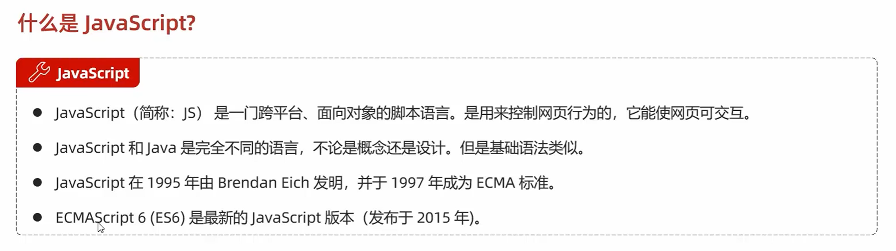

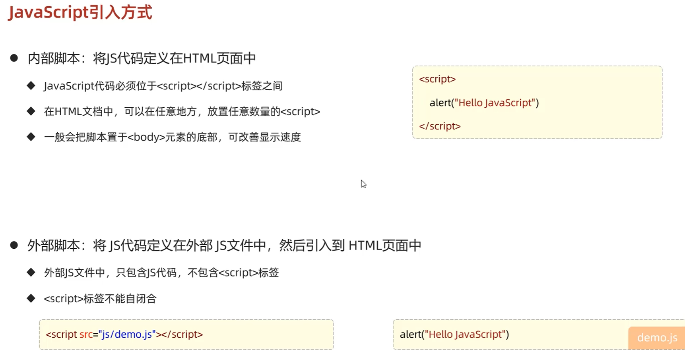

[JS引入方式](https://github.com/D5error/D5error.github.io/tree/main/docs/md/HTML/JS引入方式.html)

## 基础语法

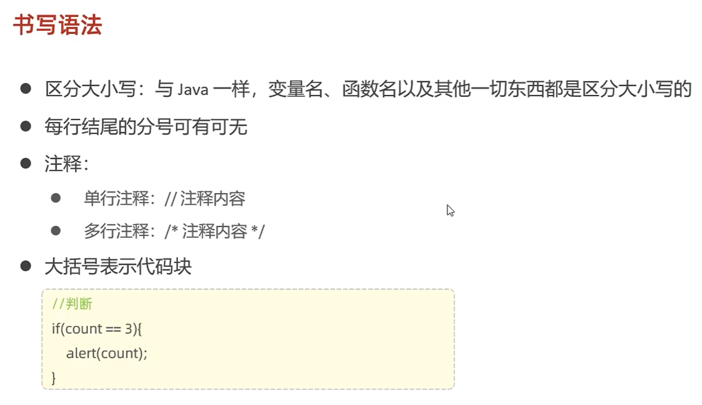

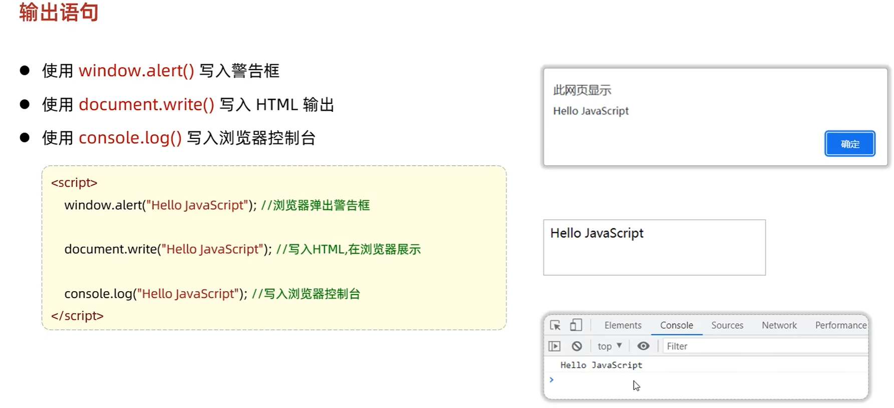

### 变量

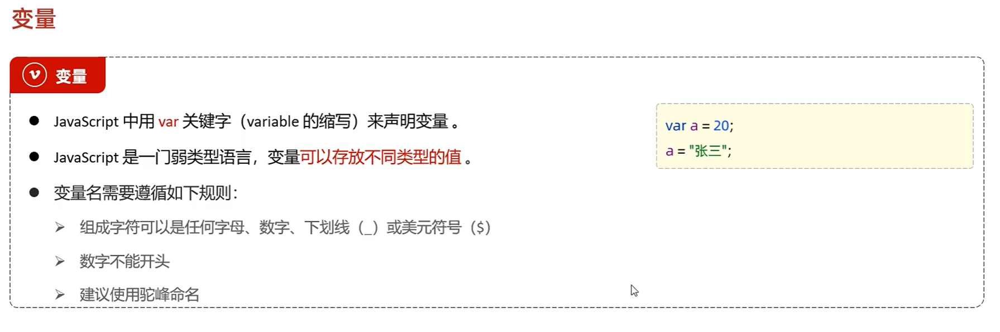

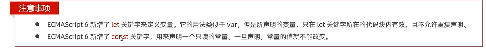

### 数据类型、运算符、流程控制语句

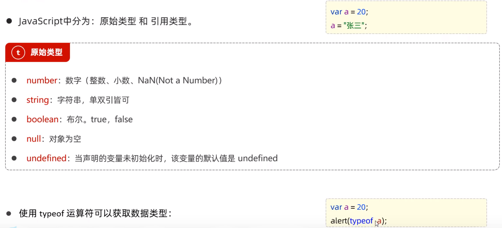

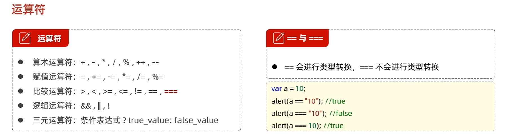

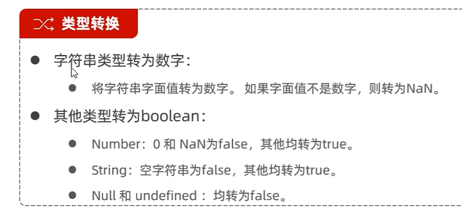

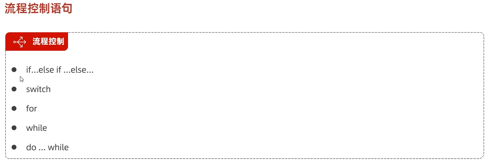

## 函数

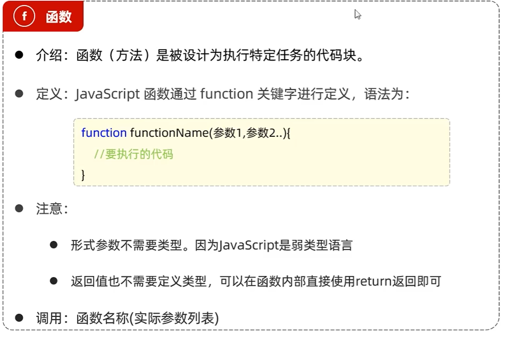

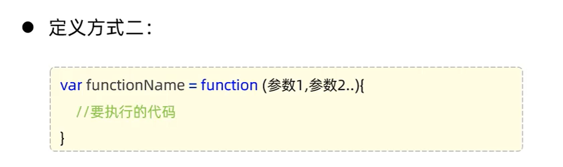

## 对象

### Array

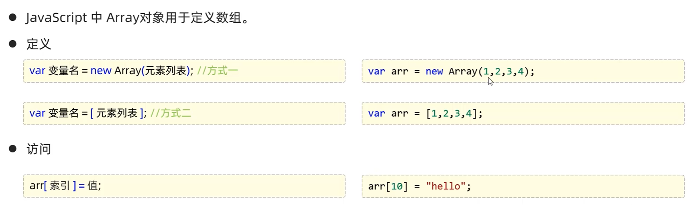

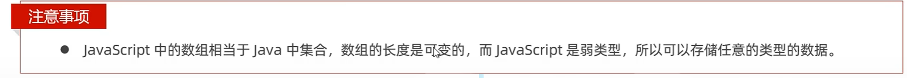

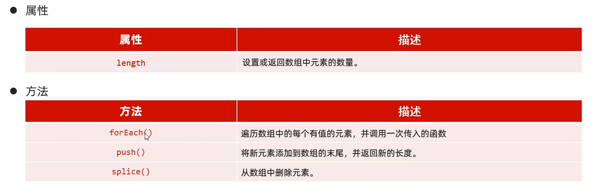

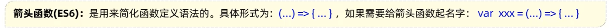

### String

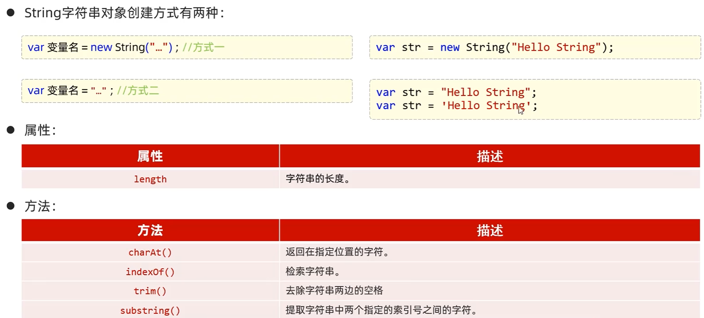

### JSON

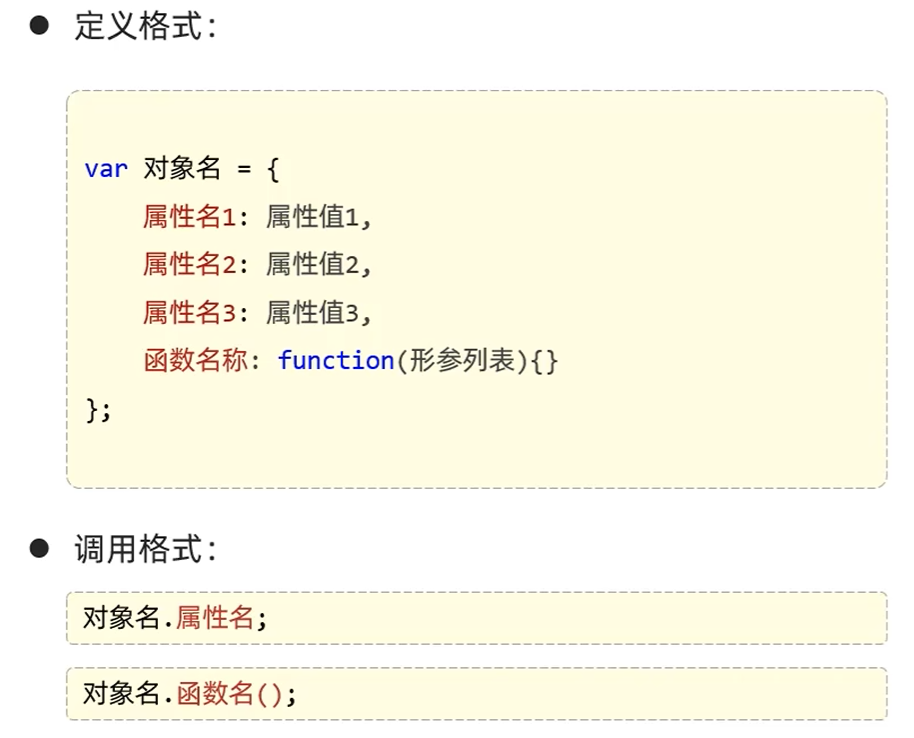

### BOM

### DOM
<!-- 
## 事件 -->