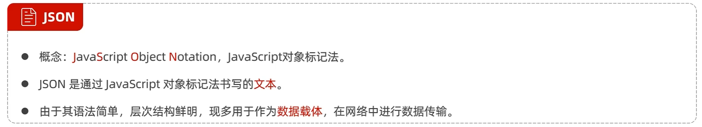

# JavaScript

[JS引入方式](https://github.com/D5error/D5error.github.io/tree/main/docs/md/HTML/JS引入方式.html)

## 基础语法

### 变量

### 数据类型、运算符、流程控制语句

## 函数

## 对象

### Array

### String

### JSON

### BOM

### DOM
<!-- 
## 事件 -->