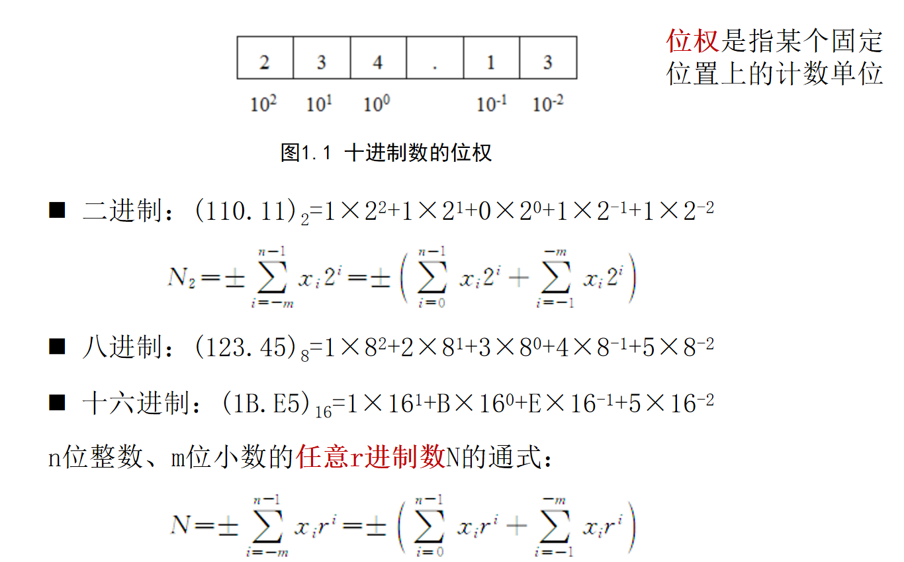
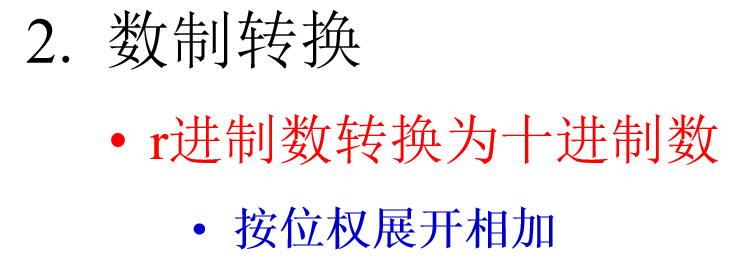
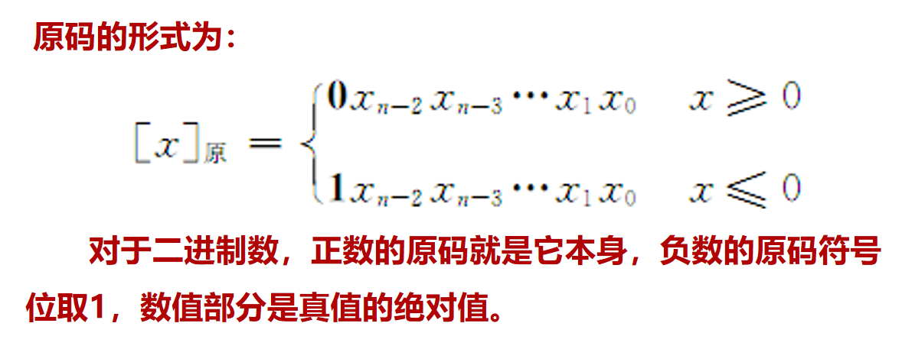

# 微机原理

## 学习资料
[微机原理与接口技术](https://www.icourse163.org/learn/JLU-1002056024?tid=1465815441#/learn/content?type=detail&id=1245721005&cid=1270888005)

[Programming in assembly language tutorial](https://github.com/mschwartz/assembly-tutorial?tab=readme-ov-file#hello-world)

## 计算机系统概述

### 计算机中的数据表示和编码

#### 数与数制
* 位权：某个固定位置上的计数单位
    * 用位权表示为：$(234.13)_{10} = 2 * 10 ^ 2 + 3 * 10 ^ 1 + 4 * 10 ^ 0 + 1 * 10 ^ { -1 } + 3 * 10 ^ {-2}$

    

##### 数制转换
* $r$进制数转换为十进制数

    

* 十进制数转换为$r$进制数
    1. 整数部分：**除$r$取余法**

        
    
    2. 小数部分：乘$r$取整法

        

* 二进制转换为八进制

    

#### 数据格式
* 定点数表示方法
    pass

* 浮点数表示方法
    pass

#### 二进制数的编码及运算
* 无符号数
    pass

* 有符号数
    pass

* 补码运算
    pass

#### 十进制数的编码及运算
* BCD码
    pass

* BCD码的加减运算
    pass

### 逻辑电路基础

#### 基本逻辑门电路

#### 译码器
* 将信号用数字代码来表示，这个过程称为**编码**

* 将数字代码翻译成信号，这个过程称为**译码**，完成译码功能的电路或装置称为**译码器**

#### 触发器
* 触发器是计算机记忆装置的基本单元，也是构成时序电路的基础。一个触发器存储一位二进制数。

pass
#### 寄存器
* 缓冲寄存器
    pass

* 移位寄存器
    pass

* 计数器
    pass

* 累加器
    pass

#### 三态电路

### 计算机系统概述

## 微型计算机系统基础

### 指令系统

### 微型计算机系统结构

### 输入/输出系统

### 微处理器的发展

## 80x86微处理器

### Intel 8086微处理器

### 8086的存储器组织

### 8086微处理器的内部结构

### 8086总线的工作周期

### 8086中断系统

### 8086微处理器外部基本引脚与工作模式

### 8086微处理器的时序

## 寻址方式与指令系统

### 指令系统概述

### 8086寻址方式

### 8086指令系统

## 汇编语言程序设计

### 汇编语言程序基本格式

### 汇编语言中的数据

### 运算符与表达式

### 伪指令

### 系统功能调用

### 宏指令

## 半导体存储器

### 存储器概述

### 随机读写存储器

### 只读存储器

## 输入/输出技术

### 输入/输出系统概述

### 程序控制方式

### 中断方式

## 常用接口芯片

### 可编程并行接口8255

### 可编程定时/计数器8253/8254

