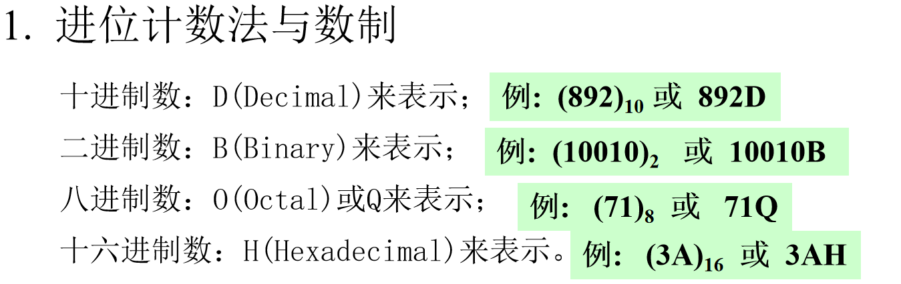
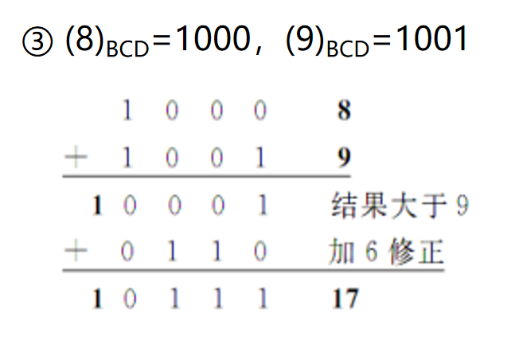

# 微机原理

[微机原理与接口技术](https://www.icourse163.org/learn/JLU-1002056024?tid=1465815441#/learn/content?type=detail&id=1245721005&cid=1270888005)
## 计算机系统概述

### 计算机中的数据表示和编码

> 补码计算中，减一取反等价于取反加一

> 当BCD码运算出现进位时，由于BCD码实际是十进制数，但用4个2进制数表示。假设个位数为9，此时为1001，加1应该为0000，但由于4个二进制是以16为周期，故需要加**6**修正，还能让十位加1而无需额外操作。故当BCD码的某位发生进位时，需要加6修正

### 微型计算机的逻辑电路基础

## 微型计算机系统基础
<!-- 

### 指令系统

### 微型计算机系统结构

### 输入/输出系统

### 微处理器的发展

## 80x86微处理器

### Intel 8086微处理器

### 8086的存储器组织

### 8086微处理器的内部结构

### 8086总线的工作周期

### 8086中断系统

### 8086微处理器外部基本引脚与工作模式

### 8086微处理器的时序

## 寻址方式与指令系统

### 指令系统概述

### 8086寻址方式

### 8086指令系统

## 汇编语言程序设计

### 汇编语言程序基本格式

### 汇编语言中的数据

### 运算符与表达式

### 伪指令

### 系统功能调用

### 宏指令

## 半导体存储器

### 存储器概述

### 随机读写存储器

### 只读存储器

## 输入/输出技术

### 输入/输出系统概述

### 程序控制方式

### 中断方式

## 常用接口芯片

### 可编程并行接口8255

### 可编程定时/计数器8253/8254
 -->
