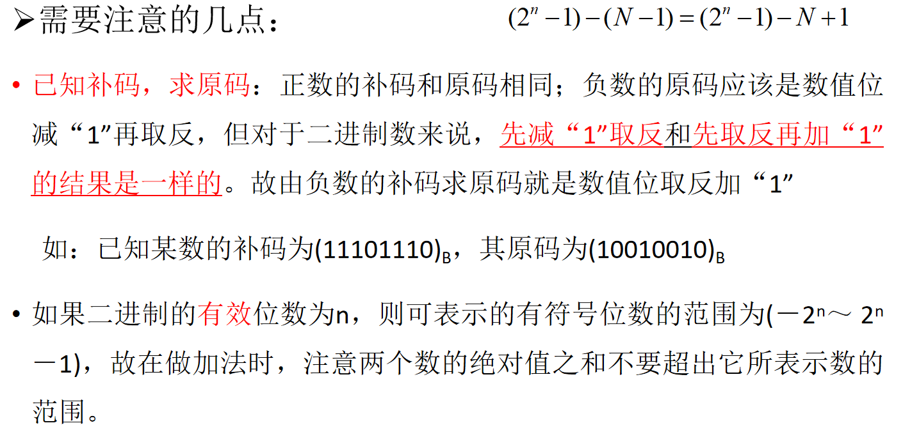
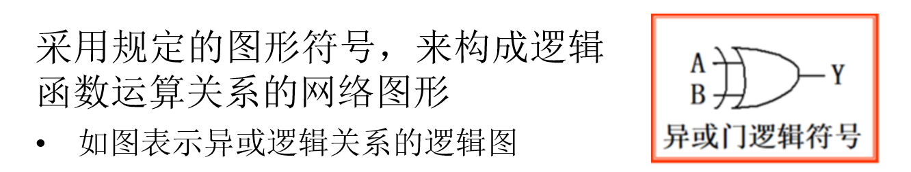
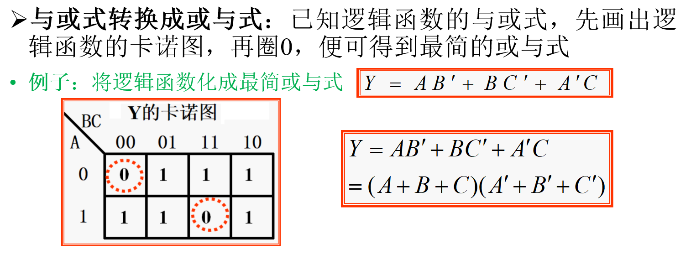

# 数字逻辑设计
[数字电子技术基础](https://www.bilibili.com/video/BV1hS4y1k7jV/?spm_id_from=333.999.0.0&vd_source=c65196c22fdd3605640aeccf1b3b4a0e)

## 概述、数制和码制

### 常用的数制

* 数制：也称为“计数制”，是用一组固定的符号和统一的规则来表示数值的方法

* 一个数码的进制
    * 可用下标表示，如$(N)_2$表示二进制; $(N)_{10}$表示十进制； $(N)_8$表示八进制， $(N)_{16}$表示十六进制
    
    * 也可用字母做下标，如$(N)_B$表示二进制；$(N)_D$表示十进制；$(N)_O$表示八进制；$(N)_H$表示十六进制

### 不同数制间的转换

### 二进制算术运算

### 常用的编码

## 逻辑代数
<!-- 

### 逻辑代数三种基本运算

#### 逻辑与、逻辑或和逻辑非

|与运算|或运算|非运算|
|-|-|-|
|$Y = A \cdot B$|$Y = A + B$|$Y = A'$|

#### 逻辑真值表

#### 图像符号

#### 异或和同或

|异或|同或|
|-|-|
|$Y = A \oplus B = A \cdot B' + A' \cdot B$|$Y = A \odot B = A \cdot B + A' \cdot B'$|

- 异或与同或互为反运算：$A \oplus B = (A \odot B)'$

### 逻辑代数的基本公式和常用公式

#### 逻辑代数基本公式

|基本公式|
|-|
|$0 \cdot A = 0$|
|$1 \cdot A = A$|
|$A \cdot A = A$|
|$A \cdot A' = 0$|
|$A \cdot B = B \cdot A$|
|$A \cdot (B \cdot C) = (A \cdot B) \cdot C$|
|$A \cdot (B + C) = A \cdot B + A \cdot C$|
|$(A \cdot B)' = A' + B'$|
|$(A')' = A$|
|$1' = 0; 0' = 1$|
|$1 + A = 1$|
|$0 + A = A$|
|$A + A = A$|
|$A + A' = 1$|
|$A + B = B + A$|
|$A + (B + C) = (A + B) + C$|
|$A + B \cdot C = (A + B) \cdot (A + C)$，注意先逻辑与再逻辑或|
|$(A + B)' = A' \cdot B'$|

#### 逻辑代数常用公式
|公式|
|-|
|$A + A \cdot B = A$|
|$A + A' \cdot B = A + B$|
|$A \cdot B + A \cdot B' = A$|
|$A \cdot (A + B) = A$|
|$A \cdot B + A' \cdot C + B \cdot C = A \cdot B + A' \cdot C$|
|$A \cdot B + A' \cdot C + BCD = A \cdot B + A' \cdot C$|
|$A \cdot (A \cdot B)' = A \cdot B'; A' \cdot (AB)' = A'$|

### 逻辑代数的基本定理

#### 代入定理
- 定理：在任何一个包含变量$A$的逻辑等式中，若以另外一个逻辑式代入式中所有$A$的位置，则等式仍然成立

#### 反演定理
- 定理：对于任意一个逻辑式$Y$，若将其中所有“$\cdot$”换成“$+$”，“$+$”换成“$\cdot$”，“$0$”换成“$1$”，“$1$”换成“$0$”，原变量换成反变量，反变量换成原变量，则得到的结果为$Y'$

- 规则
    - 遵守“先括号、然后乘、最后加”的运算优先次序

    - 不属于**单个**变量上的反号应保留不变

#### 对偶定理
- 定理：若两逻辑式相等，则它们的对偶式也相等

- 对偶式：对于任意一个逻辑式$Y$，若将其中的“$\cdot$”换成“$+$”，“$+$”换成“$\cdot$”，“$0$”换成“$1$”，“$1$”换成“$0$”，则得到一个新的逻辑式$Y^D$，这个$Y^D$就称为$Y$的对偶式，或者说$Y$和$Y^D$互为对偶式

### 逻辑函数及其描述方法

#### 逻辑函数
- 逻辑函数$Y = F(A, B, C, ...)$：以逻辑变量作为输入，以运算结果作为输出

#### 逻辑函数的描述方法

##### 逻辑真值表

##### 逻辑函数式

##### 逻辑图

##### 波形图

##### 描述方法之间的转换
1. 真值表转化为逻辑函数
    - 找出真值表中使逻辑函数$Y = 1$的那些输入变量取值的组合

    - 每组输入变量取值的组合对应一个乘积项，其中取值为$1$的写入原变量，取值为$0$的写入反变量

    - 将这些乘积项相加，即得$Y$的逻辑函数式

2. 逻辑函数式与逻辑图的相互转换
    - 用逻辑图形符号代替逻辑函数式中的逻辑运算符号并按照运算优先顺序将它们连接起来

    - 从逻辑图的输入段到输出端逐级写出每个图形符号的输出逻辑式

3. 波形图与真值表的相互转换

    

#### 逻辑函数的两种标准形式

##### 最小项和最大项
- 最小项

    

- 最小项的性质
    1. 在输入变量的任何取值下必有一个最小项，而且仅有一个最小项的值为$1$

    2. 全体最小项之和为$1$

    3. 任意两个最小项的乘积为$0$

    4. 具有相邻性的两个最小项之和可以合并成一项并消去一对因子

    > 若两个最小项只有一个因子不同，则称这两个最小项具有相邻性：$A'BC' + ABC' = (A' + A)BC' = BC'$

- 最大项

    

- 最大项的性质
    1. 在输入变量的任何取值下必有一个最大项，而且只有一个最大项的值为$0$

    2. 全体最大项之积为$0$

    3. 任意两个最大项之和为$1$
    
    4. 只有一个变量不同的两个最大项的乘积等于各相同变量之和

- 最小项和最大项存在关系：$M_i = m_i'$

> 例如，$m_0 = A'B'C'$，则$m_0' = (A'B'C')'A + B + C = M_0$

##### 逻辑函数的最小项之和形式

##### 逻辑函数的最大项之积形式

### 逻辑函数的化简方法
- 最简形式：在**与或**逻辑函数式时，若其中包含的乘积项已经最少，而且每个乘积项里的因子也不能再减少

- 化简逻辑函数的目的是消去多余的乘积项和每个乘积项中多余的因子，以得到逻辑函数式的最简形式

#### 卡诺图化简法

##### 卡诺图表示法
- 卡诺图：将$n$变量的全部最小项各用一个方块表示，并使具有**逻辑相邻性的最小项**在几何位置上也相邻地排列起来，所得图形称为$n$变量最小项的卡诺图

##### 卡诺图化简逻辑函数
1. 合并最小项的原则
    - 若**两个**最小项相邻，则可合并为一项并消去一对因子，合并后只剩下公共因子

    - 若**四个**最小项相邻并排列成一个**矩形组**，则可合并为一项并消去**两对**因子，结果只剩下公共因子

    - 若**八个**最小项相邻并排列成一个**矩形组**，则可合并为一项并消去**三对**因子，结果只剩下公共因子

    - 一般规则：如果有$2^n$个最小项相邻并排列成一个**矩形组**，则它们可以合并为一项，并消去$n$对因子，结果只剩下公共因子

    

2. 卡诺图化简法的步骤

    

### 具有无关项的逻辑函数及其化简
<https://www.bilibili.com/video/BV1uL411j77m/?spm_id_from=333.337.search-card.all.click&vd_source=c65196c22fdd3605640aeccf1b3b4a0e>

#### 无关项
- 约束项：由于输入变量取值的限制，而不可能出现的最小项

- 任意项：取值为$0$或$1$都不影响正常逻辑功能的最小项

- 无关项：
    - 约束项和任意项统称为无关项

    - 逻辑函数中用$d$表示，卡诺图中用$\times$表示

#### 利用无关项化简逻辑函数
- 加入无关项的目的：矩形圈最大，矩形数量最少

## 门电路
    * 学时9~14：“第三章、门电路”
重难点包括：
学时9,10，半导体二极管电路
学时11,12，CMOS门电路各类结构和功能
学时13,14，TTL门电路各类结构和功能
### 门电路概述

#### 基本开关电路

- 单开关电路：
    - S断开时，输出电压$v_0$为高电平$V_{CC}$
    
    - S接通时，输出为低电平0

    - 开关S由半导体三极管组成

    - 功耗比较大：S导通时，输出为低电平，电源电压全部加载电阻上，消耗$\frac{V^2_{DD}}{R}$

- 互补开关电路：
    - $S_1$和$S_2$的状态是相反的

    - $S_1$和$S_2$总有一个是断开的，所以流过$S_1$和$S_2$的电流始终为0，电路功耗极小

#### 逻辑状态表示方法

### 半导体二极管门电路

#### 半导体二极管的开关特性

#### 二极管与门

#### 二极管或门

### CMOS门电路

#### MOS管的开关特性

#### CMOS反相器的电路结构和工作原理

#### CMOS反相器的静态输入特性和输出特性

#### CMOS反相器的动态特性

### TTL门电路

#### 双极型三极管的开关特性

##### 双极性三极管的结构

##### 双极性三极管的输入特性和输出特性

##### 双极性三极管的基本开关电路-三极管反相器

##### 三极管反相器的开关等效电路

##### 双极性三极管反相器的动态开关特性

#### TTL反相器的电路结构和工作原理

##### 电路结构

##### 电压传输特性

##### 输入端噪声容限

#### TTL反相器的静态输入特性和输出特性

##### 输入特性

##### 输出特性

##### 输入端负载特性

#### TTL反相器的动态特性

##### 传输延迟时间

##### 交流噪声容限

##### 电源的动态尖峰电流

### 其他类型的TTL门电路

## 组合逻辑电路

### 组合逻辑电路分析方法

### 组合逻辑电路的基本设计方法

### 若干常用的组合逻辑电路模块

### 层次化和模块化的设计方法

### 可编程逻辑器件

### 硬件描述语言

### 组合逻辑电路中的竞争-冒险

## 半导体存储电路

### SR锁存器]

### 触发器]

### 寄存器]

### 存储器]

## 时序逻辑电路

### 时序逻辑电路的分析方法

### 若干常用的时序逻辑电路

### 时序逻辑电路的设计方法

### 用可编程逻辑器件实现同步时序逻辑电路

### 时序逻辑电路中的竞争-冒险现象

## 数模和模数的转换

### D/A转换器的电路结构和工作原理

### D/A转换器的转换精度与转换速度

### A/D转换的基本原理

### 取样-保持电路

### A/D转换器的电路结构和工作原理

### A/D转换器的转换精度与转换速度
     -->
