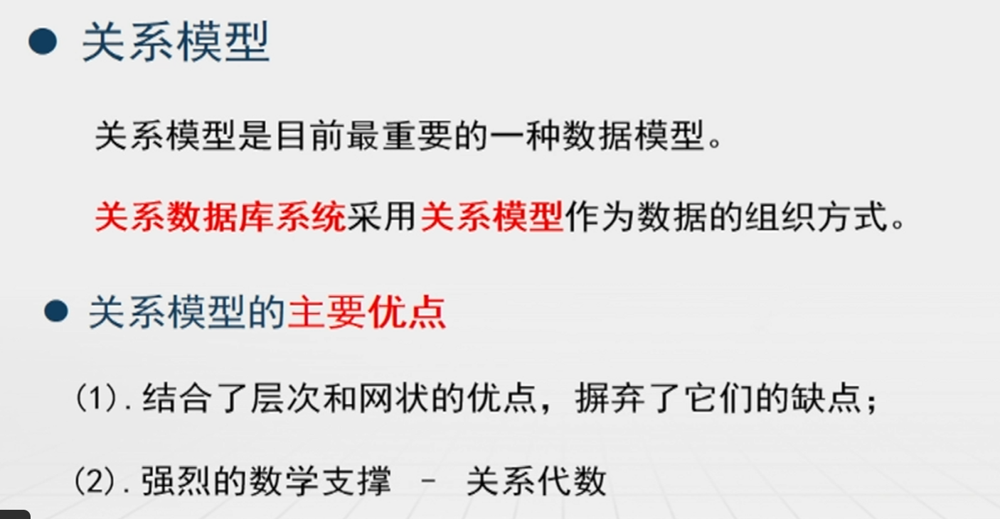
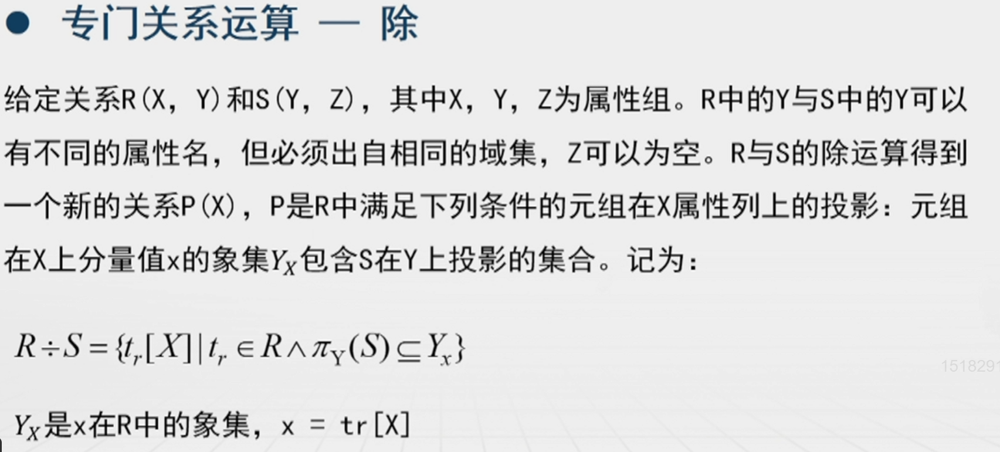
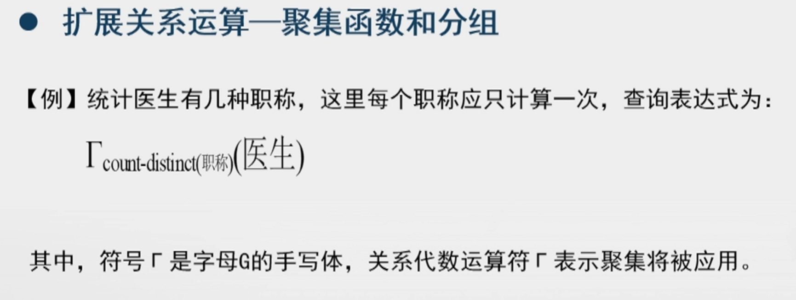
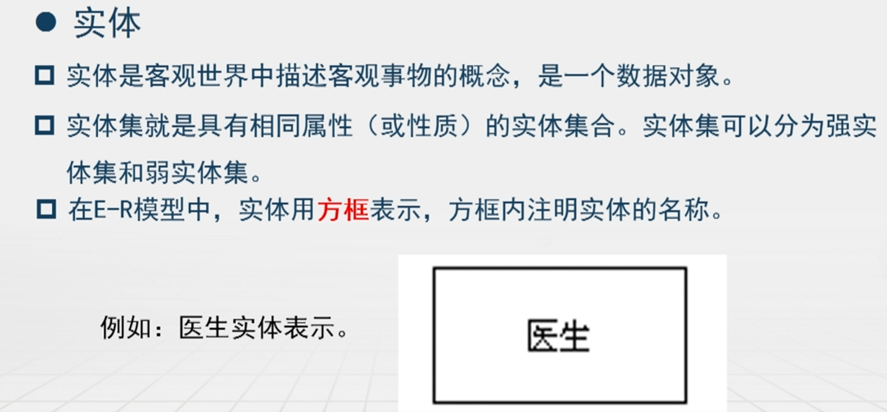
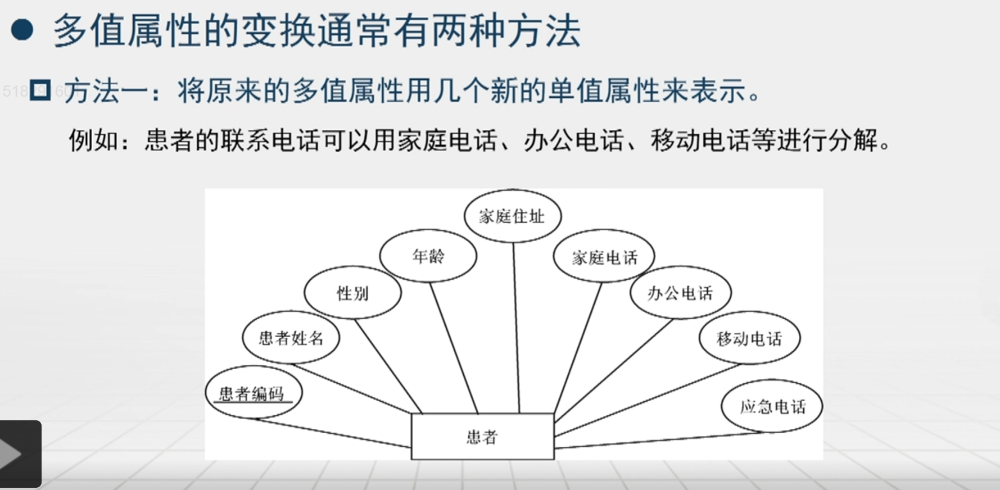
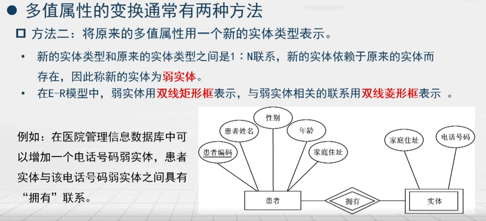

# 数据库原理

[数据库原理及应用](https://www.icourse163.org/learn/UESTC-1458643166?tid=1470104698#/learn/content?type=detail&id=1253788252&cid=1284663295)

## 数据库系统概论
* 基本概念
    

    

* 数据模型
    

    

    

    

    

    

    

    

    

* 数据库管理系统
    

    

    

    

    

    

* 数据库系统
    

    

    

    

    

    

    

    

## 关系模型和关系代数

### 关系模型的基本概念

### 关系模型的数据结构

### 关系模型的数据操作

### 关系模型的数据约束

  

### 关系代数
* 基本关系运算

    

    

    

    

    

* 专门关系运算

    

    

    

    

    

    

    

    

    

    

    

    

    

    

* 扩展关系运算

    

    

    

    

## 实体联系E-R模型

### E-R模型概述

### E-R模型的拓展特性

## 规范化

### 模式设计问题

### 函数依赖

### Amstrong公理

### 模式分解

### 关系范式

### 规范化原则及过程

## SQL语言

<!-- 
## 引言

## 关系模型介绍

## SQL

## 中级SQL

## 高级SQL

## 形式化关系查询语言

## 数据库设计和E-R模型

## 关系数据库规范化

## 事务 -->