# 自动控制原理
[自动控制原理](https://www.icourse163.org/course/HUST-1001531001?from=searchPage&outVendor=zw_mooc_pcssjg_)

## mooc

*  复习拉氏变换的所有规则

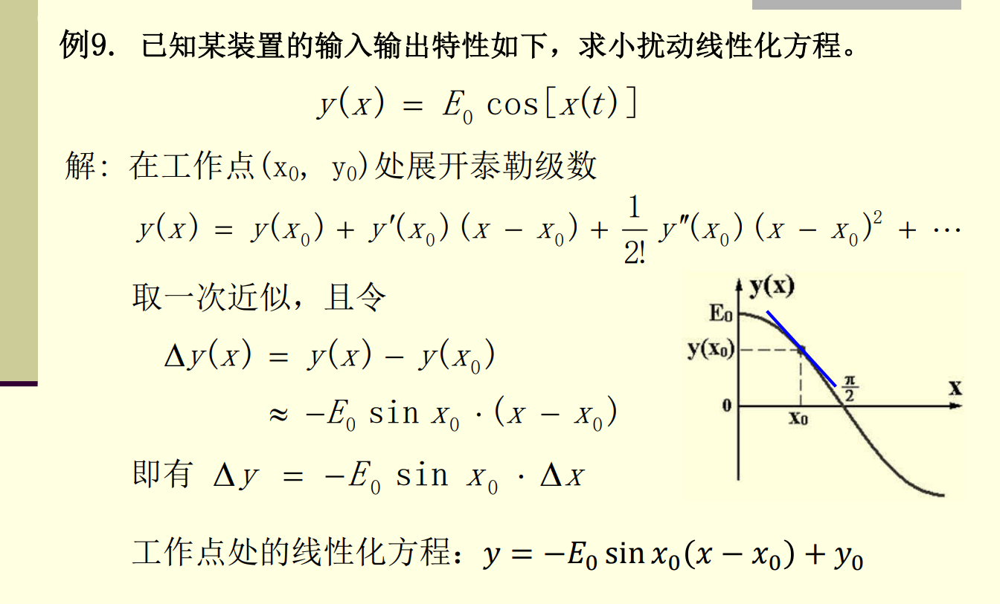

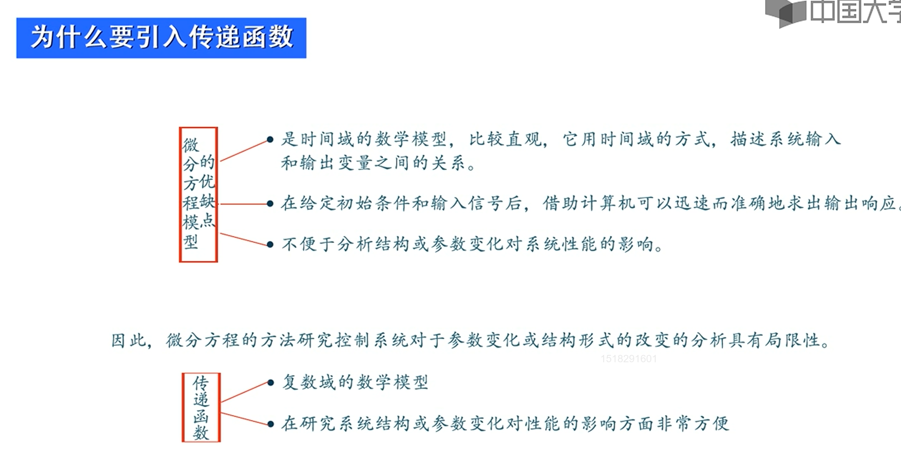

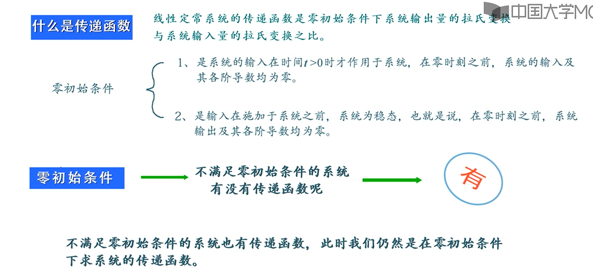

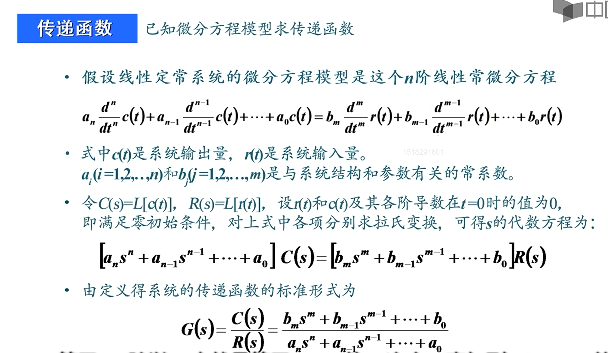

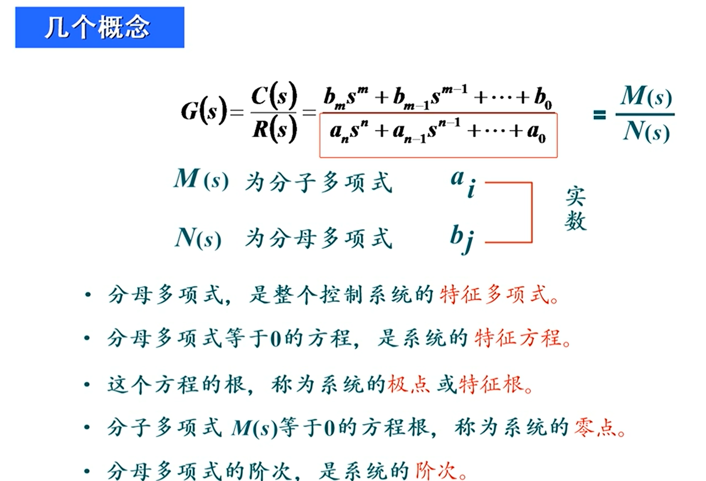

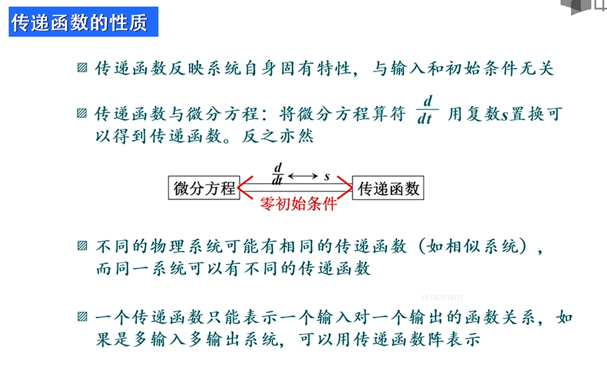

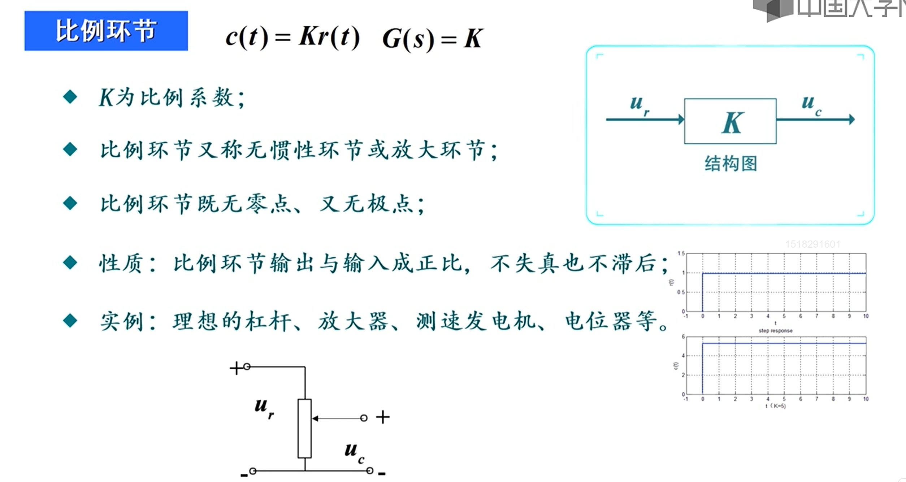

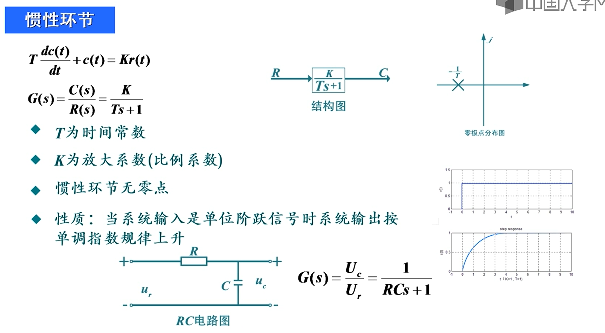

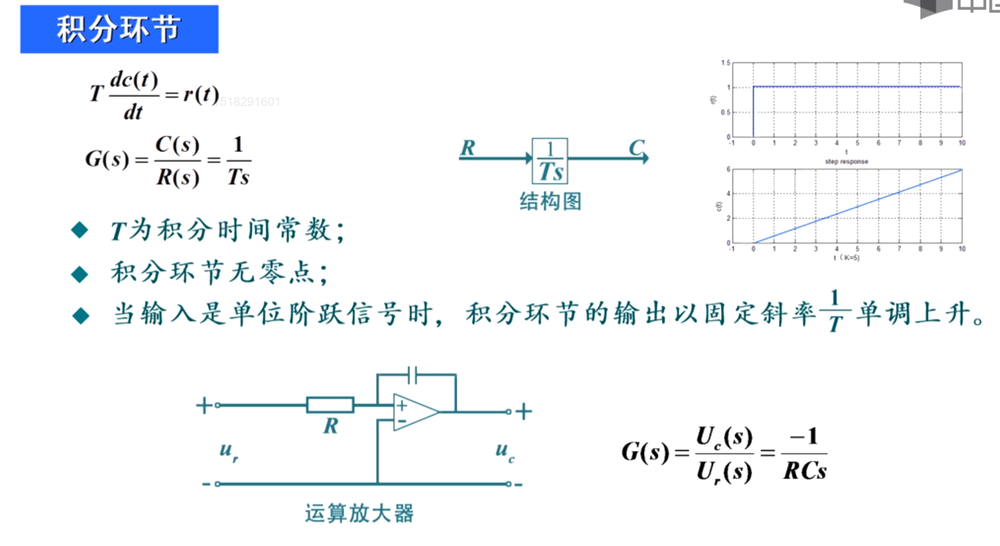

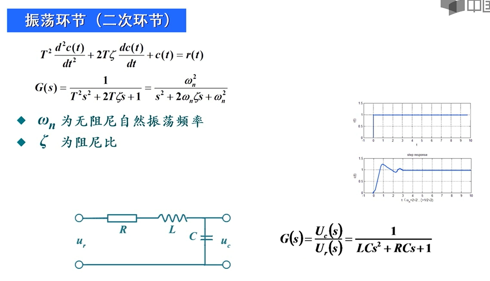

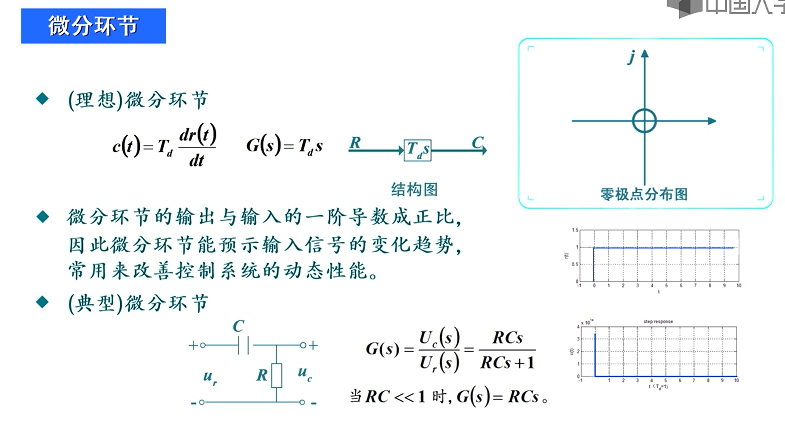

# 
<!-- 
## 自动控制的一般概念

## 控制系统的数学模型

## 线性系统基本特性

## 线性系统的微分方程

## 线性微分方程求解

## 非线性系统线性化

## 运动的模态

## 线性系统的时域分析法

## 线性系统的根轨迹法

## 线性系统的频域分析法

## 线性系统的矫正方法 -->
