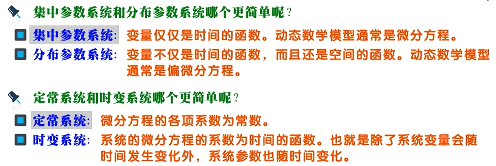
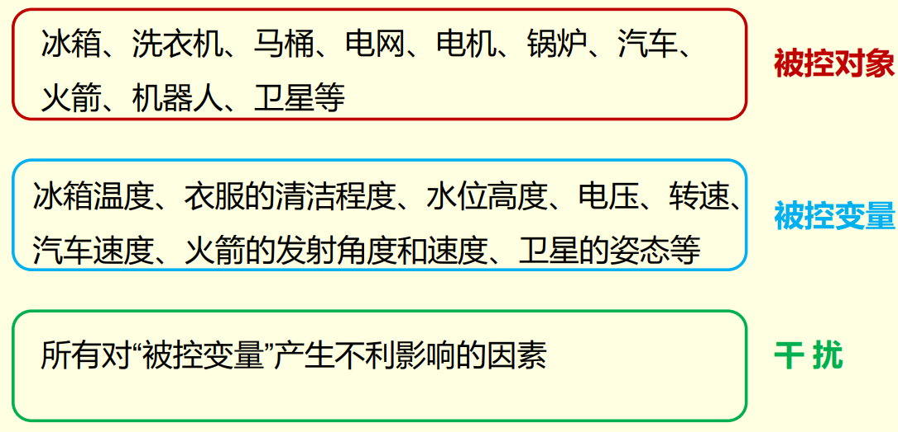
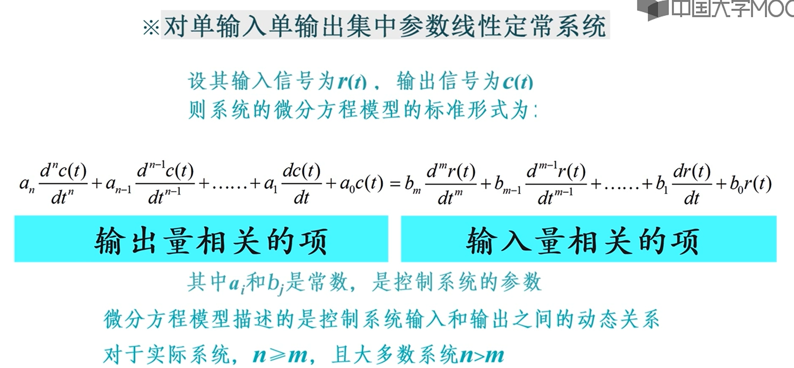
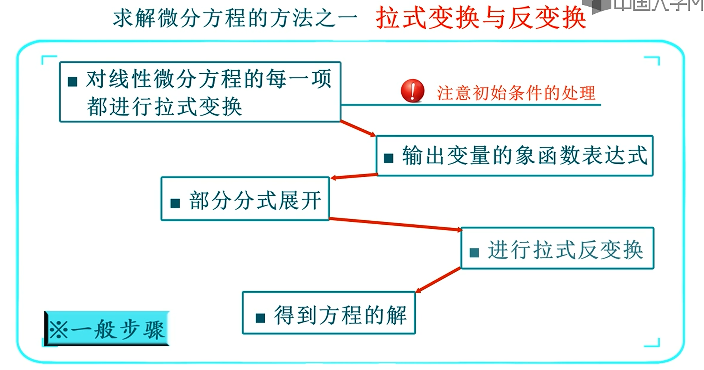

# 自动控制原理
[自动控制原理](https://www.icourse163.org/course/HUST-1001531001?from=searchPage&outVendor=zw_mooc_pcssjg_)

## 自动控制的一般概念

### 自动控制的基本概念

### 开环和闭环控制系统

#### 开环控制系统
被控变量（即输出量）对系统的控制作用无任何影响的控制系统。即没有把输出量返回到输入端的系统

* 缺点：开环控制系统的抗干扰能力差

#### 闭环控制系统
控制器与被控对象之间，不仅存在着正向作用，而且存在着反馈作用的控制系统，即系统的输出信号对控制量有直接的影响的系统

### 对控制系统的要求

## 控制系统的数学模型

### 线性系统基本特性

### 线性系统的微分方程

### 线性微分方程求解

### 非线性系统线性化

### 运动的模态

## 线性系统的时域分析法

<!-- 

## 线性系统的根轨迹法

## 线性系统的频域分析法

## 线性系统的矫正方法 -->
