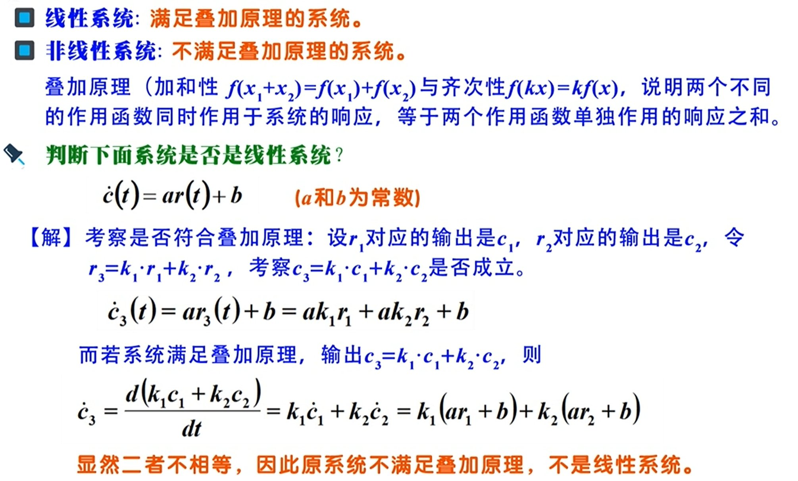
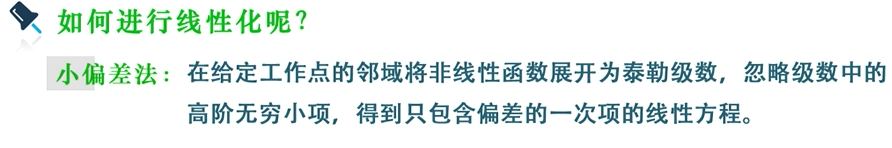
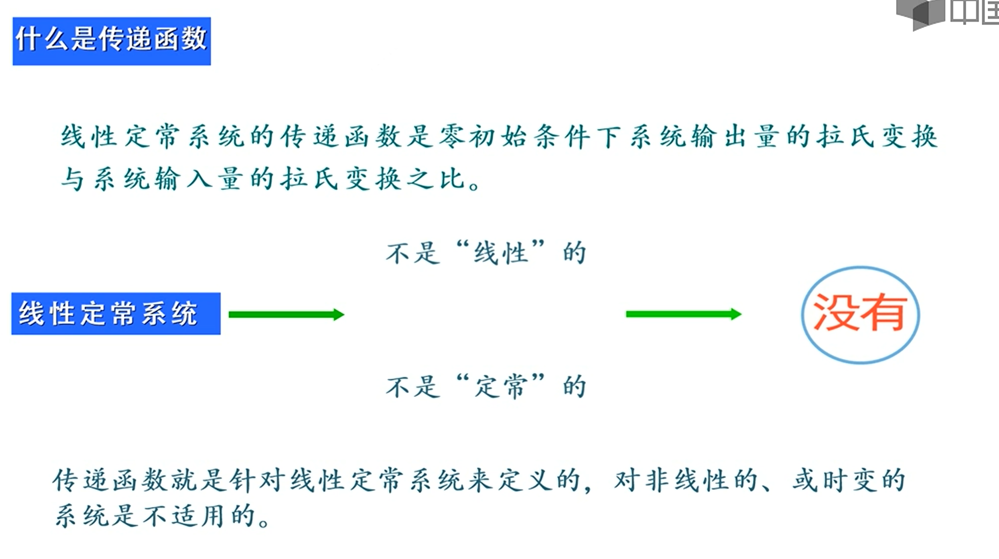
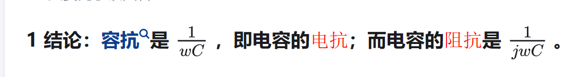
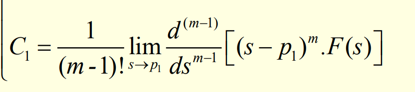
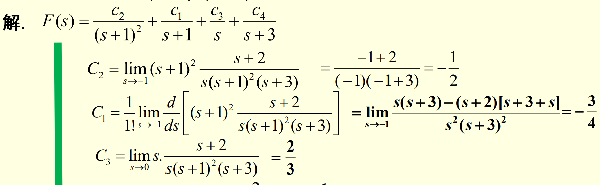

# 自动控制原理
[自动控制原理](https://www.icourse163.org/course/HUST-1001531001?from=searchPage&outVendor=zw_mooc_pcssjg_)

## mooc

*  复习拉氏变换的所有规则 https://www.cnblogs.com/yuankai-ren/p/11622815.html

* 电容的阻抗

* e^(ix)=(cos x+i sin x)称为欧拉公式

[为何在传递函数中，可以用jw 替换s？](https://www.zhihu.com/question/60755162)

* 留数法有重根的时候：分子全乘以最大次方，每降n阶就求n阶导并除以n的阶乘
    
    

    

# 
<!-- 
## 自动控制的一般概念

## 控制系统的数学模型

## 线性系统基本特性

## 线性系统的微分方程

## 线性微分方程求解

## 非线性系统线性化

## 运动的模态

## 线性系统的时域分析法

## 线性系统的根轨迹法

## 线性系统的频域分析法

## 线性系统的矫正方法 -->
