# 计算机网络
[计算机网络核心](https://www.bilibili.com/video/BV19W4y1h7xs/?spm_id_from=pageDriver&vd_source=c65196c22fdd3605640aeccf1b3b4a0e)

[中科大-计算机网络](https://www.bilibili.com/video/BV1JV411t7ow/?spm_id_from=333.999.0.0&vd_source=c65196c22fdd3605640aeccf1b3b4a0e)

[mooc](https://www.icourse163.org/learn/HDU-1002598057?tid=1472197450#/learn/content)

## 计算机网络和因特网

### 什么是Internet

#### 具体构成
1. 主机（提供服务）或端系统（享受服务）

     

2. 通信链路

     

3. 分组交换机

     

当一个端系统传输数据到另一个端系统时，发送端系统将**数据分组**，并为每段加上**首部字节**。这些数据传输单元统称为**分组或数据包**。这些分组通过网络发送到目的端系统，并被其还原为原始数据。

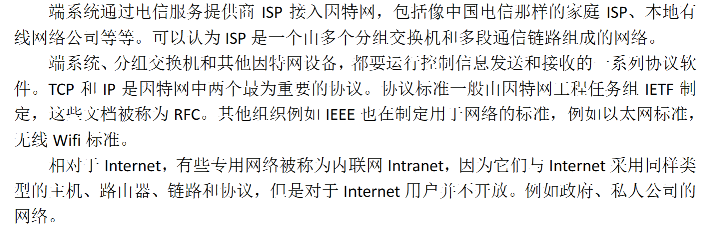

#### 什么是协议

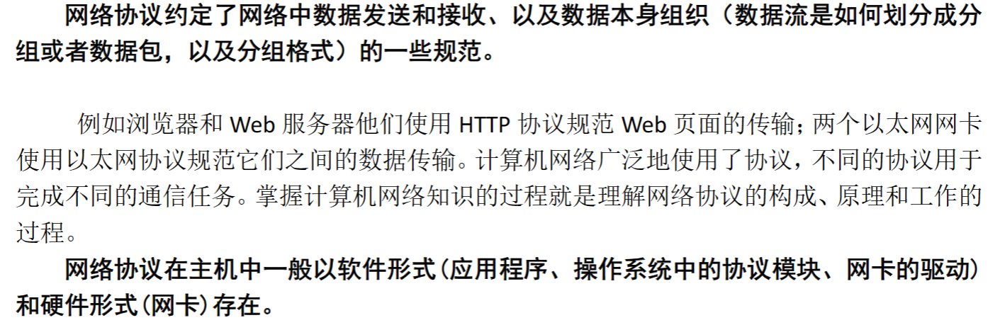

### 网络边缘

#### 接入网

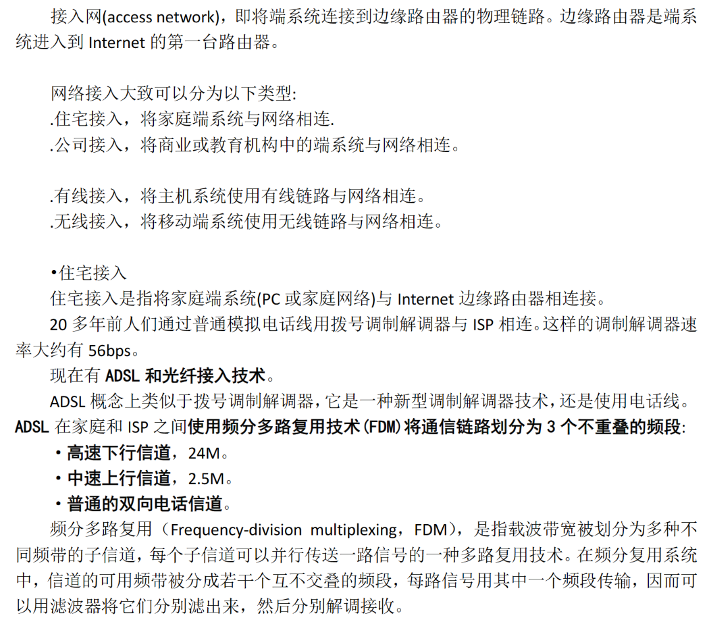

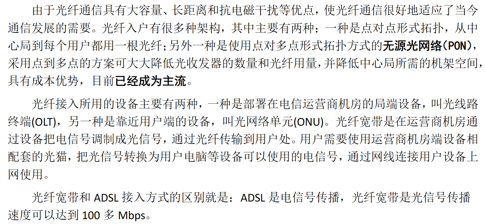

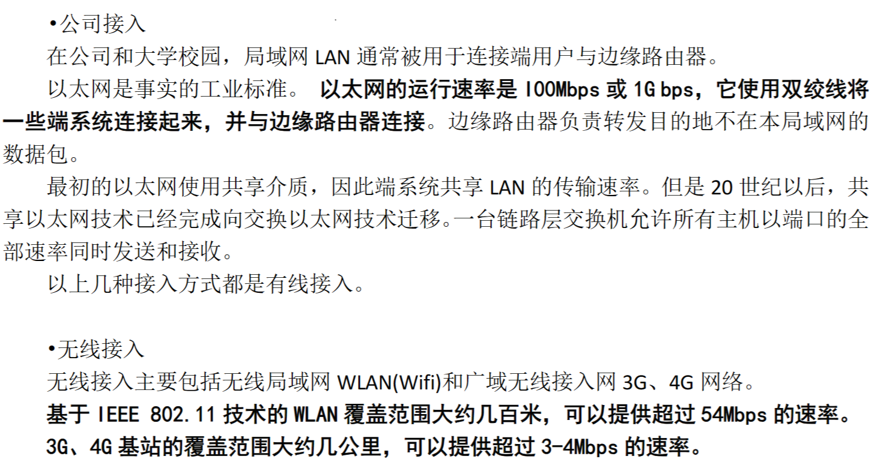

#### 物理介质

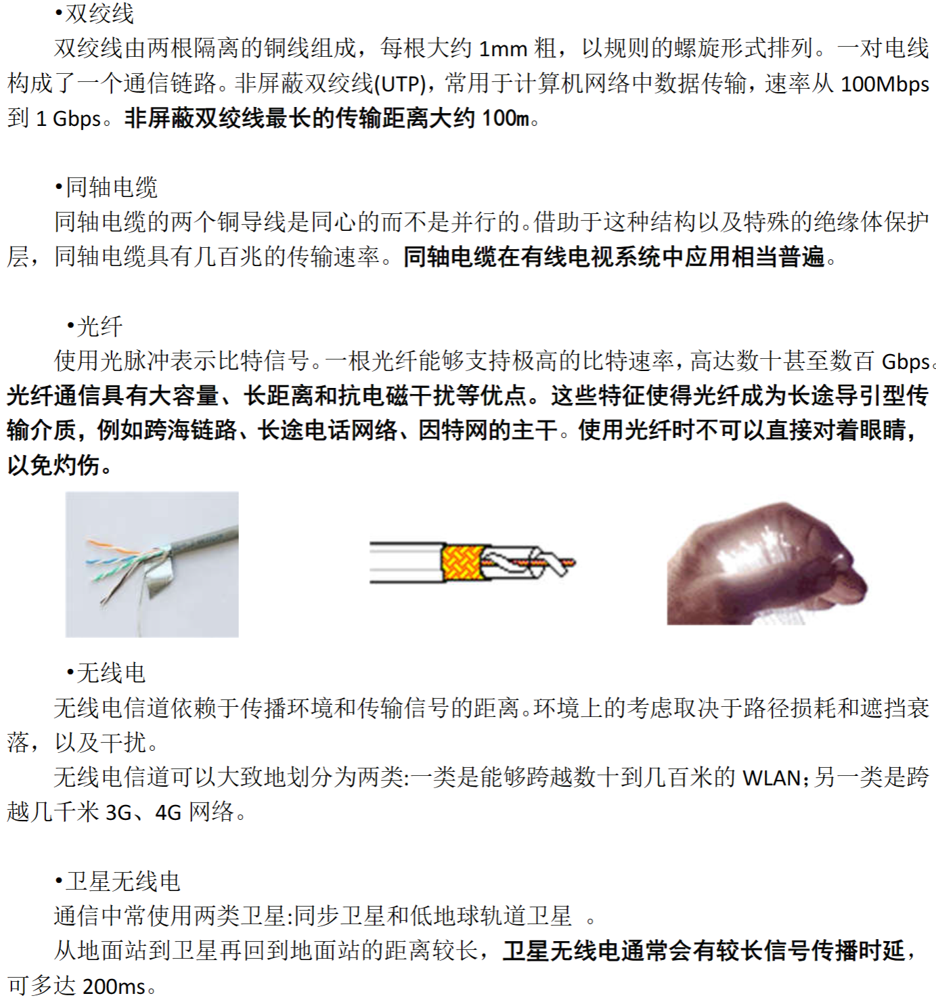

### 网络核心

数据通过网络有两种基本方式：电路交换和分组交换 

#### 电路交换

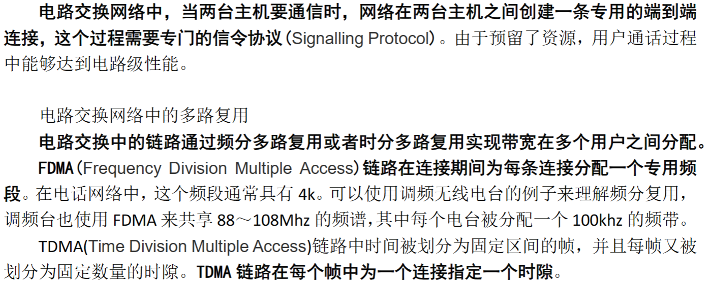

#### 分组交换

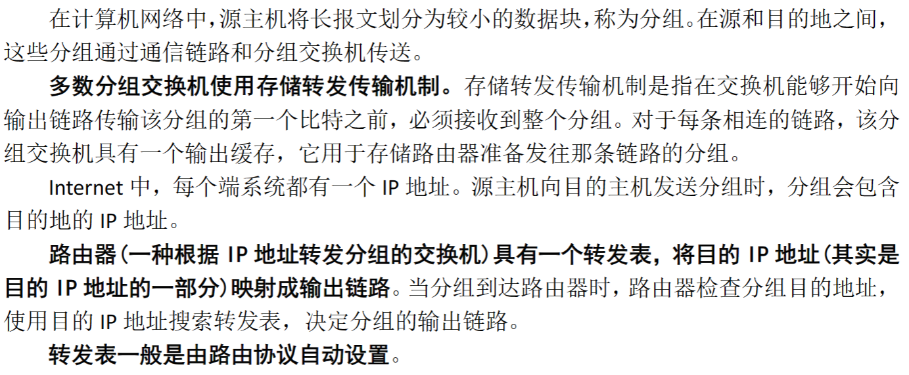

#### 电路交换与分组交换比较

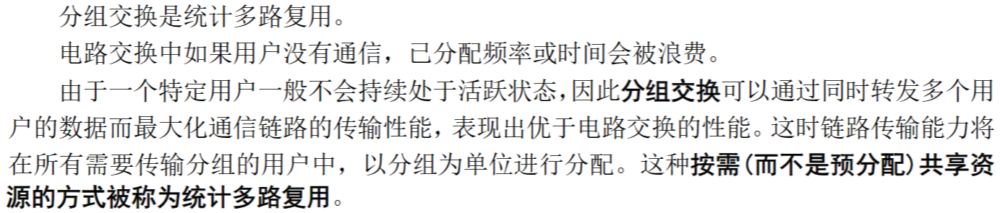

#### 网络的网络-Internet

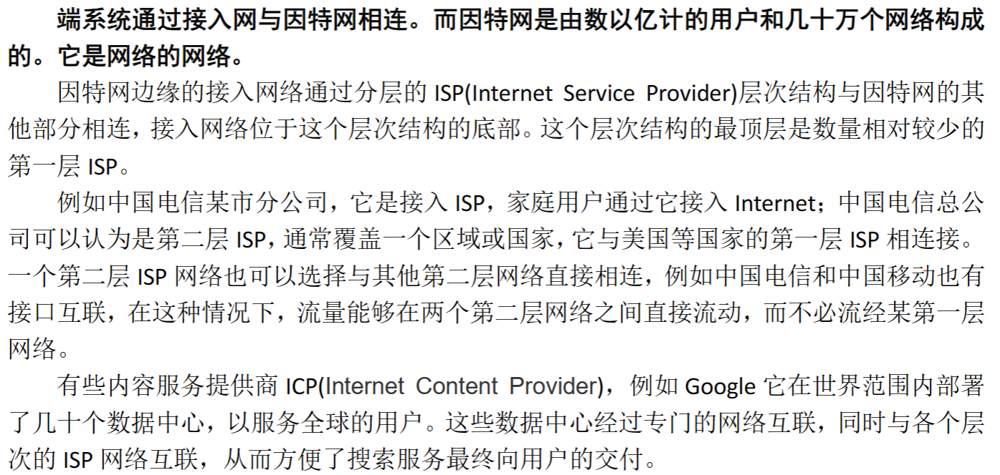

### 分组交换网络中的时延和分组丢失

#### 分组交换网络中的时延

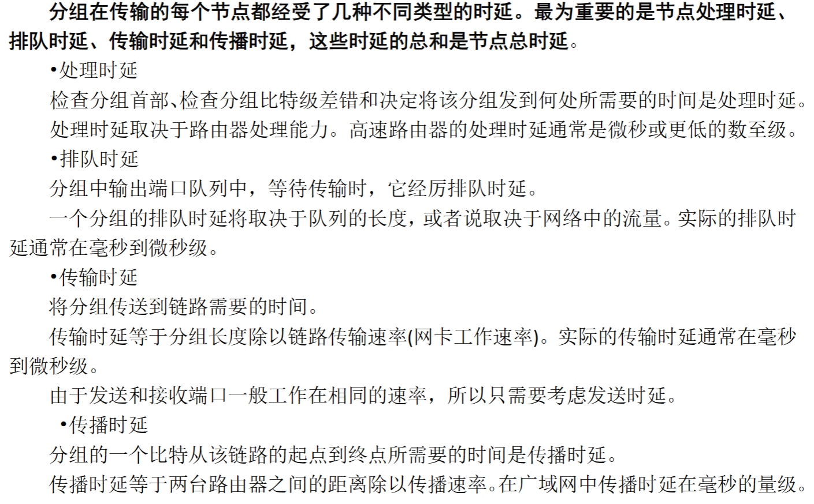

#### 排队时延和丢包

#### 端到端时延

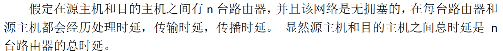

#### 计算机网络中的吞吐量

### 协议层次
因特网的协议由5个层次组成：物理层、链路层、网络层、传输层和应用层

#### 分层的体系结构

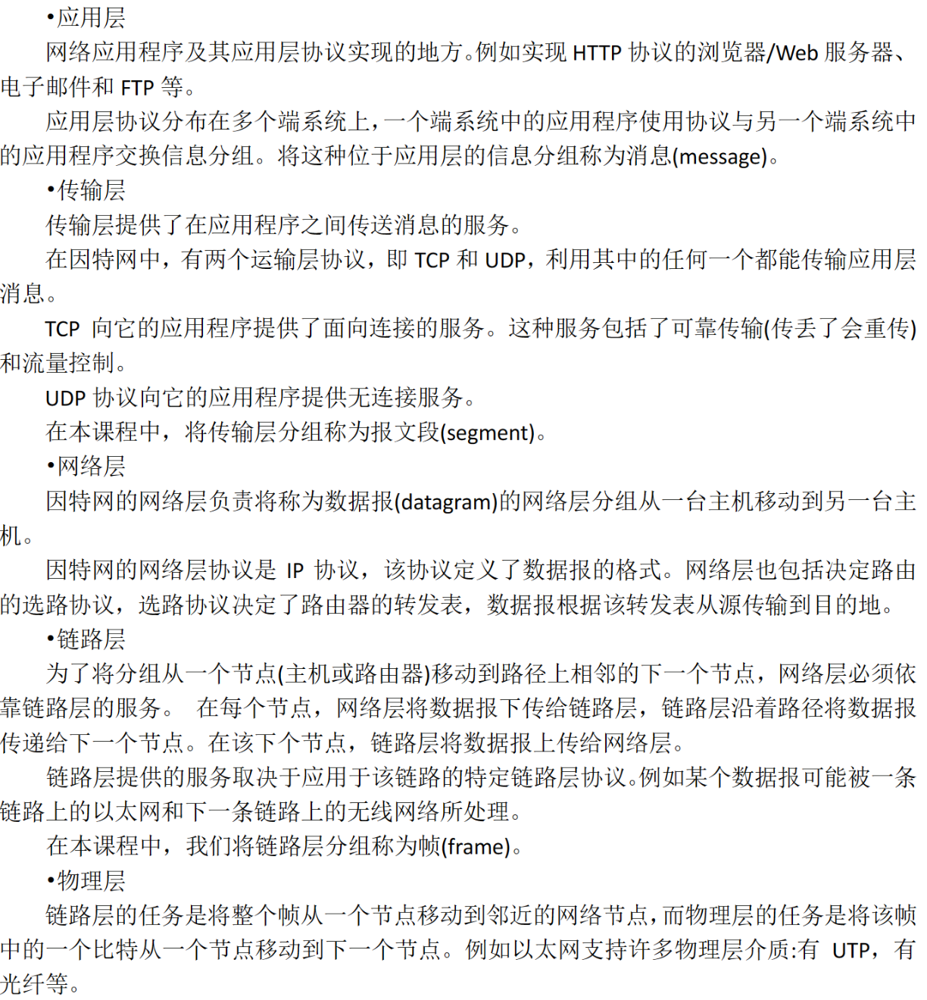

#### 分组的封装

#
<!-- 
### 网络接入和物理媒体

### 因特网结构和ISP

### 分组交换网络中的时延和分组丢失

### 协议层次与服务模型

## 应用层

## 运输层

## 网络层：数据平面

## 网络层：控制平面

## 链路层和局域网
     -->