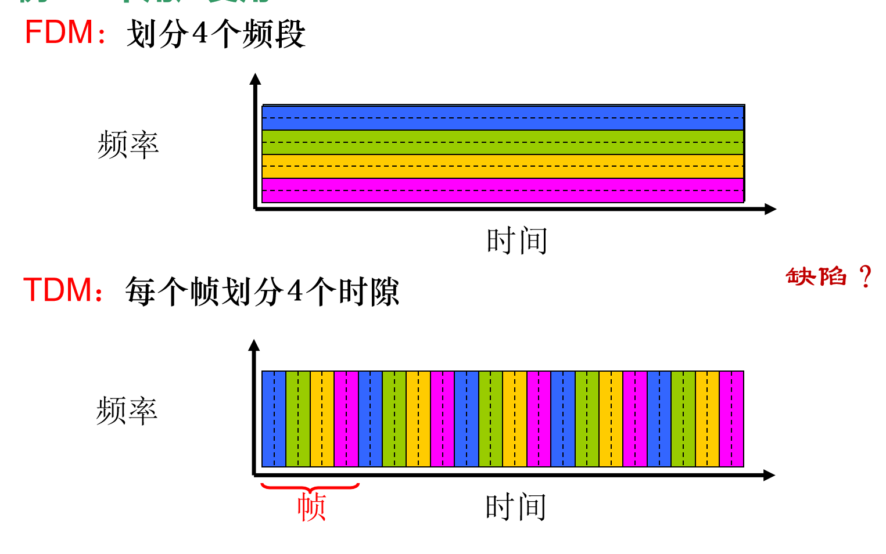

# 计算机网络
[计算机网络核心](https://www.bilibili.com/video/BV19W4y1h7xs/?spm_id_from=pageDriver&vd_source=c65196c22fdd3605640aeccf1b3b4a0e)

[中科大-计算机网络](https://www.bilibili.com/video/BV1JV411t7ow/?spm_id_from=333.999.0.0&vd_source=c65196c22fdd3605640aeccf1b3b4a0e)

[mooc](https://www.icourse163.org/learn/HDU-1002598057?tid=1472197450#/learn/content)

## 英中对照
|英文|中文|
|-|-|
|bandwidth|带宽|
|client|客户机|
|communication link|通信链路|
|FDM（frequency-division multiplexing）|频分多路复用|
|host|主机|
|end system|端系统|
|packet|包|
|packet switch|分组交换机|
|router|路由器|
|||
|IETF（Internet Engineering Task Force）|因特网工程任务组|
|||
|IP（Internet Protocol）|网际协议|
|ISP（Internet Service Provider）|因特网服务提供商|
|link-layer switch|链路层交换机|
|protocol|协议|
|RFC（Request For Comments）|请求评论（一个文档名）|
|server|服务器|
|TCP（Transmission Control Protocol）|传输控制协议|
|TDM（时分多路复用）|time-division multiplexing|
|User Datagram Protocol|用户数据报协议|
|||
|||

## 计算机网络和因特网
* 计算机网络的定义：用**通信设备和线路**将分散在不同地点的多个独立的计算机系统相互连接起来，并按照**网络协议**进行数据通信，实现**资源共享**的计算机集合。

### 什么是因特网
* 描述因特网有两种描述方法：
     1. 因特网的具体构成：构成因特网的基本硬件和软件。

     2. 因特网提供的服务：为分布式应用程序提供的服务。

#### 因特网的具体构成
Internet：**大写**开头，特指因特网，是一个全球范围的网络，遍及全世界（不考虑墙的话），是**网络的网络**。

1. 计算设备：功能是数据处理、运行网络应用程序
     1. 主机

     2. 端系统

2. 联网设备：保证高效和可靠的**数据传输**
     1. 通信链路：把端系统连接到一起的物理链路。描述传输数据可用**链路传输速率：每秒传输多少位数据来表示**，单位$bit/s$或$bps$（即比特每秒）。

     2. 分组交换机：连接**端系统**的中间设备。端系统很少直接相连，一般都有中转站，这个中转站就叫做**分组交换机。它从一条进来的通信链路接收端系统发来的分组并保存起来，再从另一条通信链路将分组发送出去，这种过程使用了**分组交换技术**。分组交换机可分为路由器和链路层交换机。

分组交换技术：发送端把数据分为小块，添加首部（**一些有用的信息，不加的话分组交换机不知道你发的东西是从哪来或到哪去**）形成分组（包），分别发送到目的端，然后再把这些小块组合复原出回数据。

3. 因特网服务提供商ISP：端系统通过服务商连接到因特网，是网络用户进入Internet的入口和桥梁。

4. 协议：计算机网络进行数据交换时必须遵守的规则就叫做**网络协议**，简称协议。就如同两个人要相互传达信息，他们必须使用某一种语言才能进行正常沟通。
     * 因特网协议：TCP/IP协议

     * 因特网标准：由IETF指定的标准文档RFC

#### 因特网提供的服务
可分为两种服务：
1. 面向连接的可靠服务：**确保**从发送方出去的数据最终按照**顺序**且**完整**地到达目的。

2. 无连接的不可靠服务：不能保证数据完美到达目的。

#### 协议是什么
协议是**在网络中控制信息接收和发送的东西**

人类之间的交流也有协议。假设两个人都说同一种语言，我对你说Hi，你回话说干嘛，这时我就知道你听到且听懂了我说的话，于是我便开始对你说“可以借我用一下吗？谢谢。”

这种人与人之间交流在网络上也适用。电脑对服务器说Hi，说Hi的这个过程就叫做**TCP连接请求**，服务器听见了并回复说干嘛，这个过程叫**TCP连接相应**，电脑便知道了服务器可以用，就开始向服务器提供请求（如下载图片）。这里有个很重要的概念，不管电脑说的是“Hi”还是“你好”，这些话就叫做**握手报文**，电脑对服务器请求下载图片的话就叫做**数据报文**。

并不是电脑无论说什么，服务器都会进行互动。电脑对服务器说“你好”，但是那个服务器只看得懂英文，所以你只能对他发英文才可以与它连接。换句话说，**双方执行不同的协议，就不能互动，不能完成工作**。

协议**定义了发送、接收报文的格式和传输顺序，以及收到报文所采取的动作**。

### 网络边缘
网络分为两大部分：**网络边缘（资源子网）和网络核心（通信子网）**

端系统之间使用因特网提供的服务传输**报文**，从而进行通信。而因特网服务有两种类型：
1. **面向连接服务**
2. **无连接服务**

#### 面向连接服务
两个端系统进行数据通信时，要先“握手”才能建立连接，然后才是发送实际的数据。

握手过程：互相发送“控制”分组，使双方做好接收后面数据分组的准备，即**在两个端系统之间创建连接**。

**面向连接服务**有着很特别的特性：（不是所有面向服务都有这些特点，可能只包含一部分，反正这三个都是很经典的）
1. 可靠的数据传送
2. 流控制
3. 拥塞控制

1. 可靠的数据传送
     * 应用程序可以通过这种连接实现**无差错、按顺序地**传递所有数据。
     
     * **确认**：当接收端收到发送端的分组时，要发一个“确认”，使发送端知道**相应**的**分组**已被接收，这个过程类似为握手，故其报文也叫做**握手报文**。

     * **重传**：如果发送端系统没有收到任何“确认”，认为发送的分组没有被对方接收到，那就**重新传输该分组**。

2. 流控制
     * 确保任何一方都不会过快地发送过量的分组而造成分组丢失，就像小河一样，缓缓流过。
     
     * 控制**发送速率**：当接收方来不及接收时，发送端就降低发送速率。

3. 拥塞控制
     * 防止因特网进入**迟滞**状态。
     * 主要问题：路由器**拥塞**。路由器的缓存出现了溢出和分组丢失，如果双方还在以很快的速度发送分组的话，那**迟滞**就会持续，几乎不会有分组能传递到目的地。
     * 解决方法：发生网络拥塞时，降低**向网络**发送分组的速率。

* 传输控制协议TCP
     * 这是一种**面向连接服务**，提供的服务可以同时包括三种特性，即**可靠的数据传送**、**流控制**和**拥塞控制**

#### 无连接服务
两个端系统之间交换数据时，不经过“握手”，可以**直接**发送分组，数据传输**更快**。

这种**无连接服务**有一些特点
1. **不可靠**：源主机不能确定分组是否已经到达目的地，因为目的没有回应，自然就不知道有没有到。
2. 没有**流控制或拥塞控制**的功能

### 网络核心
连接端系统的**分组交换机**和**链路**形成的**网状**网络。

* 电路交换：预留出端到端的资源。**占用**端系统之间的通信路径上所需的资源（缓存、链路带宽）。发送方以**恒定速率**向接收方传送数据。例如**电话网络**。
     * 通信双方必须**先建立一个专用的连接电路**，一直维持到通信结束。

     * 每个链路有n条电路，能够支持n条同步连接。在两台主机之间创建一条专用的端到端连接，分别占用每条链路的一条电路，该连接获得链路带宽的1/n，进行通信。

* 分组交换：不需要资源预留。按需使用资源，但是可能要**排队等待**。

* 多路复用
     1. 频分多路复用FDM：链路的频谱由跨越链路创建的连接所共享。
          * 按频率划分若干频段，每个频段专用于一个连接
          * 带宽：频段的宽度

     2. 时分多路复用TDM：时间划分为固定区间的帧，每帧再划分为    固定数量的时隙，每一个时隙专用于一个连接，用于传输数据。

     

电路交换有缺陷：效率较低，

### 网络接入和物理媒体

### 因特网结构和ISP

### 分组交换网络中的时延和分组丢失
#
<!-- 
## 应用层

## 运输层

## 网络层：数据平面

## 网络层：控制平面

## 链路层和局域网
     -->