# 软件工程

## 软件工程学概述

### 软件的发展历史和定义

#### 软件的发展历史

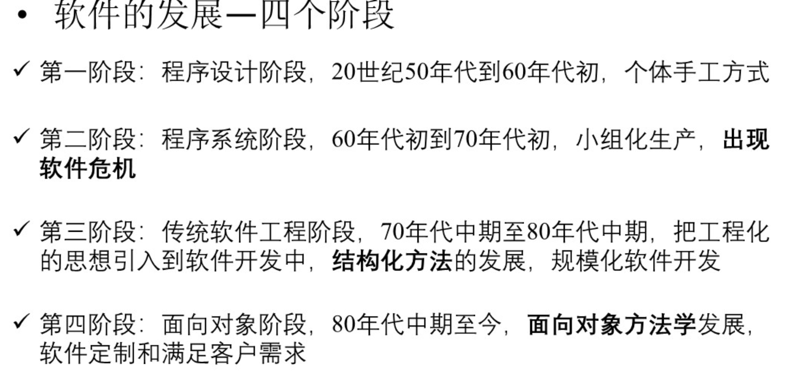

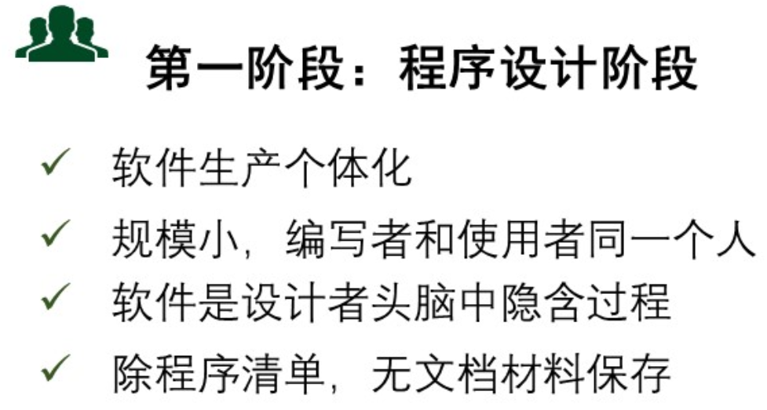

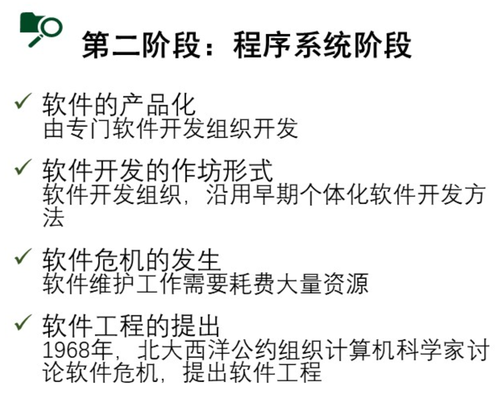

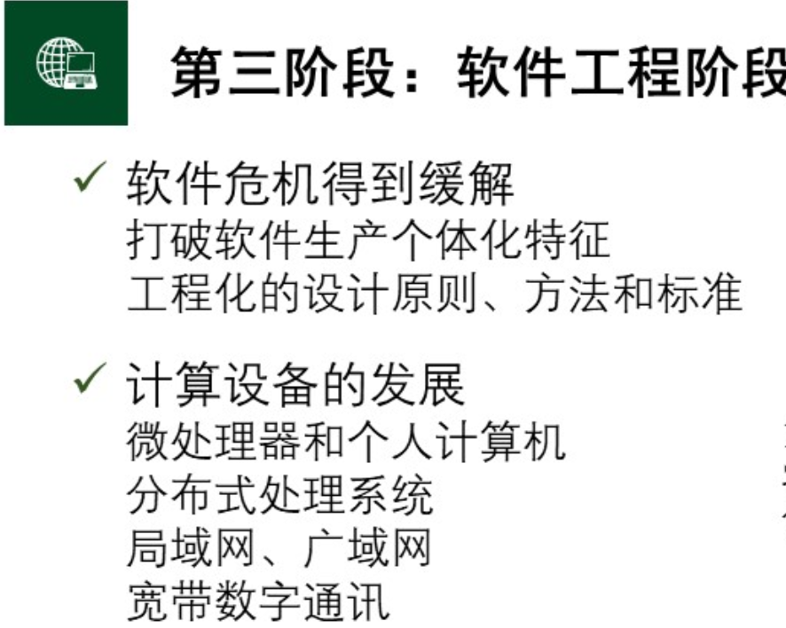

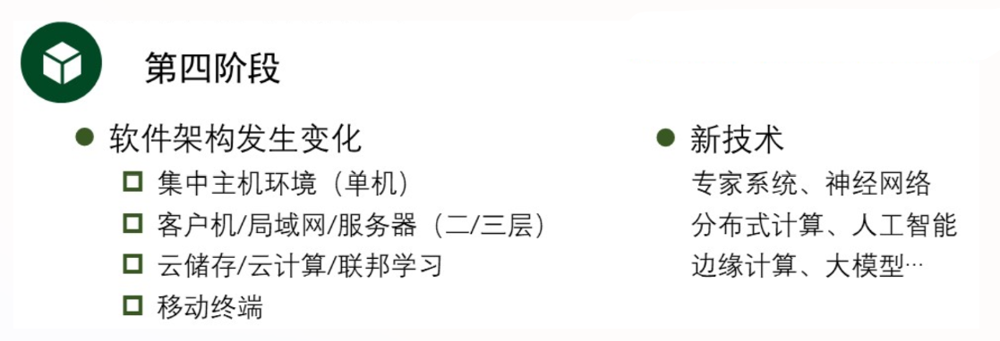

#### 软件的定义

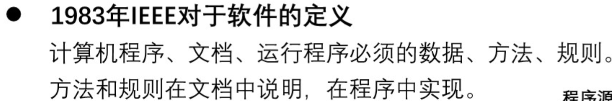

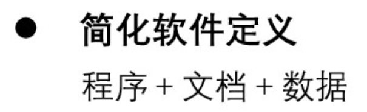

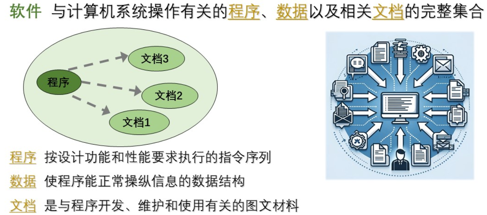

### 软件工程的定义和特点

#### 软件工程的定义

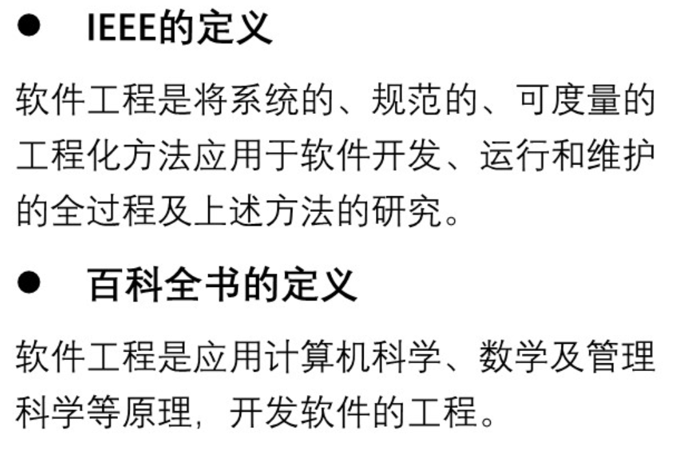

#### 软件工程的原则

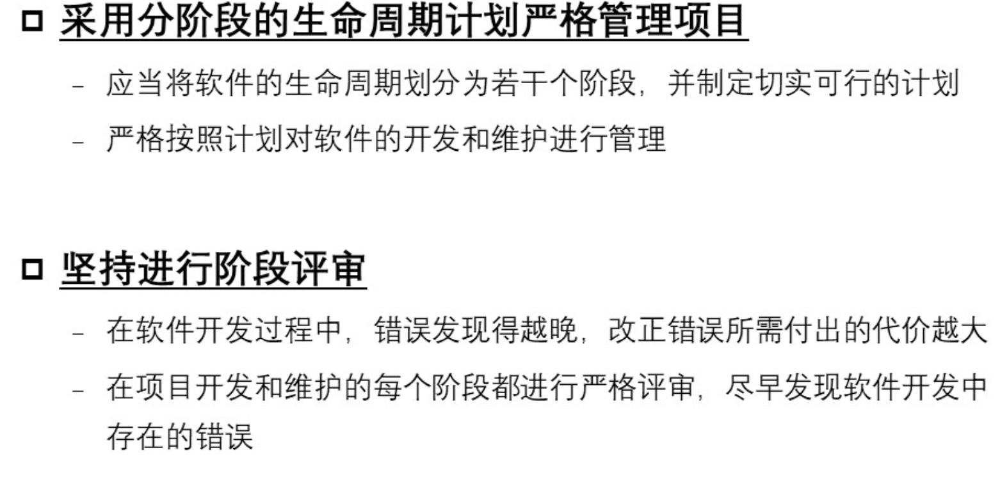

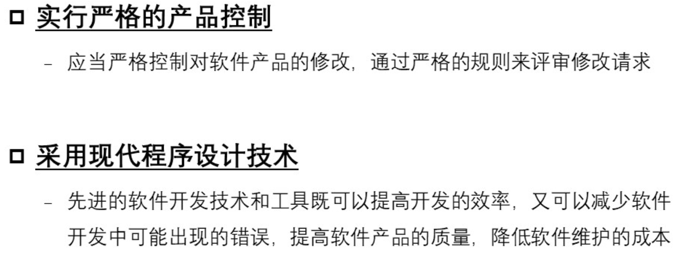

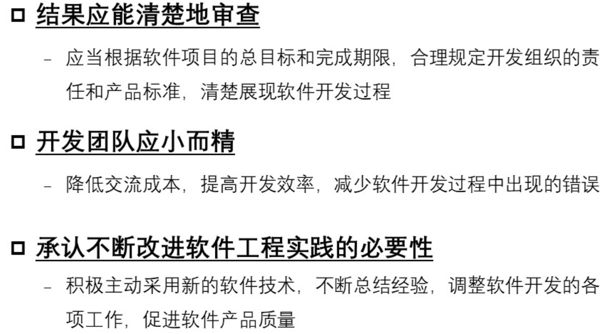

### 软件危机

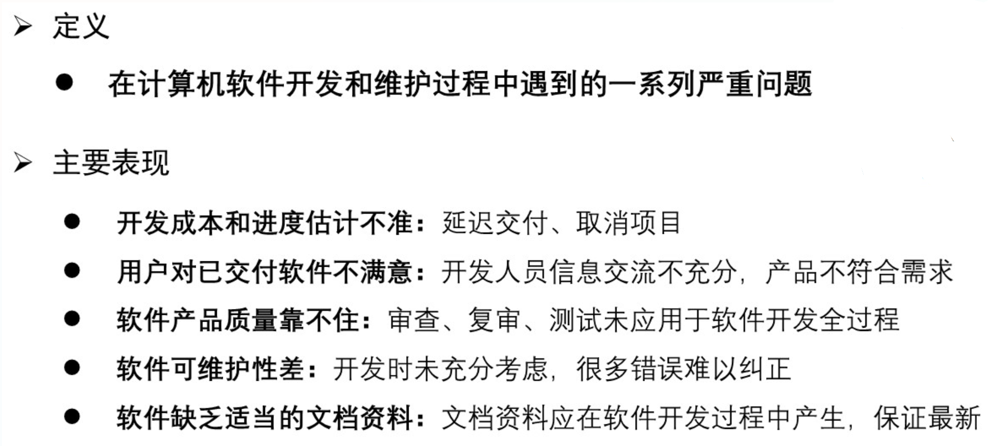

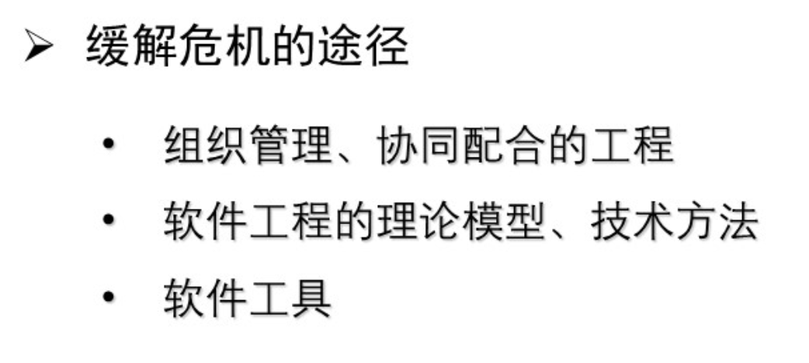

## 软件生命周期

### 软件构想和立项

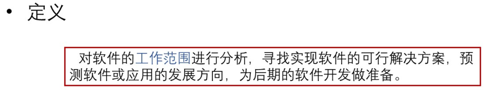

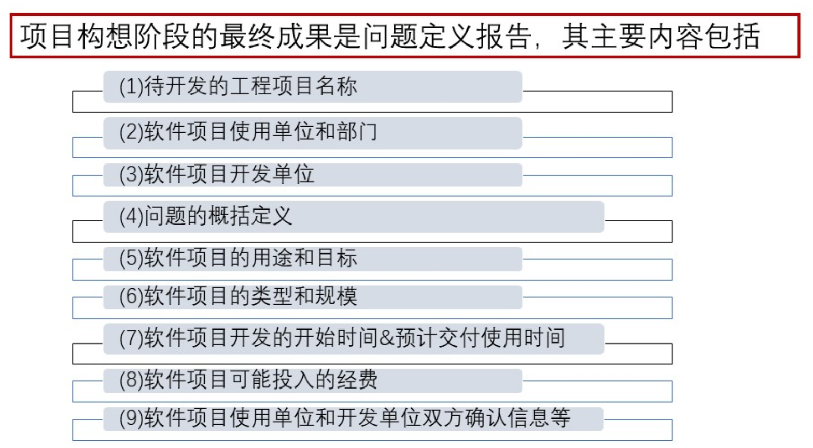

### 可行性分析

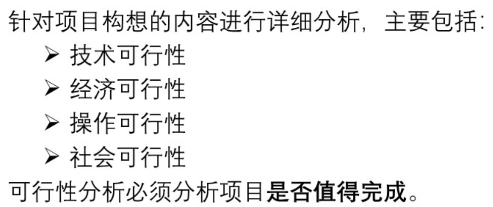

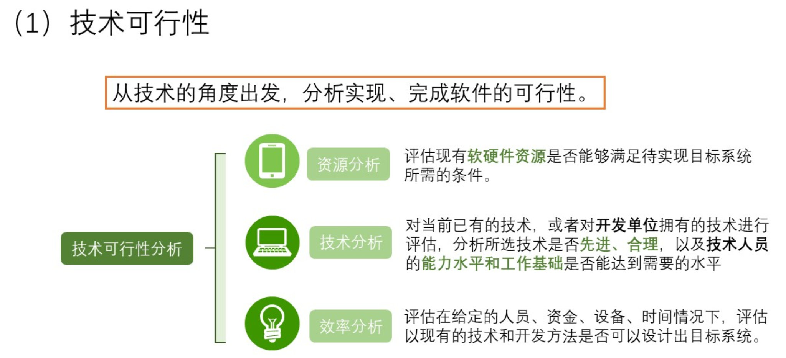

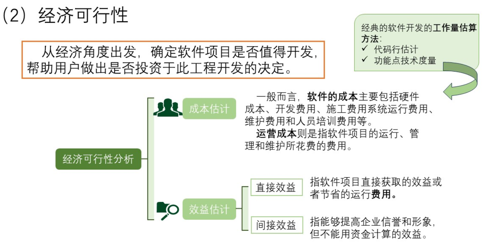

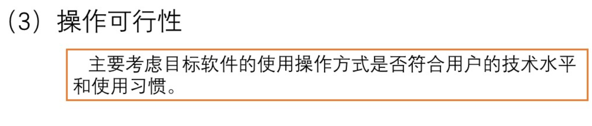

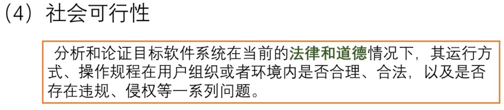

### 项目开发计划

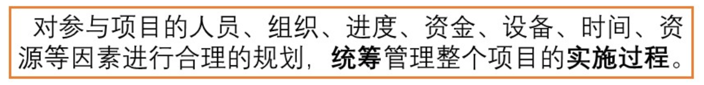

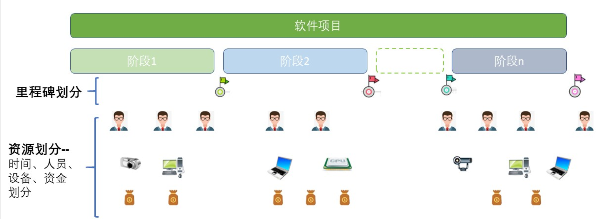

## 结构化方法
<!-- 

## 结构化设计和实现

## 面向对象方法

## 面向对象设计和实现

## 软件过程管理

## 现代软件开发 -->
