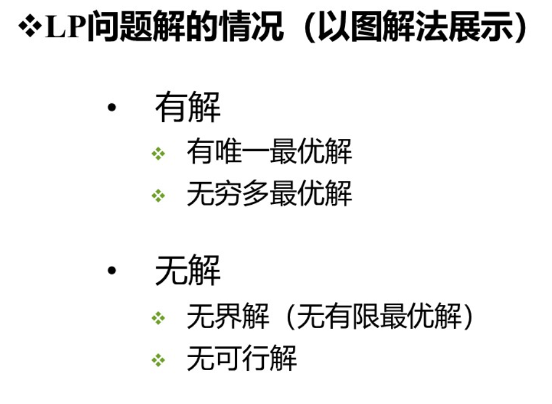
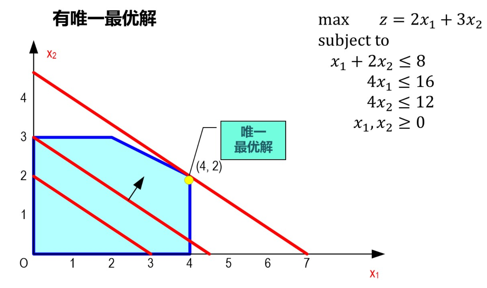
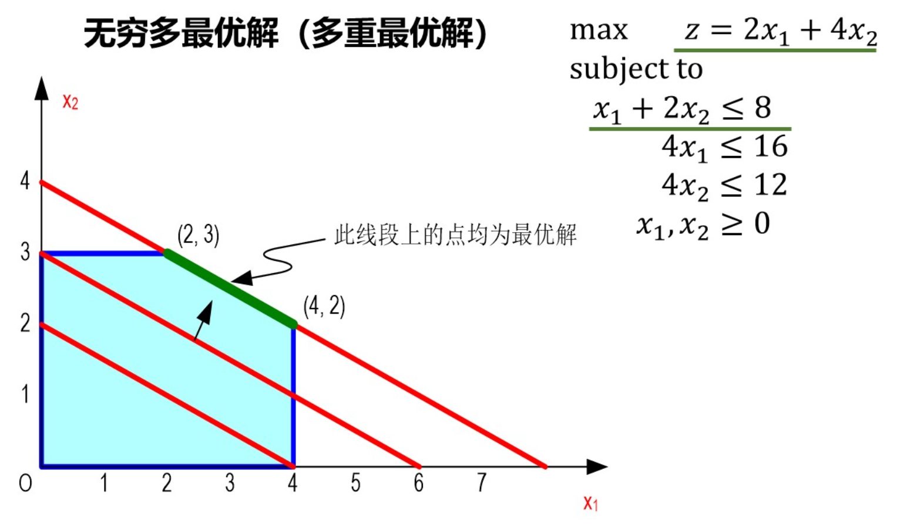
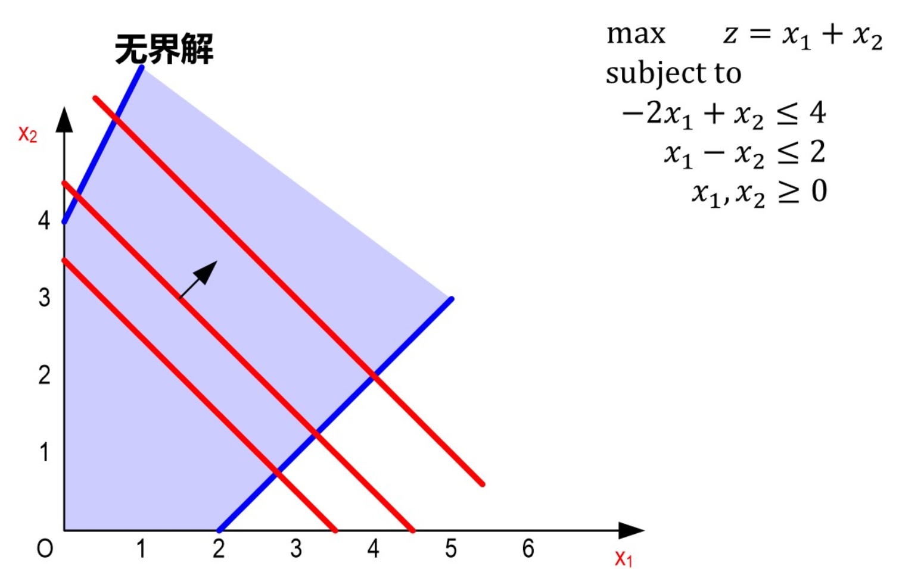
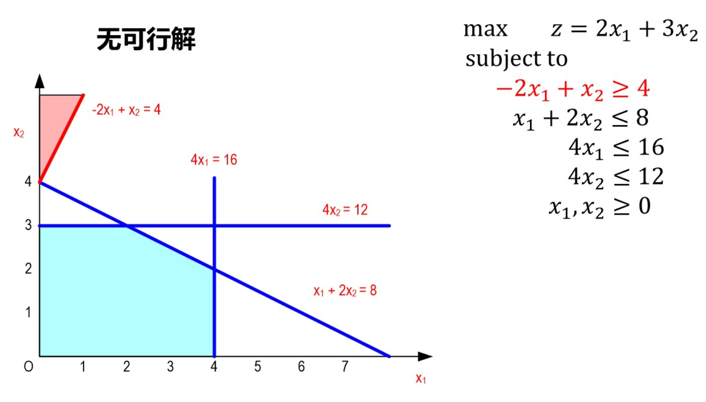

# 运筹学
[运筹学](https://www.icourse163.org/course/HUST-1207167805?from=searchPage&outVendor=zw_mooc_pcssjg_)

## 线性规划与单纯形法

### 线性规划
* 线性规划（Linear Programing，简称**LP**），是运筹学最基本的方法之一

#### 线性规划的数学模型和解

#### 线性规划模型的形式

#### 线性规划问题的相关概念

#### 线性规划问题的几何意义

## 对偶理论和灵敏度分析
<!-- 

## 运输问题

## 整数线性规划

## 图与网络优化

## 对策论基础

## 单目标决策 -->
